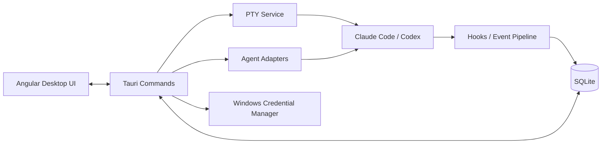

<p align="center">
  
</p>

<h1 align="center">Termexo</h1>

<p align="center"><strong>一个窗口，装下所有编程 Agent</strong></p>

<p align="center">
  <a href="./README.md">English</a> · <strong>简体中文</strong>
</p>

<p align="center">
  
  
  
  
</p>

<p align="center">
  <a href="https://www.termexo.com">官方网站</a> ·
  <a href="https://github.com/gemron/Termexo/releases/latest">下载安装</a> ·
  <a href="https://www.npmjs.com/package/termexo">npm</a>
</p>

Termexo 把 Claude Code、Codex 和围绕它们运行的终端收进一个可恢复的 Windows
工作空间。你可以同时盯住多个 Agent，及时知道谁在等待输入或授权，接着昨天的原生会话
继续工作，也可以在不重搭环境的情况下为 Claude CLI 切换兼容模型供应商。

一条命令运行完整 Windows 应用，不需要注册 Termexo 账号，也不依赖 Termexo 服务器：

```powershell
npx termexo@latest
```

> 最新正式版本为 **V0.3.12 修复版**。终端的模型配置现在能真正跨重启保留，第三方模型不再
> 退回原生默认模型；通过 npm 运行时也能收到 Windows 系统通知。


<p align="center">
  <sub>Claude Code 与 Codex 终端并排运行，工作空间会记住它们的布局。</sub>
</p>

## 现在已经能做什么

<table>
  <tr>
    <td width="50%" valign="top">
      <strong>四个 Agent，一块屏幕。</strong><br><br>
      想开多少真实 PTY 终端就开多少，再选择当前要显示的终端，排成 1–6 行/列的自定义网格。
      每个工作空间都会记住目录、标签、布局、模型和主题。
      <br><br>
      <a href="website/assets/termexo-workbench.png"></a>
    </td>
    <td width="50%" valign="top">
      <strong>Agent 需要你时，马上知道。</strong><br><br>
      等待输入、等待授权、已完成和失败状态一眼可分；常驻提示条、Windows 系统通知与任务栏
      闪烁会把你带回真正需要处理的那个终端。
      <br><br>
      <a href="website/assets/termexo-attention.png"></a>
    </td>
  </tr>
  <tr>
    <td width="50%" valign="top">
      <strong>接着昨天的会话继续。</strong><br><br>
      跨项目、账号、分支和模型搜索本机 Claude Code/Codex 会话。Termexo 调用 CLI 原生的
      <code>claude --resume</code> 与 <code>codex resume</code> 恢复完整上下文，并始终只读原生会话文件。
      <br><br>
      <a href="website/assets/termexo-session-center.png"></a>
    </td>
    <td width="50%" valign="top">
      <strong>同一个 CLI，换个模型运行。</strong><br><br>
      让 Claude Code 使用 Anthropic、DeepSeek、MiniMax、GLM 或自定义 Anthropic 兼容 Endpoint。
      供应商保存为 Profile，API Key 交给 Windows 凭据管理器保管，还能一次切换工作空间里的全部 Claude 终端。
      <br><br>
      <a href="website/assets/termexo-models.png"></a>
    </td>
  </tr>
</table>

Termexo 默认只在本地工作：没有 Termexo 账号、云服务或强制同步。工作空间状态保存在本机
SQLite，密钥保存在 Windows Credential Manager，Claude/Codex 历史会话只读。Agent CLI
仍会按照你选择的供应商及其隐私政策连接对应模型服务。

界面支持简体中文、英语、西班牙语、法语、德语、日语和韩语。默认自动跟随 Windows
系统语言，也可通过主工具栏手动切换并跨重启保留选择。

## V0.3.12 更新

- 修复终端模型配置无法跨重启保留的问题：后端快照结构此前缺少 `profileId` 与 `mcpProfileId`
  两个字段，切换到第三方模型后重开窗口会退回原生默认模型。V0.3.11 声称的会话模型保留功能
  因此从未真正生效，现已修复。
- 修复通过 npm 运行时收不到 Windows 系统通知的问题：应用启动时会注册 AppUserModelID，
  未经安装器安装的运行方式也能正常投递系统通知。
- 系统通知投递失败时会如实回传错误并降级为系统对话框，此前失败会被静默忽略。

## V0.3.11 更新

- 恢复会话时保留该会话上次使用的模型配置，第三方模型不再在重启后退回原生默认模型；在恢复配置中
  手动选择的模型仍然优先。
- 重构会话中心的信息层级，让会话列表成为主体：Agent 健康状态收敛为一行状态栏，搜索与筛选合并到
  同一行工具栏，恢复配置折叠为可展开面板并在折叠时显示当前生效的模型。
- 修复 Codex 恢复配置的栅格错位问题（"Codex 模型"字段此前会单独换行且与其他字段不对齐）。

## V0.3.10 更新

- 支持简体中文、英语、西班牙语、法语、德语、日语和韩语七种界面语言。
- 默认自动匹配操作系统语言；系统语言变化时自动更新，不支持的语言安全回退到英语。
- 在主工具栏增加紧凑的语言选择器，手动选择立即生效并跨重启保存，也可随时恢复为
  “跟随系统”。
- 工作空间、终端布局、Agent 状态、会话中心、模型切换、设置、目录选择、运行诊断、
  应用内提示、Windows 系统通知和任务栏提醒均接入统一语言服务。
- 增加语言族匹配、选择持久化、参数插值与文档语言测试，并保持原有桌面 UI 测试全部通过。

## V0.3.9 更新

- Claude 会话恢复前重新生成启动命令、模型 Profile、凭据、供应商地址和 hooks 环境；将
  旧 `MiniMax-M3[1m]` 配置迁移为 `MiniMax-M3`，避免恢复后回落到 Claude Sonnet。
- 为 Codex 接入提示提交、工具调用、授权、压缩、子 Agent、任务完成和会话边界等完整
  生命周期 hooks，新建与恢复会话都能准确更新终端状态。
- 增加等待输入/授权的常驻横幅、Windows 系统通知和任务栏提醒，同时保持任务完成反馈
  简洁且可直接定位。
- 支持合并工作空间，并安全保留与持久化其中的终端。
- 改进响应式侧栏、终端自动适配、网格尺寸、最大化/全屏显示、Codex 初始长命令隐藏和
  窄窗口可用性。
- 增加面向 Claude Code 贡献者的仓库架构与发布流程说明。

## V0.3.8 更新

- 启用 keyring 的原生 Windows 凭据管理器后端，不再使用仅在当前进程内有效的 Mock
  Store，使 MiniMax 等模型供应商 API Key 能跨新会话和应用重启保留。
- 每次写入凭据后立即重新读取并比对；安全存储未保存完整密钥时不再提示保存成功。
- 增加 Windows 原生后端编译保护和真实安全存储读写回环测试。
- V0.3.7 用户升级后需要重新输入一次第三方模型供应商 API Key。

## V0.3.7 更新

- 增加安全的工作空间删除功能；新建工作空间时可通过系统目录选择器指定项目路径。
- 全局汇总所有工作空间中等待输入、等待授权和已完成的终端，并提供醒目的提示与定位入口。
- 保持工作空间终端视图挂载，稳定切换后的 xterm 尺寸、焦点和鼠标滚轮行为，修复需要点击
  其他窗口后才能恢复滚动的问题。
- 将动画状态灯放到终端标题前，并优化运行状态的背景和对齐。
- 接入 Codex 原生 `agent-turn-complete` 通知，使新建和恢复的会话都能从运行中或思考中
  准确切换为已完成。
- 在挂载终端前重新生成已恢复 Codex 会话的启动命令，使旧工作区也能接收原生完成事件，
  不再长期停留在错误的运行状态。
- MiniMax 或其他兼容供应商缺少 API Key 时，自动打开并定位对应 Profile；重新输入前禁止
  保存和切换，密钥仍只写入 Windows 安全存储。
- 工作区颜色升级为完整应用主题，同步修改 DaisyUI 表面、侧栏、弹窗、终端背景、选区、
  ANSI 强调色和光标颜色。

## V0.3.6 更新

- 模型 Profile 会核对 Windows 安全存储中的真实 API Key，不再只相信数据库里的旧引用。
- 安全存储条目已删除时按“未配置密钥”处理，重新保存 Profile 时不会保留失效引用。
- 切换供应商遇到密钥丢失时显示可操作的中文提示，不再显示底层 keyring 错误。

## V0.3.5 更新

- 可从工作区工具栏调整终端字体大小，并在重启后保留设置。
- 支持将 CLI 标签向左或向右移动，不打乱当前选择和工作空间顺序。
- 在标签、终端面板和 Inspector 中突出显示等待输入、等待授权、429 限流和已完成状态；
  最多保留 250 条 Agent 活动，并展示更多最近活动。
- 增加 xterm 滚动缓冲区；隐藏终端重新显示时主动校正尺寸，修复部分终端无法上下滚动。
- 切换模型供应商时创建全新会话，校验自定义供应商凭据，并将 MiniMax 预设升级为
  `MiniMax-M3[1m]`。
- 识别 Claude 429/限流与超时错误，提供醒目提示；从多账号恢复会话时使用正确的隔离
  Claude 配置目录。
- 明确说明：手动恢复原生会话会重新加载历史上下文；切换供应商则不会回放旧会话，
  从而避免无意的 Token 重复消耗。

## V0.3.4 更新

- 将 Termexo DaisyUI 主题挂载到文档根节点，确保所有全局界面都能继承正确的文字与背景颜色。
- 为较旧的 WebView2 运行时提供等效十六进制颜色，并将 `color-mix()` 调整为渐进增强。
- 为桌面应用和官网增加明确的颜色兜底，避免出现黑色文字与黑色背景重叠。
- 扩展浏览器冒烟测试，自动检查根主题以及前景色、背景色的实际对比。

## V0.3.3 更新

- 发布官方 [`termexo`](https://www.npmjs.com/package/termexo) npm 包，内置完整 Windows
  x64 桌面可执行程序。
- 可通过 `npx termexo@latest` 直接运行，也可以使用
  `npm install --global termexo@latest` 全局安装。
- npm 包压缩后约 4.8 MB，安装后约 13.6 MB，适合常规分发与升级。
- 发布流程增加 PE 文件校验、构建产物与 npm 包 SHA-256 对比、隔离安装测试和真实进程
  启动验证。

## V0.3.2 更新

- 支持创建、登录、管理和切换多个隔离的 Claude Code 与 ChatGPT/Codex 账号。
- 新建或恢复 Codex 会话时可指定账号与模型，同时保持原生 rollout 文件只读。
- 会话中心可扫描系统账号及所有隔离账号目录，并在恢复时沿用会话所属账号。
- 左右侧栏均可拖动调整宽度、独立折叠，并持久化宽度和展开状态。
- 移除 Google CLI 入口，隐藏尚未完成的快照、任务和原型 Git 界面。
- 自动测试覆盖工具栏对齐、菜单、弹窗、消息、紧凑布局和双侧栏交互。

## V0.3.0 更新

- 支持不限数量的终端标签，通过终端选择器指定当前布局中显示的窗口。
- 网格布局支持持久化的 `1–6 列 × 1–6 行` 自定义配置，并根据实际窗口数量自动收缩。
- 支持单个终端最大化和整个工作区最大化，可使用 `Shift+Esc` 逐级恢复。
- Claude Code CLI 保持不变，可通过模型 Profile 切换 Anthropic、DeepSeek、MiniMax、
  GLM 或自定义 Anthropic 兼容 Endpoint。
- 批量切换当前 Workspace 内的 Claude Code 后端模型，并在重启终端后继续使用原会话 ID。
- 当本地会话记录存在时使用 `--resume`；记录缺失时改用 `--session-id`，避免启动失败。

- 原生检测 Codex CLI 可执行文件与安装版本，检测过程不弹出系统控制台。
- 通过统一托管 PTY 在指定工作目录中启动 Codex。
- 只读扫描 `CODEX_HOME/sessions` 中的 Codex rollout 元数据，不修改原生 JSONL。
- 使用原生 UUID 和 `codex resume` 恢复 Codex 会话。
- 在 Agent 会话中心统一展示 Claude 与 Codex 会话，并保留各 Agent 独立的恢复参数。
- 支持按 Agent、健康状态、Workspace 和范围搜索筛选会话，并容忍部分扫描失败。
- 行列设置增加步进控制、可视化预览、行列互换与实时容量提示。
- 桌面应用、安装包和网站统一使用新的简约科技线条品牌标识。

## V0.4 开发进展

- 支持全局或 Workspace 作用域的 HTTP、HTTPS、SOCKS 与 `NO_PROXY` 网络 Profile。
- 管理 npm registry、proxy、`https-proxy`、`strict-ssl` 和企业 CA，且不改写用户全局 npm 配置。
- 代理密码保存到操作系统凭据库，并拒绝在代理 URL 中直接保存账号密码。
- 支持 DNS/TCP 连通性测试，启动 Claude/Codex 时优先使用 Workspace Profile，再回退全局 Profile。
- 支持预览并确认从官方 npm 包一键安装/升级 Claude Code 与 Codex，可选择精确版本或 dist-tag。
- 安装时应用当前网络 Profile，先检查 registry，禁止并发修改，设置超时并在完成后验证 CLI 健康状态。
- 多个隔离 Claude/ChatGPT 账号已可使用；失败自动回滚、系统代理发现和 Plan 余量监控仍在后续计划中。

## 为什么做 Termexo

AI 编程工具通常以独立终端或独立会话运行。项目一多，开发者需要自己记住：

- 哪个终端属于哪个项目、分支和 Agent；
- 哪些会话正在运行、等待输入或等待权限确认；
- 某次 Claude 会话如何恢复；
- 不同模型、Endpoint、API Key 和 MCP 配置应当如何组合；
- 应用重启后哪些只是终端配置，哪些是真正可恢复的原生会话。

Termexo 以 **Workspace** 为组织单位，把这些信息集中到一个可观察、可恢复、
可扩展的本地控制面中。

## 已实现功能

| 能力               | 当前实现                                                                          |
| ------------------ | --------------------------------------------------------------------------------- |
| Workspace 管理     | 创建、改名、换色、手动排序和切换 Workspace，并持久化项目路径、布局与终端配置      |
| 多终端工作台       | 不限终端数量、指定窗口显示、1–6 行列网格、终端/工作区最大化；桌面端启动真实 PTY   |
| Claude Code 检测   | 在 Windows 上检测 `claude.exe` / `claude.cmd`、版本与健康状态                     |
| 新建 Agent 会话    | 按目录启动 Claude/Codex，并选择隔离账号及 Agent 对应的模型配置                    |
| Agent 会话中心     | 只读发现多账号 Claude/Codex 会话，支持搜索、Workspace 过滤与原生恢复              |
| Agent 状态识别     | 为每个终端生成隔离 Hooks 设置，识别思考、工具调用、权限确认、用户输入和完成状态   |
| 模型与 MCP Profile | 管理模型、Endpoint、API Key 与 MCP 配置；Claude CLI 可切换 Anthropic 兼容后端     |
| 网络与 npm Profile | 按全局/Workspace 管理 HTTP/HTTPS/SOCKS 与 npm 配置，测试连通性并在启动时注入      |
| 多账号管理         | 管理多个隔离 Claude 与 ChatGPT/Codex 登录、默认账号、认证状态和启动时选择         |
| CLI 生命周期管理   | 预览、确认、安装或升级官方 Claude Code/Codex npm 包，并在完成后验证结果           |
| 本地数据与密钥     | Workspace、会话索引和事件保存到 SQLite；API Key 保存到 Windows Credential Manager |
| 浏览器预览         | 无需 Rust 即可预览完整 UI，并使用可交互的模拟终端验证布局与基础流程               |


<p align="center">
  <sub>模型、Endpoint 与凭据入口集中管理；已保存的密钥不会回传给前端。</sub>
</p>

## 设计目标

1. **本地优先**：项目路径、终端、会话索引和配置默认留在本机，不依赖 Termexo 云服务。
2. **尊重 Agent 原生能力**：优先调用 Agent 自己的会话恢复与配置机制，不伪造对话恢复。
3. **统一管理而非替代终端**：Termexo 提供工作台、状态和编排层，命令仍在 PTY 与原生 Agent 中运行。
4. **状态可观察**：将不同 Agent 的事件映射为运行、思考、等待输入、等待确认、完成和失败等统一状态。
5. **安全边界清晰**：密钥进入操作系统凭据存储，不写入 SQLite、快照、Hook payload 或日志。
6. **面向多 Agent 扩展**：以后端 Adapter、PTY、Hooks、Snapshot 和 Router 等边界逐步接入更多 CLI。
7. **安全延伸到可信设备**：在不削弱本地所有权和安全边界的前提下，增加共享、远程访问、
   手机审批与协作能力。

## 当前边界

- Claude Code 与 Codex 都已支持原生检测、按账号/模型启动、本地会话发现、恢复和基于生命周期
  事件的终端状态。两者的事件语义并不完全相同；兼容供应商模型切换目前只适用于 Claude 终端。
- 应用退出后，已退出的操作系统进程不会被“伪恢复”。Termexo 只恢复终端配置，
  历史 Claude 会话需要从会话中心显式恢复。
- Claude 与 Codex 原始 JSONL 均只读，Termexo 不修改、重命名或删除这些文件。
- 快照、Git 与任务编排入口会保持隐藏，直到对应生产后端完成。
- 当前版本不包含自动权限批准、跨 Agent 会话迁移或跨 Agent 批量模型切换事务。

完整产品规划见 [Termexo.md](./Termexo.md)，当前架构边界见
[V0.2 架构说明](./docs/architecture/v0.2.md)。

## 快速开始

### 通过 npm 直接运行

npm 包已经包含 Windows x64 桌面可执行文件：

```powershell
npx termexo
```

也可以全局安装命令：

```powershell
npm install --global termexo
termexo
```

此方式需要 Windows 10/11、WebView2 和 Node.js 18.18 或更高版本。从源码构建
则使用下方列出的新版开发工具链。

### 环境要求

- Windows 10/11；
- Node.js `^22.22.3`、`^24.15.0` 或 `>=26.0.0`；
- 桌面模式需要 Rust stable、Visual Studio C++ Build Tools 和 WebView2；
- 本机已安装 Claude Code 和/或 Codex CLI（也可由 Termexo 管理安装与升级）。

### 1. 获取代码与安装前端依赖

```powershell
git clone https://github.com/gemron/Termexo.git
cd Termexo
npm --prefix apps/desktop-ui install
```

### 2. 运行浏览器预览

```powershell
npm run dev
```

打开 <http://127.0.0.1:4200>。浏览器模式使用模拟终端，支持 `help`、`status`、
`git status` 和 `clear`，适合查看界面与开发前端。

### 3. 运行桌面应用

```powershell
npm run tauri:dev
```

桌面模式使用真实 PTY。若 Claude Code 不在 PATH 中，可以显式指定：

```powershell
$env:TERMEXO_CLAUDE_PATH = "C:\path\to\claude.exe"
npm run tauri:dev
```

## 工作方式



- **Angular UI**：Workspace、终端布局、会话中心、设置和 Inspector。
- **Tauri Commands**：前后端 IPC 边界，暴露最小化桌面能力。
- **PTY Service**：创建、输入、调整尺寸和关闭真实终端进程。
- **Agent Adapters**：检测 Claude/Codex 安装、只读扫描会话，并生成原生启动/恢复命令。
- **Hooks Pipeline**：接收 Agent 生命周期事件，去重并映射统一终端状态。
- **SQLite / Credential Manager**：分别保存结构化本地数据和敏感凭据。

## 数据与安全

| 数据                  | 存储位置                   | 处理原则                               |
| --------------------- | -------------------------- | -------------------------------------- |
| Workspace、终端配置   | SQLite                     | 本地持久化                             |
| Claude/Codex 会话索引 | SQLite                     | 从 Agent 原生会话文件只读解析后 Upsert |
| Agent 事件            | JSONL spool + SQLite       | 按 `event_key` 去重                    |
| 模型与 MCP Profile    | SQLite                     | API Key 明文不进入数据库               |
| API Key               | Windows Credential Manager | 前端只能读取 `hasCredential`           |
| Agent 原始会话        | Claude/Codex 数据目录      | 只读，不修改、重命名或删除             |

为兼容早期安装，数据库文件和部分 Tauri 内部标识仍沿用旧标识；这不影响产品名称
与新的 `TERMEXO_*` 环境变量。

## 路线图

| 版本 | 目标                                            | 状态     |
| ---- | ----------------------------------------------- | -------- |
| V0.1 | Workspace、多终端、PTY、SQLite 基础             | 已完成   |
| V0.2 | Claude Code 检测、会话恢复、Hooks、Profile      | 已完成   |
| V0.3 | Codex CLI Adapter 与 Claude/Codex 统一会话中心  | 当前版本 |
| V0.4 | 账号/供应商控制、CLI/网络环境、回滚与 Plan 余量 | 开发中   |
| V0.5 | 会话摘要与跨 Agent 迁移                         | 规划中   |
| V0.6 | 多 Agent 协作、任务编排与通知                   | 规划中   |
| V0.7 | Workspace 共享、远程电脑与手机访问              | 规划中   |
| V1.0 | 稳定发布、安全加固与完整恢复体验                | 规划中   |

## 项目结构

```text
Termexo/
├── apps/desktop-ui/       # Angular 桌面界面与浏览器预览
├── src-tauri/             # Rust Core、PTY、Agent、Hooks、数据库与命令
├── docs/architecture/     # 当前版本架构说明
├── docs/images/           # README 截图
└── Termexo.md             # 产品设计与长期路线图
```

## 开发与验证

```powershell
npm run build
npm test
cargo test --manifest-path src-tauri/Cargo.toml
npm --prefix apps/desktop-ui run e2e:smoke
npm run tauri:build
```

本地开发服务运行后，可重新生成 README 截图：

```powershell
npm run capture:readme
```

## 参与贡献

欢迎通过 [Issues](https://github.com/gemron/Termexo/issues) 报告问题、讨论设计或提出功能建议。
提交代码前，请确认改动属于当前版本范围，并为行为变化补充相应测试。

## 许可证

仓库当前尚未声明开源许可证。在许可证补充前，请勿默认获得复制、修改或分发授权。
