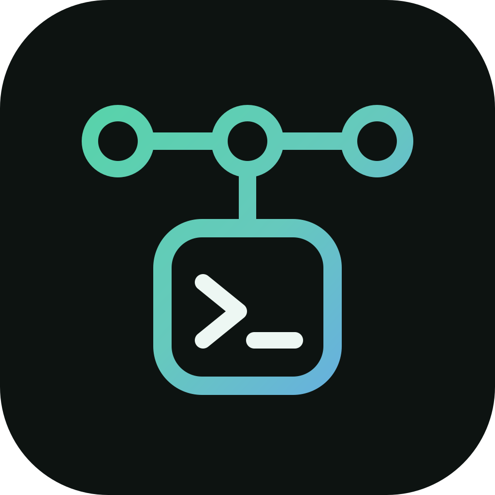
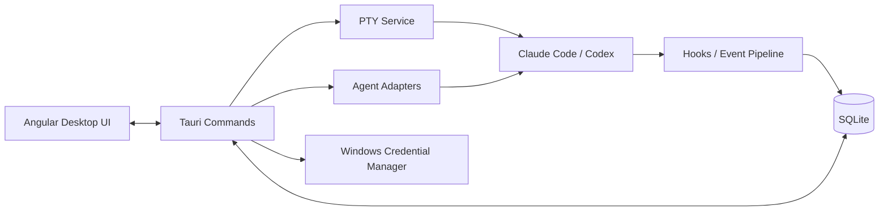

<p align="center">
  
</p>

<h1 align="center">Termexo</h1>

<p align="center"><strong>一个窗口，装下所有编程 Agent</strong></p>

<p align="center">
  <a href="./README.md">English</a> · <strong>简体中文</strong>
</p>

<p align="center">
  
  
  
  
</p>

<p align="center">
  <a href="https://www.termexo.com">官方网站</a> ·
  <a href="https://github.com/gemron/Termexo/releases/latest">下载安装</a> ·
  <a href="https://www.npmjs.com/package/termexo">npm</a>
</p>

Termexo 把 Claude Code、Codex 和围绕它们运行的终端收进一个可恢复的 Windows
工作空间。你可以同时盯住多个 Agent，及时知道谁在等待输入或授权，接着昨天的原生会话
继续工作，也可以在不重搭环境的情况下为 Claude CLI 切换兼容模型供应商。

一条命令运行完整 Windows 应用，不需要注册 Termexo 账号，也不依赖 Termexo 服务器：

```powershell
npx termexo@latest
```

> 当前版本为 **V0.7.0**，窗口去掉系统标题栏改由应用自绘，顶栏横跨整个窗口、左右侧栏在其下；
> 终端改用 GPU 渲染，长回滚滚动顺滑；终端在重连和应用重启后保持在原账号上；
> 配置、插件与技能可在账号之间复制，且不携带任何凭据。


<p align="center">
  <sub>Claude Code 与 Codex 终端并排运行，工作空间会记住它们的布局。</sub>
</p>

## 现在已经能做什么

<table>
  <tr>
    <td width="50%" valign="top">
      <strong>四个 Agent，一块屏幕。</strong><br><br>
      Claude Code、Codex 和 OpenCode 可以并排跑在真实 PTY 终端里，想开多少开多少，再选择当前
      要显示的终端，排成 1–6 行/列的自定义网格。标签支持拖拽排序和中键关闭，工作台支持键盘
      快捷键。每个工作空间都会记住目录、标签、布局、模型和主题。
      <br><br>
      <a href="website/assets/termexo-workbench.png"></a>
    </td>
    <td width="50%" valign="top">
      <strong>Agent 需要你时，马上知道。</strong><br><br>
      等待输入、等待授权、已完成和失败状态一眼可分；常驻提示条、Windows 系统通知与任务栏
      闪烁会把你带回真正需要处理的那个终端。
      <br><br>
      <a href="website/assets/termexo-attention.png"></a>
    </td>
  </tr>
  <tr>
    <td width="50%" valign="top">
      <strong>接着昨天的会话继续。</strong><br><br>
      跨项目、账号、分支和模型搜索本机 Claude Code/Codex/OpenCode 会话。Termexo 调用 CLI 原生的
      <code>claude --resume</code>、<code>codex resume</code> 与 <code>opencode --session</code>
      恢复完整上下文，也能接管 CLI 仍然持有的 Claude 后台会话，并始终只读原生会话文件。
      <br><br>
      <a href="website/assets/termexo-session-center.png"></a>
    </td>
    <td width="50%" valign="top">
      <strong>同一个 CLI，换个模型运行。</strong><br><br>
      让 Claude Code 使用 Anthropic、DeepSeek、MiniMax、GLM 或自定义 Anthropic 兼容 Endpoint。
      供应商保存为 Profile，API Key 交给 Windows 凭据管理器保管，还能一次切换工作空间里的全部 Claude 终端。
      <br><br>
      <a href="website/assets/termexo-models.png"></a>
    </td>
  </tr>
  <tr>
    <td width="50%" valign="top">
      <strong>把一条任务直接跑成 Agent。</strong><br><br>
      任务看板按项目管理任务，带优先级和验收标准。把任务交给 Claude Code、Codex 或 OpenCode，
      它就变成一个真实终端，并随该终端上报的状态在待办、执行中、已完成、已验收之间流转。
    </td>
    <td width="50%" valign="top">
      <strong>不用盯着一路点确认。</strong><br><br>
      三个 Agent 都可以带自动确认启动——Claude 用 <code>--permission-mode auto</code>，Codex 用
      <code>--approve-for-me</code>，OpenCode 用 <code>--auto</code>——终端上的 AUTO 标记在任意
      Agent 下含义一致。
    </td>
  </tr>
</table>

Termexo 默认只在本地工作：没有 Termexo 账号、云服务或强制同步。工作空间状态保存在本机
SQLite，密钥保存在 Windows Credential Manager，Claude/Codex 历史会话只读。Agent CLI
仍会按照你选择的供应商及其隐私政策连接对应模型服务。

界面支持简体中文、英语、西班牙语、法语、德语、日语和韩语。默认自动跟随 Windows
系统语言，也可通过主工具栏手动切换并跨重启保留选择。

## V0.7.0 新增

- **窗口由应用自己绘制**：去掉系统标题栏，顶栏横跨整个窗口、右端是窗口控制按钮，左右两个
  侧栏都从它下面开始。拖动顶栏移动窗口、双击最大化的操作保持不变。
- **终端改用 GPU 渲染**：长回滚滚动不再出现原先 DOM 渲染的卡顿；没有可用 GPU 的机器自动
  回退到原渲染方式。
- **终端保持在原账号上**：重连（包括应用重启后）会依据终端自身记录重建账号目录、代理设置和
  供应商密钥，不再悄悄回落到 CLI 的默认目录。
- **在终端标题栏切换账号**：标题栏显示当前使用的登录账号，换成另一个后终端会以新账号重启并
  开始新会话，模型、MCP 和自动确认保持不变。
- **账号之间可以复制配置**：设置、全局指令、插件与技能会一并复制，凭据、账号身份和会话历史
  则不会。
- **登录完成后自动识别**：不再依赖那些在浏览器流程结束后仍继续运行的登录进程。

[](website/assets/termexo-task-board.png)

<p align="center">
  <sub>一条任务带着验收标准从待办走到已验收，并作为真实的 Agent 终端运行。</sub>
</p>

更早版本的完整更新记录见 [CHANGELOG.cn.md](CHANGELOG.cn.md)。

## 为什么做 Termexo

AI 编程工具通常以独立终端或独立会话运行。项目一多，开发者需要自己记住：

- 哪个终端属于哪个项目、分支和 Agent；
- 哪些会话正在运行、等待输入或等待权限确认；
- 某次 Claude 会话如何恢复；
- 不同模型、Endpoint、API Key 和 MCP 配置应当如何组合；
- 应用重启后哪些只是终端配置，哪些是真正可恢复的原生会话。

Termexo 以 **Workspace** 为组织单位，把这些信息集中到一个可观察、可恢复、
可扩展的本地控制面中。

## 已实现功能

| 能力               | 当前实现                                                                          |
| ------------------ | --------------------------------------------------------------------------------- |
| Workspace 管理     | 创建、改名、换色、手动排序和切换 Workspace，并持久化项目路径、布局与终端配置      |
| 多终端工作台       | 不限终端数量、指定窗口显示、1–6 行列网格、终端/工作区最大化；桌面端启动真实 PTY   |
| Agent 检测         | 在 Windows 上检测 Claude Code、Codex 与 OpenCode 的可执行文件、版本与健康状态     |
| 新建 Agent 会话    | 按目录启动 Claude/Codex/OpenCode，选择隔离账号与 Agent 对应的模型配置，并可开启自动确认 |
| Agent 会话中心     | 只读发现多账号 Claude/Codex/OpenCode 会话，支持搜索、Workspace 过滤、原生恢复，以及接管 CLI 仍持有的 Claude 后台会话 |
| Agent 状态识别     | 为每个终端生成隔离 Hooks 设置，识别思考、工具调用、权限确认、用户输入和完成状态   |
| 模型与 MCP Profile | 管理模型、Endpoint、API Key 与 MCP 配置；Claude CLI 可切换 Anthropic 兼容后端     |
| 网络与 npm Profile | 按全局/Workspace 管理 HTTP/HTTPS/SOCKS 与 npm 配置，测试连通性并在启动时注入      |
| 多账号管理         | 管理多个隔离 Claude 与 ChatGPT/Codex 登录、默认账号、认证状态和启动时选择         |
| CLI 生命周期管理   | 预览、确认、安装或升级官方 Claude Code/Codex/OpenCode npm 包，并在完成后验证结果  |
| 任务看板           | 按项目管理任务，带优先级与验收标准；可将一条任务跑成 Claude/Codex/OpenCode 终端，并从待办跟踪到执行中、已完成、已验收 |
| 提示词资产         | 按终端恢复实时草稿；搜索、收藏、置顶、删除和复用已提交提示词                     |
| 会话交接           | 生成带脱敏和 Token 预算的 Git/任务包；导入导出文档并交给另一个 Agent 继续         |
| 本地数据与密钥     | Workspace、会话索引和事件保存到 SQLite；API Key 保存到 Windows Credential Manager |
| 浏览器预览         | 无需 Rust 即可预览完整 UI，并使用可交互的模拟终端验证布局与基础流程               |


<p align="center">
  <sub>模型、Endpoint 与凭据入口集中管理；已保存的密钥不会回传给前端。</sub>
</p>

## 设计目标

1. **本地优先**：项目路径、终端、会话索引和配置默认留在本机，不依赖 Termexo 云服务。
2. **尊重 Agent 原生能力**：优先调用 Agent 自己的会话恢复与配置机制，不伪造对话恢复。
3. **统一管理而非替代终端**：Termexo 提供工作台、状态和编排层，命令仍在 PTY 与原生 Agent 中运行。
4. **状态可观察**：将不同 Agent 的事件映射为运行、思考、等待输入、等待确认、完成和失败等统一状态。
5. **安全边界清晰**：密钥进入操作系统凭据存储，不写入 SQLite、快照、Hook payload 或日志。
6. **面向多 Agent 扩展**：以后端 Adapter、PTY、Hooks、Snapshot 和 Router 等边界逐步接入更多 CLI。
7. **安全延伸到可信设备**：在不削弱本地所有权和安全边界的前提下，增加共享、远程访问、
   手机审批与协作能力。

## 当前边界

- Claude Code 与 Codex 都已支持原生检测、按账号/模型启动、本地会话发现、恢复和基于生命周期
  事件的终端状态。两者的事件语义并不完全相同；兼容供应商模型切换目前只适用于 Claude 终端。
- 应用退出后，已退出的操作系统进程不会被“伪恢复”。Termexo 只恢复终端配置，
  历史 Claude 会话需要从会话中心显式恢复。
- Claude 与 Codex 原始 JSONL 均只读，Termexo 不修改、重命名或删除这些文件。
- 快照、Git 与任务编排入口会保持隐藏，直到对应生产后端完成。
- V0.5 迁移的是脱敏后的上下文包，不会改写供应商私有的原生会话记录。自动权限批准、
  原生 transcript 改写和跨 Agent 批量模型切换事务仍不在当前版本范围内。

完整产品规划见 [Termexo.md](./Termexo.md)，当前架构边界见
[V0.2 架构说明](./docs/architecture/v0.2.md)。

## 快速开始

### 通过 npm 直接运行

npm 包已经包含 Windows x64 桌面可执行文件：

```powershell
npx termexo
```

也可以全局安装命令：

```powershell
npm install --global termexo
termexo
```

此方式需要 Windows 10/11、WebView2 和 Node.js 18.18 或更高版本。从源码构建
则使用下方列出的新版开发工具链。

### 环境要求

- Windows 10/11；
- Node.js `^22.22.3`、`^24.15.0` 或 `>=26.0.0`；
- 桌面模式需要 Rust stable、Visual Studio C++ Build Tools 和 WebView2；
- 本机已安装 Claude Code 和/或 Codex CLI（也可由 Termexo 管理安装与升级）。

### 1. 获取代码与安装前端依赖

```powershell
git clone https://github.com/gemron/Termexo.git
cd Termexo
npm --prefix apps/desktop-ui install
```

### 2. 运行浏览器预览

```powershell
npm run dev
```

打开 <http://127.0.0.1:4200>。浏览器模式使用模拟终端，支持 `help`、`status`、
`git status` 和 `clear`，适合查看界面与开发前端。

### 3. 运行桌面应用

```powershell
npm run tauri:dev
```

桌面模式使用真实 PTY。若 Claude Code 不在 PATH 中，可以显式指定：

```powershell
$env:TERMEXO_CLAUDE_PATH = "C:\path\to\claude.exe"
npm run tauri:dev
```

## 工作方式



- **Angular UI**：Workspace、终端布局、会话中心、设置和 Inspector。
- **Tauri Commands**：前后端 IPC 边界，暴露最小化桌面能力。
- **PTY Service**：创建、输入、调整尺寸和关闭真实终端进程。
- **Agent Adapters**：检测 Claude/Codex 安装、只读扫描会话，并生成原生启动/恢复命令。
- **Hooks Pipeline**：接收 Agent 生命周期事件，去重并映射统一终端状态。
- **SQLite / Credential Manager**：分别保存结构化本地数据和敏感凭据。

## 数据与安全

| 数据                  | 存储位置                   | 处理原则                               |
| --------------------- | -------------------------- | -------------------------------------- |
| Workspace、终端配置   | SQLite                     | 本地持久化                             |
| Claude/Codex 会话索引 | SQLite                     | 从 Agent 原生会话文件只读解析后 Upsert |
| Agent 事件            | JSONL spool + SQLite       | 按 `event_key` 去重                    |
| 模型与 MCP Profile    | SQLite                     | API Key 明文不进入数据库               |
| 提示词资产与交接包    | SQLite                     | 保存前自动清除常见凭据                 |
| API Key               | Windows Credential Manager | 前端只能读取 `hasCredential`           |
| Agent 原始会话        | Claude/Codex 数据目录      | 只读，不修改、重命名或删除             |

为兼容早期安装，数据库文件和部分 Tauri 内部标识仍沿用旧标识；这不影响产品名称
与新的 `TERMEXO_*` 环境变量。

## 路线图

| 版本 | 目标                                            | 状态     |
| ---- | ----------------------------------------------- | -------- |
| V0.1 | Workspace、多终端、PTY、SQLite 基础             | 已完成   |
| V0.2 | Claude Code 检测、会话恢复、Hooks、Profile      | 已完成   |
| V0.3 | 多 Agent 基础、交互稳定化与文件链接打开方式     | 已完成   |
| V0.4 | 模型切换、Token 实时统计与 Plan 额度/恢复提示   | 已完成   |
| V0.5 | 提示词资产、会话摘要、交接文档与跨 Agent 迁移   | 已完成   |
| V0.6 | OpenCode 第三 Agent、任务看板与统一自动确认     | 当前版本 |
| V0.7 | Workspace 共享、远程电脑与手机访问              | 规划中   |
| V1.0 | 稳定发布、安全加固与完整恢复体验                | 规划中   |

接下来：通知渠道（[#5](https://github.com/gemron/Termexo/issues/5)），之后进入 V0.7 的
Workspace 共享与远程访问。详细依赖和验收标准见 [Termexo.md](Termexo.md)，各版本实际交付内容见
[CHANGELOG.cn.md](CHANGELOG.cn.md)。

## 项目结构

```text
Termexo/
├── apps/desktop-ui/       # Angular 桌面界面与浏览器预览
├── src-tauri/             # Rust Core、PTY、Agent、Hooks、数据库与命令
├── docs/architecture/     # 当前版本架构说明
├── docs/images/           # README 截图
└── Termexo.md             # 产品设计与长期路线图
```

## 开发与验证

```powershell
npm run build
npm test
cargo test --manifest-path src-tauri/Cargo.toml
npm --prefix apps/desktop-ui run e2e:smoke
npm run tauri:build
```

本地开发服务运行后，可重新生成 README 截图：

```powershell
npm run capture:readme
```

## 参与贡献

欢迎通过 [Issues](https://github.com/gemron/Termexo/issues) 报告问题、讨论设计或提出功能建议。
提交代码前，请确认改动属于当前版本范围，并为行为变化补充相应测试。

## 许可证

本项目基于 [MIT 许可证](LICENSE) 开源。
