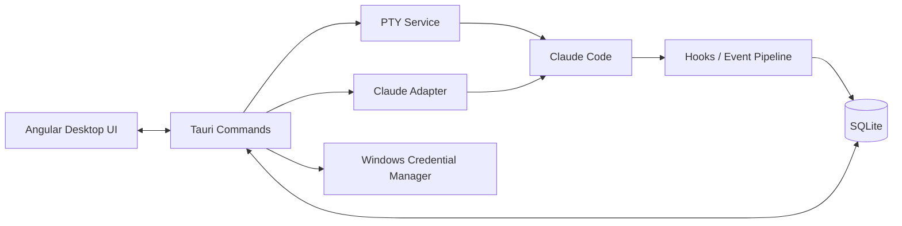

<p align="center">
  
</p>

<h1 align="center">Termexo</h1>

<p align="center">面向 Agent、模型与多设备连接的本地优先 AI 开发工作空间</p>

<p align="center">
  <a href="./README.md">English</a> · <strong>简体中文</strong>
</p>

<p align="center">
  
  
  
  
</p>

Termexo 是一个本地优先的 AI 开发工作空间与控制平面。它把项目、终端、Agent
原生会话、模型/供应商配置和运行状态集中到一个可恢复的桌面环境中，而不是再做一个
彼此隔离的聊天窗口。

当前桌面版本重点统一管理本机 AI 编程终端；后续路线图会沿用同一个 Workspace 模型，
逐步扩展多 Agent 编排、供应商 Plan 余量实时查看、安全的 Workspace 共享，以及从可信
电脑和手机访问工作空间。项目数据与凭据仍由明确的设备、权限和加密边界保护。

> 最新正式版本为 **V0.3 多 Agent 会话工作台**。Claude Code 与 Codex CLI
> 现在可以在同一个桌面 Workspace 中完成检测、启动、会话发现和恢复；Gemini CLI、
> 跨 Agent 模型切换和会话迁移仍在规划中。


<p align="center">
  <sub>7 个 Agent 终端、自定义网格、指定窗口显示、会话状态与 Inspector。</sub>
</p>

## V0.3.0 更新

- 支持不限数量的终端标签，通过终端选择器指定当前布局中显示的窗口。
- 网格布局支持持久化的 `1–6 列 × 1–6 行` 自定义配置，并根据实际窗口数量自动收缩。
- 支持单个终端最大化和整个工作区最大化，可使用 `Shift+Esc` 逐级恢复。
- Claude Code CLI 保持不变，可通过模型 Profile 切换 Anthropic、DeepSeek、MiniMax、
  GLM 或自定义 Anthropic 兼容 Endpoint。
- 批量切换当前 Workspace 内的 Claude Code 后端模型，并在重启终端后继续使用原会话 ID。
- 当本地会话记录存在时使用 `--resume`；记录缺失时改用 `--session-id`，避免启动失败。

- 原生检测 Codex CLI 可执行文件与安装版本，检测过程不弹出系统控制台。
- 通过统一托管 PTY 在指定工作目录中启动 Codex。
- 只读扫描 `CODEX_HOME/sessions` 中的 Codex rollout 元数据，不修改原生 JSONL。
- 使用原生 UUID 和 `codex resume` 恢复 Codex 会话。
- 在 Agent 会话中心统一展示 Claude 与 Codex 会话，并保留各 Agent 独立的恢复参数。
- 支持按 Agent、健康状态、Workspace 和范围搜索筛选会话，并容忍部分扫描失败。
- 行列设置增加步进控制、可视化预览、行列互换与实时容量提示。
- 桌面应用、安装包和网站统一使用新的简约科技线条品牌标识。

## 为什么做 Termexo

AI 编程工具通常以独立终端或独立会话运行。项目一多，开发者需要自己记住：

- 哪个终端属于哪个项目、分支和 Agent；
- 哪些会话正在运行、等待输入或等待权限确认；
- 某次 Claude 会话如何恢复；
- 不同模型、Endpoint、API Key 和 MCP 配置应当如何组合；
- 应用重启后哪些只是终端配置，哪些是真正可恢复的原生会话。

Termexo 以 **Workspace** 为组织单位，把这些信息集中到一个可观察、可恢复、
可扩展的本地控制面中。

## 已实现功能

| 能力               | 当前实现                                                                          |
| ------------------ | --------------------------------------------------------------------------------- |
| Workspace 管理     | 创建、改名、换色、手动排序和切换 Workspace，并持久化项目路径、布局与终端配置      |
| 多终端工作台       | 不限终端数量、指定窗口显示、1–6 行列网格、终端/工作区最大化；桌面端启动真实 PTY   |
| Claude Code 检测   | 在 Windows 上检测 `claude.exe` / `claude.cmd`、版本与健康状态                     |
| 新建 Claude 会话   | 选择会话名称、模型 Profile 和 MCP Profile 后启动 Claude                           |
| 历史会话中心       | 只读扫描 Claude JSONL，会话搜索、Workspace 过滤，并通过原生 `--resume` 恢复       |
| Agent 状态识别     | 为每个终端生成隔离 Hooks 设置，识别思考、工具调用、权限确认、用户输入和完成状态   |
| 模型与 MCP Profile | 管理模型、Endpoint、API Key 与 MCP 配置；Claude CLI 可切换 Anthropic 兼容后端     |
| 本地数据与密钥     | Workspace、会话索引和事件保存到 SQLite；API Key 保存到 Windows Credential Manager |
| 浏览器预览         | 无需 Rust 即可预览完整 UI，并使用可交互的模拟终端验证布局与基础流程               |


<p align="center">
  <sub>模型、Endpoint 与凭据入口集中管理；已保存的密钥不会回传给前端。</sub>
</p>

## 设计目标

1. **本地优先**：项目路径、终端、会话索引和配置默认留在本机，不依赖 Termexo 云服务。
2. **尊重 Agent 原生能力**：优先调用 Agent 自己的会话恢复与配置机制，不伪造对话恢复。
3. **统一管理而非替代终端**：Termexo 提供工作台、状态和编排层，命令仍在 PTY 与原生 Agent 中运行。
4. **状态可观察**：将不同 Agent 的事件映射为运行、思考、等待输入、等待确认、完成和失败等统一状态。
5. **安全边界清晰**：密钥进入操作系统凭据存储，不写入 SQLite、快照、Hook payload 或日志。
6. **面向多 Agent 扩展**：以后端 Adapter、PTY、Hooks、Snapshot 和 Router 等边界逐步接入更多 CLI。
7. **安全延伸到可信设备**：在不削弱本地所有权和安全边界的前提下，增加共享、远程访问、
   手机审批与协作能力。

## 当前边界

- Claude Code 仍是能力最完整的 Adapter。Codex 已支持原生检测、启动、本地会话发现和恢复，
  但 Codex Hooks 与统一运行事件尚未实现；Gemini 仍为界面原型。
- 应用退出后，已退出的操作系统进程不会被“伪恢复”。Termexo 只恢复终端配置，
  历史 Claude 会话需要从会话中心显式恢复。
- Claude 与 Codex 原始 JSONL 均只读，Termexo 不修改、重命名或删除这些文件。
- Inspector 中的 Git 与任务页当前使用原型数据，尚未连接真实后端。
- 当前版本不包含自动权限批准、跨 Agent 会话迁移或跨 Agent 批量模型切换事务。

完整产品规划见 [Termexo.md](./Termexo.md)，当前架构边界见
[V0.2 架构说明](./docs/architecture/v0.2.md)。

## 快速开始

### 环境要求

- Windows 10/11；
- Node.js `^22.22.3`、`^24.15.0` 或 `>=26.0.0`；
- 桌面模式需要 Rust stable、Visual Studio C++ Build Tools 和 WebView2；
- 使用 Claude 功能需要本机已安装 Claude Code。

### 1. 获取代码与安装前端依赖

```powershell
git clone https://github.com/gemron/Termexo.git
cd Termexo
npm --prefix apps/desktop-ui install
```

### 2. 运行浏览器预览

```powershell
npm run dev
```

打开 <http://127.0.0.1:4200>。浏览器模式使用模拟终端，支持 `help`、`status`、
`git status` 和 `clear`，适合查看界面与开发前端。

### 3. 运行桌面应用

```powershell
npm run tauri:dev
```

桌面模式使用真实 PTY。若 Claude Code 不在 PATH 中，可以显式指定：

```powershell
$env:TERMEXO_CLAUDE_PATH = "C:\path\to\claude.exe"
npm run tauri:dev
```

## 工作方式



- **Angular UI**：Workspace、终端布局、会话中心、设置和 Inspector。
- **Tauri Commands**：前后端 IPC 边界，暴露最小化桌面能力。
- **PTY Service**：创建、输入、调整尺寸和关闭真实终端进程。
- **Claude Adapter**：安装检测、只读会话扫描和原生启动/恢复命令。
- **Hooks Pipeline**：接收 Claude Hooks，去重并映射统一 Agent 状态。
- **SQLite / Credential Manager**：分别保存结构化本地数据和敏感凭据。

## 数据与安全

| 数据                | 存储位置                         | 处理原则                          |
| ------------------- | -------------------------------- | --------------------------------- |
| Workspace、终端配置 | SQLite                           | 本地持久化                        |
| Claude 会话索引     | SQLite                           | 从 Claude JSONL 只读解析后 Upsert |
| Agent 事件          | JSONL spool + SQLite             | 按 `event_key` 去重               |
| 模型与 MCP Profile  | SQLite                           | API Key 明文不进入数据库          |
| API Key             | Windows Credential Manager       | 前端只能读取 `hasCredential`      |
| Claude 原始会话     | `%USERPROFILE%\.claude\projects` | 只读，不回写                      |

为兼容早期安装，数据库文件和部分 Tauri 内部标识仍沿用旧标识；这不影响产品名称
与新的 `TERMEXO_*` 环境变量。

## 路线图

| 版本 | 目标                                             | 状态     |
| ---- | ------------------------------------------------ | -------- |
| V0.1 | Workspace、多终端、PTY、SQLite 基础              | 已完成   |
| V0.2 | Claude Code 检测、会话恢复、Hooks、Profile       | 已完成   |
| V0.3 | Codex CLI Adapter 与 Claude/Codex 统一会话中心   | 当前版本 |
| V0.4 | Gemini Adapter、模型切换、Plan 余量监控与失败回滚 | 规划中   |
| V0.5 | 会话摘要与跨 Agent 迁移                          | 规划中   |
| V0.6 | 多 Agent 协作、任务编排与通知                    | 规划中   |
| V0.7 | Workspace 共享、远程电脑与手机访问               | 规划中   |
| V1.0 | 稳定发布、安全加固与完整恢复体验                 | 规划中   |

## 项目结构

```text
Termexo/
├── apps/desktop-ui/       # Angular 桌面界面与浏览器预览
├── src-tauri/             # Rust Core、PTY、Agent、Hooks、数据库与命令
├── docs/architecture/     # 当前版本架构说明
├── docs/images/           # README 截图
└── Termexo.md             # 产品设计与长期路线图
```

## 开发与验证

```powershell
npm run build
npm test
cargo test --manifest-path src-tauri/Cargo.toml
npm --prefix apps/desktop-ui run e2e:smoke
npm run tauri:build
```

本地开发服务运行后，可重新生成 README 截图：

```powershell
npm run capture:readme
```

## 参与贡献

欢迎通过 [Issues](https://github.com/gemron/Termexo/issues) 报告问题、讨论设计或提出功能建议。
提交代码前，请确认改动属于当前版本范围，并为行为变化补充相应测试。

## 许可证

仓库当前尚未声明开源许可证。在许可证补充前，请勿默认获得复制、修改或分发授权。
