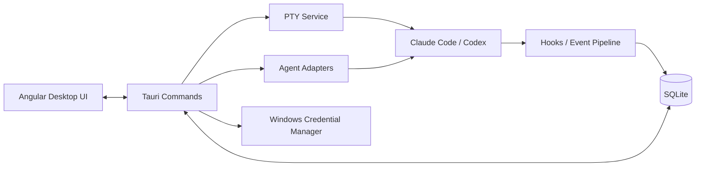

<p align="center">
  
</p>

<h1 align="center">Termexo</h1>

<p align="center"><strong>One window for every coding agent</strong></p>

<p align="center">
  <strong>English</strong> · <a href="./README.cn.md">简体中文</a>
</p>

<p align="center">
  
  
  
  
</p>

<p align="center">
  <a href="https://www.termexo.com">Website</a> ·
  <a href="https://github.com/gemron/Termexo/releases/latest">Download</a> ·
  <a href="https://www.npmjs.com/package/termexo">npm</a>
</p>

Termexo puts Claude Code, Codex, and the terminals around them into one recoverable Windows
workspace. Keep several agents visible at once, see immediately when one needs input or
approval, reopen yesterday's native session, and switch the Claude CLI between compatible
model providers without rebuilding your setup.

Run the complete Windows app with one command—no Termexo account or server required:

```powershell
npx termexo@latest
```

> The current version is **V0.6.0**. It adds OpenCode as a third first-class agent, a task board
> that turns a task into a running agent terminal and tracks it from todo through verified,
> automatic confirmation for every agent, Claude background-session reclaim, and a reworked
> terminal workbench with tab reordering and keyboard shortcuts.


<p align="center">
  <sub>Claude Code and Codex terminals side by side in a workspace that remembers its layout.</sub>
</p>

## What Works Today

<table>
  <tr>
    <td width="50%" valign="top">
      <strong>Four agents. One screen.</strong><br><br>
      Open as many real PTY terminals as you need, choose which stay visible, and arrange them
      in a custom 1–6 row/column grid. Each workspace remembers its folder, tabs, layout, model,
      and theme.
      <br><br>
      <a href="website/assets/termexo-workbench.png"></a>
    </td>
    <td width="50%" valign="top">
      <strong>Know when an agent needs you.</strong><br><br>
      Waiting for input, waiting for approval, completed, and failed states are distinct. A
      persistent banner, native Windows notification, and taskbar flash bring you back to the
      exact terminal that needs attention.
      <br><br>
      <a href="website/assets/termexo-attention.png"></a>
    </td>
  </tr>
  <tr>
    <td width="50%" valign="top">
      <strong>Pick up yesterday's conversation.</strong><br><br>
      Search local Claude Code and Codex sessions across projects, accounts, branches, and
      models. Termexo restores them through the CLIs' own <code>claude --resume</code> and
      <code>codex resume</code> commands while keeping native session files read-only.
      <br><br>
      <a href="website/assets/termexo-session-center.png"></a>
    </td>
    <td width="50%" valign="top">
      <strong>Same CLI. Different model.</strong><br><br>
      Point Claude Code at Anthropic, DeepSeek, MiniMax, GLM, or a custom Anthropic-compatible
      endpoint. Save providers as profiles, keep API keys in Windows Credential Manager, and
      switch every Claude terminal in a workspace together.
      <br><br>
      <a href="website/assets/termexo-models.png"></a>
    </td>
  </tr>
</table>

Termexo is local by default: it has no account, cloud service, or required sync. Workspace
state stays in local SQLite storage, credentials stay in Windows Credential Manager, and
Claude/Codex session histories are read-only. The agent CLIs still connect to the providers
you configure under their own terms and privacy policies.

The interface is available in Simplified Chinese, English, Spanish, French, German, Japanese,
and Korean. It follows the Windows language automatically, or you can choose a language from
the main toolbar and keep that choice across restarts.

## V0.3.18 Updates

- Model profiles are organised by provider. One profile now holds the Claude side (Anthropic
  protocol) and the Codex side (OpenAI protocol) together — a model and endpoint each, a switch
  each, both on by default, and one shared API key. A provider serves the two agents on different
  paths (DeepSeek answers on `/anthropic` and `/v1`), which the previous single-endpoint profile
  could not express.
- DeepSeek, MiniMax, GLM, Kimi, and SCNet ship as presets taken from their published API docs.
  Selecting a provider fills both sides at once and shows where the values came from. The official
  Anthropic and OpenAI presets remain, alongside a blank Custom entry, and every field stays
  editable.
- A side the provider publishes no endpoint for switches itself off rather than sitting half
  configured, so "enabled" always means "reachable".
- Launching an agent only ever picks a profile enabled for it: naming one that is switched off for
  that agent falls back to the default instead of pointing it at the other protocol's URL.
- On upgrade, existing single-protocol profiles move to the side their protocol served, with the
  other side left off.
- Fix Codex never actually switching to a third-party provider. The endpoint was passed as
  `OPENAI_BASE_URL` and `OPENAI_MODEL`, neither of which Codex reads — it resolves providers from
  its own config, so every session kept talking to the official endpoint. Termexo now declares the
  provider through the `-c` overrides Codex supports (`model_provider`, `base_url`, `env_key`,
  `wire_api`), with the API key staying in the environment rather than on the command line. Note
  that current Codex speaks only the Responses API (`{base_url}/responses`), so reaching a provider
  depends on it offering that interface.

## V0.3.17 Updates

- Fix the IME candidate window appearing in a screen corner, with a second small box pinned to the
  top-left. The IME anchors to xterm's hidden textarea, which xterm moves only once the cursor
  moves inside the viewport — before that it sits off-screen (`left: -9999em`, zero-sized). Typing
  on a terminal that has just opened, or one scrolled away from its cursor, left Windows without a
  caret rect. Termexo now re-anchors it from the cursor coordinates when a composition starts or
  the terminal takes focus.
- Waiting statuses can be cleared. Each entry in the global notice panel has a clear button, and
  the header clears them all at once. A waiting terminal returns to Running and a completed one to
  Idle, so the bell, the attention banner, and the terminal header all settle together; the agent
  raises a fresh notice when something changes.

## V0.3.16 Updates

- Fix right-click pasting twice in Claude Code. Claude turns on mouse reporting (`?1000h`), so
  xterm forwarded the right button to it and Claude read the clipboard and pasted a copy of its
  own on top of Termexo's. Codex leaves mouse reporting off, which is why only Claude doubled the
  text. The right button is now stopped before it reaches xterm and Termexo alone acts on it —
  copy with a selection, paste without one. No TUI receives the right button any more, matching
  the Windows terminal convention Termexo already follows.

## V0.3.15 Updates

- Fix Shift+Tab doing nothing in Claude Code and other agents. xterm emits no input for that
  combination, so the key never reached the terminal; Termexo now sends the reverse-tab sequence
  (CSI Z) and stops the browser from treating it as focus navigation.
- Fix right-click paste inserting the text twice. Paste previously came from the native WebView2
  menu and the agent handled it again; Termexo now owns the right-click — copy when there is a
  selection, paste when there is not, written exactly once.
- Rename a terminal by double-clicking its title. Enter saves, Escape cancels.
- The model name in each agent terminal's header is now a button that switches only that
  terminal. The toolbar button becomes "Switch all", making the batch scope explicit.
- The agent menu closes on an outside click or Escape.
- CLI upgrade checks query the published version before comparing, so an already-current CLI no
  longer offers an upgrade — only "Reinstall anyway" — and installs show a progress indicator.
- Builds installed through npm can update themselves: Termexo closes, npm installs the new
  version, and the app reopens. Windows locks a running executable, so the install has to happen
  after the app exits. Installer builds still open the release page.

## V0.3.14 Updates

- Fix agents hanging on every message when a proxy was entered as `https://`. A proxy URL's
  scheme says how to *reach the proxy*, not what it forwards: `https://` asks the client to
  complete a TLS handshake with the proxy port, which ordinary proxies drop, so requests stall
  until they time out. Saving now rejects it and suggests the corrected address.
- Proxy connectivity tests go beyond a TCP handshake: they issue a `CONNECT` through the proxy
  and verify the tunnel actually reaches the model endpoint, distinguishing authentication
  required (407), a refused destination, and a tunnel that opens but leads nowhere.
- Add import/export for proxy profiles. Exported files carry **no passwords** and no
  machine-local credential handles; imported profiles are always created fresh, never overwrite
  a profile of the same name, never become the default, and pass the same validation as a
  manual save.
- Setting `NO_PROXY` now also sets npm's `noproxy`, since npm's own config outranks the
  environment variable and would otherwise bypass the exclusion list.

## V0.3.13 Updates

- Add update checks: once at launch, then every 6 hours against the latest GitHub release. A
  published update raises an in-app notice and a Windows notification, and the download page is
  one click away. Each version is announced only once.
- Update checks can be switched off under Settings → Diagnostics, which stops the background
  requests immediately. Failed checks stay silent; only a manual check reports an error.
- Fix the top toolbar overlapping the window buttons in narrow windows, while keeping the
  toolbar centred on wide ones.
- Refine the Diagnostics and CLI panels: an unavailable CLI no longer keeps the success palette,
  body text is larger, the selected agent card reads more clearly, and the detail grids collapse
  earlier in narrow windows.

## V0.3.12 Updates

- Fix terminal model profiles being lost on restart. The backend snapshot struct was missing the
  `profileId` and `mcpProfileId` fields, so switching to a third-party model and reopening the
  window fell back to the native default. The session model persistence V0.3.11 announced never
  actually worked; it does now.
- Fix missing Windows notifications when Termexo runs from npm. The app registers its
  AppUserModelID at startup, so toasts are delivered even without an installer.
- Report notification delivery failures instead of swallowing them, so a failed toast falls back
  to a system dialog.

## V0.3.11 Updates

- Keep the model profile a session last ran with when resuming it, so a third-party model no longer
  falls back to the native default after restarting the app. An explicit pick in the resume settings
  still wins.
- Rebuild the session center around the session list: agent health collapses into a status line,
  search and filters share one toolbar row, and the resume settings fold into an expandable panel
  that summarizes the active profiles while collapsed.
- Fix the Codex resume settings grid, where the model field wrapped onto its own row out of
  alignment with the rest of the form.

## V0.3.10 Updates

- Add Simplified Chinese, English, Spanish, French, German, Japanese, and Korean interface support.
- Follow the operating-system language by default, react to system-language changes, and fall back
  to English when the locale is not supported.
- Add a compact language picker to the main toolbar; manual selections apply immediately, persist
  across restarts, and can return to automatic system-language mode at any time.
- Localize the workspace, terminal layout, Agent status, session center, model switching, settings,
  directory picker, runtime diagnostics, in-app alerts, Windows notifications, and taskbar prompts.
- Add language-family resolution, persistence, interpolation, and document-locale tests while
  retaining the complete existing desktop UI test suite.

## V0.3.9 Updates

- Rebuild restored Claude launch commands, model profiles, credentials, provider URLs, and hook
  environments before mounting terminals; migrate legacy `MiniMax-M3[1m]` profiles to
  `MiniMax-M3` so restored MiniMax sessions no longer fall back to Claude Sonnet.
- Add Codex lifecycle hooks for prompts, tools, permissions, compaction, subagents, completion, and
  session boundaries, with accurate terminal states for new and restored sessions.
- Add persistent waiting/approval banners, Windows notifications, and taskbar attention while
  keeping completed-task feedback concise and actionable.
- Add workspace merging with terminal preservation and safe persistence.
- Improve responsive sidebar behavior, terminal refitting, grid sizing, maximized/fullscreen views,
  hidden initial Codex commands, and narrow-window usability.
- Document the repository architecture and release workflow for Claude Code contributors.

## V0.3.8 Updates

- Enable keyring's native Windows Credential Manager backend instead of its process-local mock
  backend, so MiniMax and other model-provider API keys survive new sessions and app restarts.
- Read back every credential immediately after writing it and fail the save if secure storage did
  not persist the exact secret.
- Add compile-time backend coverage and an explicit native credential-store round-trip test.
- Existing V0.3.7 users need to re-enter third-party model-provider API keys once after upgrading.

## V0.3.7 Updates

- Add safe workspace deletion and a native folder picker when creating a workspace.
- Surface waiting-input, approval, and completed terminals across every workspace through a global
  attention center and prominent notifications.
- Keep workspace terminal views mounted, stabilize xterm sizing and focus after workspace switches,
  and restore reliable mouse-wheel scrollback without selecting an unrelated pane.
- Align the animated terminal status indicator before the title and improve its running-state
  background treatment.
- Integrate Codex's native `agent-turn-complete` notification so new and resumed sessions reliably
  transition from running or thinking to completed.
- Regenerate restored Codex launch commands before terminal mounting so existing workspaces also
  receive native completion events instead of remaining in a stale running state.
- Route a missing MiniMax or other compatible-provider API key directly to the affected Profile,
  require a replacement before saving or switching, and keep the value in Windows secure storage.
- Turn each workspace color into a complete application theme, including DaisyUI surfaces, sidebars,
  dialogs, terminal background, selection, ANSI accents, and cursor.

## V0.3.6 Updates

- Verify model-profile API keys against Windows secure storage instead of trusting a stale database
  reference.
- Treat a deleted secure-storage entry as an unconfigured credential and stop preserving invalid
  references when a profile is saved.
- Replace the low-level keyring error during provider switching with an actionable localized prompt.

## V0.3.5 Updates

- Adjust terminal font size from the workspace toolbar and persist the preference between launches.
- Move CLI tabs left or right without disrupting the selected terminal or workspace order.
- Make waiting, approval, rate-limit, and completed states visually distinct in tabs, panels, and
  the Inspector; keep up to 250 Agent events and show more recent activity.
- Preserve xterm scrollback and refit terminals when hidden panes become visible, fixing terminals
  that could no longer scroll vertically.
- Start a fresh session when switching model providers, validate custom provider credentials, and
  update the MiniMax preset to `MiniMax-M3[1m]`.
- Detect Claude 429/rate-limit and timeout failures, surface actionable notices, and resolve
  managed-account sessions against the correct isolated Claude configuration directory.
- Explain that an explicit native session resume reloads its historical context, while provider
  switching deliberately avoids replaying the previous session.

## V0.3.4 Updates

- Apply the Termexo DaisyUI theme from the document root so global surfaces inherit the correct
  foreground and background colors on every supported system.
- Replace OKLCH-only critical theme tokens with equivalent hexadecimal colors and use
  `color-mix()` only as a progressive enhancement.
- Add explicit website and desktop color fallbacks to prevent black text on black backgrounds.
- Extend browser smoke coverage to verify the root theme and computed foreground/background
  contrast.

## V0.3.3 Updates

- Published the official [`termexo`](https://www.npmjs.com/package/termexo) package with the
  complete Windows x64 desktop executable included.
- Run the desktop app directly with `npx termexo@latest`, or install the command globally with
  `npm install --global termexo@latest`.
- Kept the package practical for npm delivery: about 4.8 MB compressed and 13.6 MB installed.
- Added release-time PE validation, build-to-package SHA-256 verification, isolated installation
  tests, and direct process-launch verification.

## V0.3.2 Updates

- Create, authenticate, manage, and switch isolated Claude Code and ChatGPT/Codex accounts.
- Launch or resume Codex with a selected account and optional model while keeping native rollout files read-only.
- Scan session indexes across system and managed account homes, and preserve the originating account during recovery.
- Resize and independently collapse both sidebars; widths and visibility persist across launches.
- Remove the Google CLI entry and hide unfinished Snapshot, Tasks, and prototype Git surfaces.
- Verify toolbar alignment, menus, dialogs, toast surfaces, compact layouts, and sidebar interactions with automated browser tests.

## V0.3.0 Updates

- Keep any number of terminal tabs and choose which terminals are visible in the active layout.
- Configure and persist grid layouts from `1–6 columns × 1–6 rows`; unused rows collapse automatically.
- Maximize an individual terminal or the entire workspace, then restore with `Shift+Esc`.
- Keep the Claude Code CLI while switching model profiles between Anthropic, DeepSeek,
  MiniMax, GLM, or a custom Anthropic-compatible endpoint.
- Batch-switch Claude Code terminals in the active workspace and restart them with their existing session IDs.
- Use `--resume` when a local transcript exists and fall back to `--session-id` when it does not.

- Detect the native Codex CLI executable and report its installed version without opening a console window.
- Start Codex in a selected workspace directory through the same managed PTY used by other terminals.
- Read Codex rollout metadata from `CODEX_HOME/sessions` without modifying native JSONL files.
- Resume a Codex session by its native UUID using `codex resume`.
- Show Claude and Codex sessions together in the Agent session center while preserving Agent-specific resume options.
- Search and filter sessions by agent, health, workspace, and scope, with partial-scan error handling.
- Adjust grid rows and columns with steppers, a visual preview, dimension swapping, and live capacity feedback.
- Use the new compact circuit-line identity across the desktop app, installers, and website.

## V0.4.0

- Create global or workspace-scoped network profiles for HTTP, HTTPS, SOCKS, and `NO_PROXY`.
- Manage npm registry, proxy, `https-proxy`, `strict-ssl`, and enterprise CA settings without rewriting the user's global npm configuration.
- Keep proxy passwords in the operating-system credential store and reject credentials embedded directly in proxy URLs.
- Test DNS/TCP reachability and apply the effective workspace-over-global profile to Claude and Codex launch environments.
- Preview and confirm one-click Claude Code/Codex installation or upgrades from their official npm packages, with exact version or dist-tag selection.
- Apply the effective network profile to npm, preflight the registry, prevent overlapping mutations, enforce a timeout, and verify CLI health after completion.
- Discover standard proxy environment variables or the current Windows user proxy and import it as an editable Profile without reading passwords.
- Restore the previously detected CLI version automatically when npm mutation or post-install health verification fails.
- Switch one or many Claude/Codex terminals as a transaction: preflight every launch, and restore original commands, sessions, and profiles after a partial failure.
- Extract per-turn Token usage from native Claude/Codex event and transcript data, then show cumulative totals, Tokens/minute, per-terminal totals, and a recent activity curve.
- Configure a Plan allowance, reset time, and alert threshold per provider Profile. The inspector shows remaining allowance, reset countdown, one-time threshold warnings, and blocks switching to an exhausted Profile.
- Provider quota APIs are not universally available. V0.4 labels configured/local figures as estimates and unsupported providers as unavailable instead of presenting estimates as official data.

## V0.5.0

- Capture live Claude Code and Codex input independently per terminal, recover unsent drafts after an abnormal close, and keep submitted prompt history searchable, favoritable, and pinnable.
- Redact common API keys, bearer tokens, passwords, and secrets before prompt assets or handoff packages are persisted.
- Generate terminal- or workspace-scoped handoff packages with task state, session summaries, recent prompts, terminal output, Git status/diff, changed files, validation evidence, risks, and next actions.
- Enforce a configurable Token budget and truncate bulky terminal output or Git diff without breaking UTF-8 content.
- Export and import readable Markdown or machine-readable JSON handoff documents, then send the handoff directly to another Claude Code or Codex terminal to continue work.
- Keep Chinese IME composition anchored to the active terminal caret when another terminal is producing output.

## V0.6.0

- Run OpenCode as a third first-class agent beside Claude Code and Codex, with the same launch, resume, restart-restore, and automatic-confirmation controls.
- Turn a task into a running agent terminal from the task board: each task carries its project, agent, model, and acceptance criteria, and moves through todo, executing, completed, and verified as its terminal reports status.
- Launch any agent with automatic confirmation — `--permission-mode auto` for Claude, `--approve-for-me` for Codex, and `--auto` for OpenCode — so the AUTO chip means the same thing whichever agent drew it.
- Reclaim a Claude session the CLI still holds open through background-session inspection, fork, and attach, instead of starting a terminal that exits on its first message.
- Reorder terminal tabs by dragging, close one with the middle mouse button, scroll the tab strip with the wheel, and drive the workbench from the keyboard.
- Bound every CLI version and session probe with a timeout that terminates the whole Windows command tree, so an unresponsive agent no longer hangs the session centre.
- Skip a single unreadable session record instead of failing the whole list, matching how the Claude and Codex transcript scanners already behave.

## Why Termexo

AI coding tools usually run in isolated terminals and sessions. As the number of projects
grows, developers have to remember:

- which terminal belongs to which project, branch, and agent;
- which sessions are running, waiting for input, or waiting for approval;
- how to resume a specific Claude session;
- how model, endpoint, API key, and MCP configurations fit together;
- which parts of a workspace can actually be restored after an application restart.

Termexo uses the **Workspace** as its organizing unit and turns this scattered state into
a local control plane that is observable, recoverable, and extensible.

## Implemented Features

| Capability               | Current implementation                                                                                             |
| ------------------------ | ------------------------------------------------------------------------------------------------------------------ |
| Workspace management     | Create, rename, theme, manually reorder, and switch workspaces; persist paths, layouts, and terminal configuration |
| Multi-terminal workbench | Unlimited tabs, explicit pane selection, configurable 1–6 row/column grids, pane/workspace maximize, and real PTYs |
| Claude Code detection    | Detect `claude.exe` / `claude.cmd`, version, and health on Windows                                                 |
| Start agent sessions     | Launch Claude or Codex with a working directory, isolated login account, and Agent-specific model configuration    |
| Session center           | Read-only multi-account Claude/Codex discovery, search, workspace filtering, and native resume                     |
| Agent status tracking    | Isolated hooks per terminal for thinking, tool use, approval, user input, completion, and failure states           |
| Model and MCP profiles   | Manage endpoints, keys, and MCP configuration; switch Claude CLI across Anthropic-compatible backends              |
| Network and npm profiles | Scope HTTP/HTTPS/SOCKS and npm settings globally or per workspace, test reachability, and inject them at launch    |
| Account management       | Manage multiple isolated Claude and ChatGPT/Codex logins, defaults, authentication status, and launch-time choice  |
| Managed CLI lifecycle    | Preview, confirm, install, or upgrade official Claude Code and Codex npm packages, then verify the result          |
| Prompt assets            | Recover live per-terminal drafts; search, favorite, pin, delete, and reuse submitted prompts                       |
| Session handoff          | Build redacted, token-budgeted Git/task packages; import/export documents and continue in another Agent            |
| Local data and secrets   | Store workspace/session/event data in SQLite and API keys in Windows Credential Manager                            |
| Browser preview          | Preview the complete UI without Rust and exercise layout flows through an interactive simulated terminal           |


<p align="center">
  <sub>Models, endpoints, and credential entry are managed in one place. Stored secrets are never returned to the frontend.</sub>
</p>

## Design Goals

1. **Local first** — Project paths, terminals, session indexes, and configuration stay on
   the local machine by default. Termexo does not require a Termexo cloud service.
2. **Preserve native agent semantics** — Prefer native session and configuration
   mechanisms instead of pretending that a terminated process is still alive.
3. **Coordinate terminals, do not replace them** — Termexo provides the workbench,
   state, and orchestration layer. Commands still run inside real PTYs and agents.
4. **Make agent state observable** — Map agent-specific events into common running,
   thinking, input, approval, completed, and failed states.
5. **Keep security boundaries explicit** — Secrets belong in the operating-system
   credential store, not in SQLite, snapshots, hook payloads, or logs.
6. **Grow into a multi-agent architecture** — Evolve around adapters, PTY, hooks,
   snapshots, and routing boundaries so more CLIs can be added without rebuilding the core.
7. **Extend workspaces across trusted devices** — Add sharing, remote access, mobile
   approvals, and collaboration without weakening local ownership or security boundaries.

## Current Boundaries

- Claude Code and Codex both support native detection, account/model-aware launch, local session
  discovery, resume, and lifecycle-driven terminal states. Their event vocabularies are not
  identical, and compatible-provider model switching currently applies to Claude terminals.
- When the app exits, terminated operating-system processes are not “fake restored.”
  Termexo restores terminal configuration; historical Claude sessions must be resumed
  explicitly from the session center.
- Claude and Codex JSONL files are read-only. Termexo never edits, renames, or deletes them.
- Snapshot, Git, and task orchestration surfaces remain hidden until their production
  backends are implemented.
- V0.5 migrates a redacted context package, not a provider's private native transcript. Automatic
  permission approval, native transcript rewriting, and cross-agent batch model-switch transactions
  remain outside the current release.

See [Termexo.md](./Termexo.md) for the complete product plan and
[V0.2 architecture](./docs/architecture/v0.2.md) for current technical boundaries.

## Quick Start

### Run directly from npm

The npm package includes the Windows x64 desktop executable:

```powershell
npx termexo
```

Or install the command globally:

```powershell
npm install --global termexo
termexo
```

This path requires Windows 10/11, WebView2, and Node.js 18.18 or later. Building
from source uses the newer toolchain listed below.

### Requirements

- Windows 10/11;
- Node.js `^22.22.3`, `^24.15.0`, or `>=26.0.0`;
- Rust stable, Visual Studio C++ Build Tools, and WebView2 for the desktop runtime;
- a local Claude Code and/or Codex CLI installation (Termexo can also manage installation and upgrades).

### 1. Clone and install frontend dependencies

```powershell
git clone https://github.com/gemron/Termexo.git
cd Termexo
npm --prefix apps/desktop-ui install
```

### 2. Run the browser preview

```powershell
npm run dev
```

Open <http://127.0.0.1:4200>. Browser mode uses a simulated terminal with `help`,
`status`, `git status`, and `clear`, making it suitable for UI development and review.

### 3. Run the desktop application

```powershell
npm run tauri:dev
```

Desktop mode uses real PTYs. If Claude Code is not available on PATH, specify it:

```powershell
$env:TERMEXO_CLAUDE_PATH = "C:\path\to\claude.exe"
npm run tauri:dev
```

## How It Works



- **Angular UI** — workspaces, terminal layouts, session center, settings, and Inspector.
- **Tauri Commands** — a minimal IPC boundary between the frontend and desktop core.
- **PTY Service** — creates, writes to, resizes, and closes real terminal processes.
- **Agent Adapters** — Claude/Codex installation detection, read-only session scanning, and native launch/resume.
- **Hooks Pipeline** — receives agent lifecycle events, deduplicates them, and maps common terminal states.
- **SQLite / Credential Manager** — stores structured local data and sensitive credentials separately.

## Data and Security

| Data                                  | Storage                       | Policy                                       |
| ------------------------------------- | ----------------------------- | -------------------------------------------- |
| Workspaces and terminal configuration | SQLite                        | Local persistence                            |
| Claude/Codex session index            | SQLite                        | Upserted from read-only native session files |
| Agent events                          | JSONL spool + SQLite          | Deduplicated by `event_key`                  |
| Model and MCP profiles                | SQLite                        | Plaintext API keys never enter the database  |
| Prompt assets and handoff packages    | SQLite                        | Common credentials are redacted before save  |
| API keys                              | Windows Credential Manager    | The frontend can read only `hasCredential`   |
| Native agent sessions                 | Claude/Codex data directories | Read-only; never modified or deleted         |

For compatibility with early installations, the database filename and some internal Tauri
identifiers still use a legacy name. This does not affect the Termexo product name or new
`TERMEXO_*` environment variables.

## Roadmap

| Version | Goal                                                                           | Status      |
| ------- | ------------------------------------------------------------------------------ | ----------- |
| V0.1    | Workspace, multi-terminal, PTY, and SQLite foundation                          | Complete    |
| V0.2    | Claude detection, session resume, hooks, and profiles                          | Complete    |
| V0.3    | Multi-agent foundation, interaction stabilization, and file-link openers        | Complete    |
| V0.4    | Model switching, live token telemetry, and Plan quota/reset alerts              | Complete    |
| V0.5    | Prompt assets, handoff documents, session summaries, and cross-agent migration  | Current     |
| V0.6    | Multi-agent collaboration, orchestration, and domestic/international channels   | Planned     |
| V0.7    | Workspace sharing, remote computers, and mobile access                         | Planned     |
| V1.0    | Stable release, security hardening, and complete recovery UX                   | Planned     |

Near-term order: interaction and file-opening fixes ([#11](https://github.com/gemron/Termexo/issues/11),
[#15](https://github.com/gemron/Termexo/issues/15)) → model switching and token/Plan visibility
([#4](https://github.com/gemron/Termexo/issues/4), [#12](https://github.com/gemron/Termexo/issues/12)) →
prompt assets and session handoff ([#8](https://github.com/gemron/Termexo/issues/8),
[#7](https://github.com/gemron/Termexo/issues/7)) → notification channels
([#5](https://github.com/gemron/Termexo/issues/5)). See [Termexo.md](Termexo.md) for dependencies and acceptance criteria.

## Repository Layout

```text
Termexo/
├── apps/desktop-ui/       # Angular desktop UI and browser preview
├── src-tauri/             # Rust core, PTY, agents, hooks, database, and commands
├── docs/architecture/     # Architecture notes for implemented versions
├── docs/images/           # README screenshots
└── Termexo.md             # Product design and long-term roadmap
```

## Development and Verification

```powershell
npm run build
npm test
cargo test --manifest-path src-tauri/Cargo.toml
npm --prefix apps/desktop-ui run e2e:smoke
npm run tauri:build
```

With the local development server running, regenerate the README screenshots with:

```powershell
npm run capture:readme
```

## Contributing

Use [Issues](https://github.com/gemron/Termexo/issues) to report bugs, discuss design
decisions, or propose features. Before submitting code, make sure the change fits the
current release scope and add tests for behavior changes.

## License

Released under the [MIT License](LICENSE).
