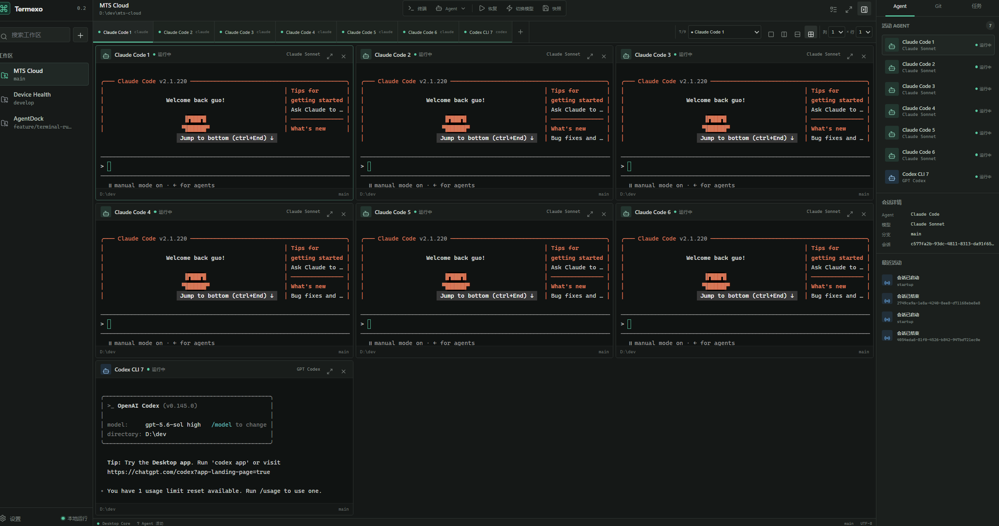
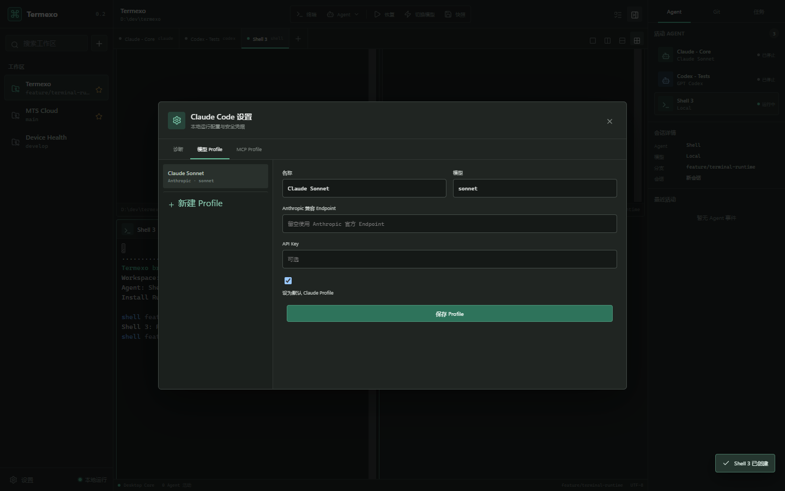
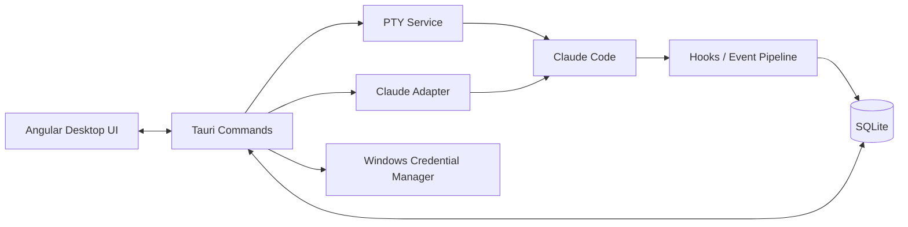

<h1 align="center">Termexo</h1>

<p align="center">A local-first AI development workspace for agents, models, and connected devices</p>

<p align="center">
  <strong>English</strong> · <a href="./README.cn.md">简体中文</a>
</p>

<p align="center">
  
  
  
  
</p>

Termexo is a local-first AI development workspace and control plane. It brings projects,
terminals, native agent sessions, model/provider profiles, and runtime state into one
recoverable desktop environment instead of another isolated chat window.

The current desktop release focuses on coordinating local AI coding terminals. The roadmap
extends the same Workspace model into multi-agent orchestration, real-time provider Plan
quota visibility, secure workspace sharing, and access from trusted computers and phones.
Local project data and credentials remain protected by explicit device, permission, and
encryption boundaries.

> The current release is **V0.2, focused on Claude Code**. Codex CLI, Gemini CLI,
> cross-agent model switching, and session migration are planned but not implemented.



<p align="center">
  <sub>Seven active agent terminals with a configurable grid, explicit pane selection, session state, and the Inspector.</sub>
</p>

## V0.2.2 Updates

- Keep any number of terminal tabs and choose which terminals are visible in the active layout.
- Configure and persist grid layouts from `1–6 columns × 1–6 rows`; unused rows collapse automatically.
- Maximize an individual terminal or the entire workspace, then restore with `Shift+Esc`.
- Keep the Claude Code CLI while switching model profiles between Anthropic, DeepSeek,
  MiniMax, GLM, or a custom Anthropic-compatible endpoint.
- Batch-switch Claude Code terminals in the active workspace and restart them with their existing session IDs.
- Use `--resume` when a local transcript exists and fall back to `--session-id` when it does not.

## Why Termexo

AI coding tools usually run in isolated terminals and sessions. As the number of projects
grows, developers have to remember:

- which terminal belongs to which project, branch, and agent;
- which sessions are running, waiting for input, or waiting for approval;
- how to resume a specific Claude session;
- how model, endpoint, API key, and MCP configurations fit together;
- which parts of a workspace can actually be restored after an application restart.

Termexo uses the **Workspace** as its organizing unit and turns this scattered state into
a local control plane that is observable, recoverable, and extensible.

## Implemented Features

| Capability               | Current implementation                                                                                             |
| ------------------------ | ------------------------------------------------------------------------------------------------------------------ |
| Workspace management     | Create, rename, theme, manually reorder, and switch workspaces; persist paths, layouts, and terminal configuration |
| Multi-terminal workbench | Unlimited tabs, explicit pane selection, configurable 1–6 row/column grids, pane/workspace maximize, and real PTYs |
| Claude Code detection    | Detect `claude.exe` / `claude.cmd`, version, and health on Windows                                                 |
| Start Claude sessions    | Select a session name, model profile, and MCP profile before launch                                                |
| Session center           | Read-only Claude JSONL scanning, search, workspace filtering, and native `--resume`                                |
| Agent status tracking    | Isolated hooks per terminal for thinking, tool use, approval, user input, completion, and failure states           |
| Model and MCP profiles   | Manage endpoints, keys, and MCP configuration; switch Claude CLI across Anthropic-compatible backends              |
| Local data and secrets   | Store workspace/session/event data in SQLite and API keys in Windows Credential Manager                            |
| Browser preview          | Preview the complete UI without Rust and exercise layout flows through an interactive simulated terminal           |



<p align="center">
  <sub>Models, endpoints, and credential entry are managed in one place. Stored secrets are never returned to the frontend.</sub>
</p>

## Design Goals

1. **Local first** — Project paths, terminals, session indexes, and configuration stay on
   the local machine by default. Termexo does not require a Termexo cloud service.
2. **Preserve native agent semantics** — Prefer native session and configuration
   mechanisms instead of pretending that a terminated process is still alive.
3. **Coordinate terminals, do not replace them** — Termexo provides the workbench,
   state, and orchestration layer. Commands still run inside real PTYs and agents.
4. **Make agent state observable** — Map agent-specific events into common running,
   thinking, input, approval, completed, and failed states.
5. **Keep security boundaries explicit** — Secrets belong in the operating-system
   credential store, not in SQLite, snapshots, hook payloads, or logs.
6. **Grow into a multi-agent architecture** — Evolve around adapters, PTY, hooks,
   snapshots, and routing boundaries so more CLIs can be added without rebuilding the core.
7. **Extend workspaces across trusted devices** — Add sharing, remote access, mobile
   approvals, and collaboration without weakening local ownership or security boundaries.

## Current Boundaries

- V0.2 fully integrates Claude Code only. Codex and Gemini terminals currently appear as
  UI prototypes.
- When the app exits, terminated operating-system processes are not “fake restored.”
  Termexo restores terminal configuration; historical Claude sessions must be resumed
  explicitly from the session center.
- Claude JSONL files are read-only. Termexo never edits, renames, or deletes them.
- The Git and Tasks tabs in the Inspector currently use prototype data and are not wired
  to production backends.
- Automatic permission approval, cross-agent session migration, and cross-agent batch
  model-switch transactions are outside the current release.

See [Termexo.md](./Termexo.md) for the complete product plan and
[V0.2 architecture](./docs/architecture/v0.2.md) for current technical boundaries.

## Quick Start

### Requirements

- Windows 10/11;
- Node.js `^22.22.3`, `^24.15.0`, or `>=26.0.0`;
- Rust stable, Visual Studio C++ Build Tools, and WebView2 for the desktop runtime;
- a local Claude Code installation for Claude integration.

### 1. Clone and install frontend dependencies

```powershell
git clone https://github.com/gemron/Termexo.git
cd Termexo
npm --prefix apps/desktop-ui install
```

### 2. Run the browser preview

```powershell
npm run dev
```

Open <http://127.0.0.1:4200>. Browser mode uses a simulated terminal with `help`,
`status`, `git status`, and `clear`, making it suitable for UI development and review.

### 3. Run the desktop application

```powershell
npm run tauri:dev
```

Desktop mode uses real PTYs. If Claude Code is not available on PATH, specify it:

```powershell
$env:TERMEXO_CLAUDE_PATH = "C:\path\to\claude.exe"
npm run tauri:dev
```

## How It Works



- **Angular UI** — workspaces, terminal layouts, session center, settings, and Inspector.
- **Tauri Commands** — a minimal IPC boundary between the frontend and desktop core.
- **PTY Service** — creates, writes to, resizes, and closes real terminal processes.
- **Claude Adapter** — installation detection, read-only session scanning, and native launch/resume.
- **Hooks Pipeline** — receives Claude hooks, deduplicates events, and maps common agent states.
- **SQLite / Credential Manager** — stores structured local data and sensitive credentials separately.

## Data and Security

| Data                                  | Storage                          | Policy                                       |
| ------------------------------------- | -------------------------------- | -------------------------------------------- |
| Workspaces and terminal configuration | SQLite                           | Local persistence                            |
| Claude session index                  | SQLite                           | Upserted from read-only Claude JSONL parsing |
| Agent events                          | JSONL spool + SQLite             | Deduplicated by `event_key`                  |
| Model and MCP profiles                | SQLite                           | Plaintext API keys never enter the database  |
| API keys                              | Windows Credential Manager       | The frontend can read only `hasCredential`   |
| Native Claude sessions                | `%USERPROFILE%\.claude\projects` | Read-only; never written back                |

For compatibility with early installations, the database filename and some internal Tauri
identifiers still use a legacy name. This does not affect the Termexo product name or new
`TERMEXO_*` environment variables.

## Roadmap

| Version | Goal                                                             | Status   |
| ------- | ---------------------------------------------------------------- | -------- |
| V0.1    | Workspace, multi-terminal, PTY, and SQLite foundation            | Complete |
| V0.2    | Claude detection, session resume, hooks, and profiles            | Current  |
| V0.3    | Codex CLI and Gemini CLI adapters                                | Planned  |
| V0.4    | Model switching, provider plan quota monitoring, and rollback    | Planned  |
| V0.5    | Session summaries and cross-agent migration                      | Planned  |
| V0.6    | Multi-agent collaboration, task orchestration, and notifications | Planned  |
| V0.7    | Workspace sharing, remote computers, and mobile access           | Planned  |
| V1.0    | Stable release, security hardening, and complete recovery UX     | Planned  |

## Repository Layout

```text
Termexo/
├── apps/desktop-ui/       # Angular desktop UI and browser preview
├── src-tauri/             # Rust core, PTY, agents, hooks, database, and commands
├── docs/architecture/     # Architecture notes for implemented versions
├── docs/images/           # README screenshots
└── Termexo.md             # Product design and long-term roadmap
```

## Development and Verification

```powershell
npm run build
npm test
cargo test --manifest-path src-tauri/Cargo.toml
npm --prefix apps/desktop-ui run e2e:smoke
npm run tauri:build
```

With the local development server running, regenerate the README screenshots with:

```powershell
npm run capture:readme
```

## Contributing

Use [Issues](https://github.com/gemron/Termexo/issues) to report bugs, discuss design
decisions, or propose features. Before submitting code, make sure the change fits the
current release scope and add tests for behavior changes.

## License

This repository does not currently declare an open-source license. Until one is added,
do not assume permission to copy, modify, or redistribute the project.
