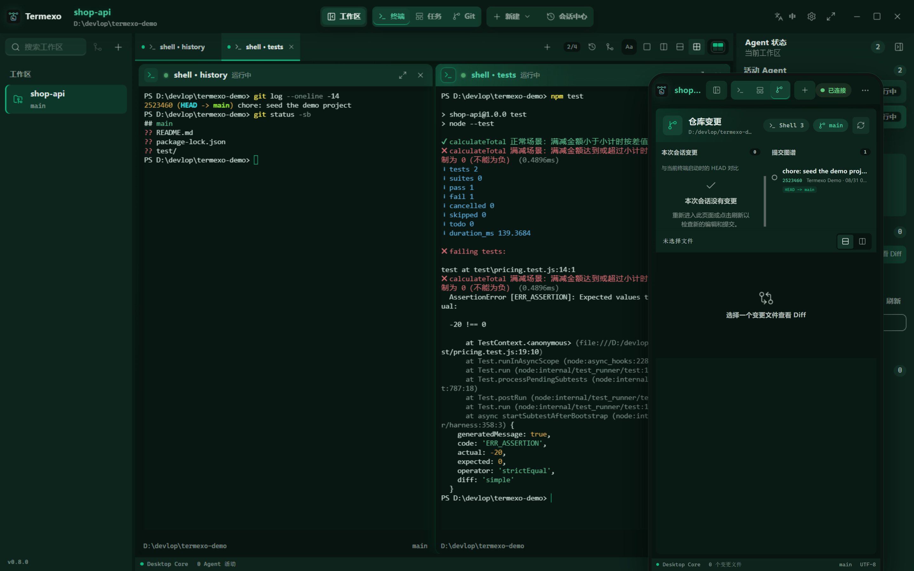
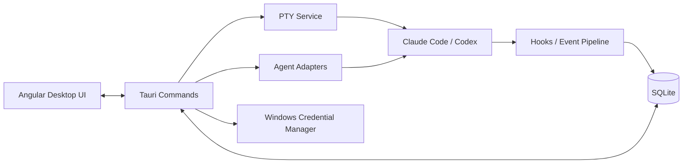

<p align="center">
  
</p>

<h1 align="center">Termexo</h1>

<p align="center"><strong>One window for every coding agent</strong></p>

<p align="center">
  <strong>English</strong> · <a href="./README.cn.md">简体中文</a>
</p>

<p align="center">
  
  
  
  
</p>

<p align="center">
  <a href="https://www.termexo.com">Website</a> ·
  <a href="https://github.com/gemron/Termexo/releases/latest">Download</a> ·
  <a href="https://www.npmjs.com/package/termexo">npm</a>
</p>

Termexo puts Claude Code, Codex, and the terminals around them into one recoverable Windows
workspace. Keep several agents visible at once, see immediately when one needs input or
approval, reopen yesterday's native session, and switch the Claude CLI between compatible
model providers without rebuilding your setup. Turn on remote access and that same workbench
opens in a browser on your phone or a second computer, driving the very same live terminals —
so the agent waiting on an approval can be answered from wherever you are.

Run the complete Windows app with one command—no Termexo account or server required:

```powershell
npx termexo@latest
```

> The current version is **V0.8.4**.


<p align="center">
  <sub>Claude Code and Codex terminals side by side in a workspace that remembers its layout.</sub>
</p>

## What Works Today

<table>
  <tr>
    <td width="50%" valign="top">
      <strong>Four agents. One screen.</strong><br><br>
      Run Claude Code, Codex, and OpenCode side by side in as many real PTY terminals as you
      need, choose which stay visible, and arrange them in a custom 1–6 row/column grid. Reorder
      tabs by dragging, close one with the middle mouse button, and drive the workbench from the
      keyboard. Each workspace remembers its folder, tabs, layout, model, and theme.
      <br><br>
      <a href="website/assets/termexo-workbench.png"></a>
    </td>
    <td width="50%" valign="top">
      <strong>Know when an agent needs you.</strong><br><br>
      Waiting for input, waiting for approval, completed, and failed states are distinct. A
      persistent banner, native Windows notification, and taskbar flash bring you back to the
      exact terminal that needs attention.
      <br><br>
      <a href="website/assets/termexo-attention.png"></a>
    </td>
  </tr>
  <tr>
    <td width="50%" valign="top">
      <strong>Pick up yesterday's conversation.</strong><br><br>
      Search local Claude Code, Codex, and OpenCode sessions across projects, accounts,
      branches, and models. Termexo restores them through the CLIs' own
      <code>claude --resume</code>, <code>codex resume</code>, and <code>opencode --session</code>
      commands, reclaims a Claude session the CLI still holds open, and keeps native session
      files read-only.
      <br><br>
      <a href="website/assets/termexo-session-center.png"></a>
    </td>
    <td width="50%" valign="top">
      <strong>Same CLI. Different model.</strong><br><br>
      Point Claude Code at Anthropic, DeepSeek, MiniMax, GLM, or a custom Anthropic-compatible
      endpoint. Save providers as profiles, keep API keys in Windows Credential Manager, and
      switch every Claude terminal in a workspace together.
      <br><br>
      <a href="website/assets/termexo-models.png"></a>
    </td>
  </tr>
  <tr>
    <td width="50%" valign="top">
      <strong>Answer it from your phone.</strong><br><br>
      Turn on remote access and any phone, tablet, or second computer on your network or VPN
      opens the whole workbench in a browser — the same workspaces and the same live terminals,
      reading and writing the very PTYs the desktop is running. Terminals scroll by finger, the
      layout folds down to one terminal with panels that float over it, and the link is HTTPS
      behind an access token you can reveal, turn into a QR code, or rotate.
      <br><br>
      <a href="website/assets/termexo-phone.png"></a>
    </td>
    <td width="50%" valign="top">
      <strong>See what this session changed.</strong><br><br>
      The Git view follows the active terminal and measures against the HEAD that terminal started
      on: the files it touched, the commits it made, and a unified or split diff of any one of
      them. It keeps reading while you are in it, so the list stays current without a refresh, and
      it comes back to the file and layout you left it on.
      <br><br>
      <a href="website/assets/termexo-git.png"></a>
    </td>
  </tr>
  <tr>
    <td width="50%" valign="top">
      <strong>Turn a task into a running agent.</strong><br><br>
      The task board keeps projects and tasks with priorities and acceptance criteria. Hand one
      to Claude Code, Codex, or OpenCode and it becomes a real terminal, moving through todo,
      executing, completed, and verified as that terminal reports its own status.
    </td>
    <td width="50%" valign="top">
      <strong>Let it run without babysitting.</strong><br><br>
      Start any agent with automatic confirmation — <code>--permission-mode auto</code> for
      Claude, <code>--approve-for-me</code> for Codex, <code>--auto</code> for OpenCode — so the
      AUTO chip on a terminal means the same thing whichever agent drew it.
    </td>
  </tr>
</table>

Termexo is local by default: it has no account, cloud service, or required sync. Workspace
state stays in local SQLite storage, credentials stay in Windows Credential Manager, and
Claude/Codex session histories are read-only. The agent CLIs still connect to the providers
you configure under their own terms and privacy policies.

The interface is available in Simplified Chinese, English, Spanish, French, German, Japanese,
and Korean. It follows the Windows language automatically, or you can choose a language from
the main toolbar and keep that choice across restarts.

## What's New in V0.8.4

- **Codex scrolls on a phone.** A finger drag reached xterm as a wheel event, which xterm damps as a
  trackpad's below 50px and answers with a single arrow key on the alternate buffer however far the
  wheel turned. Codex CLI runs full-screen without tracking the mouse, so those arrow keys were all
  it saw: four rows of finger travel moved its transcript one line, which reads as not scrolling at
  all. A drag now takes the route the program on the other end actually reads, and follows the
  finger row for row.
- **A wheel notch scrolls three lines in a full-screen agent**, the distance a native Windows
  terminal moves, rather than the one line xterm sent.

## What's New in V0.8.3

- **Typing keeps up with a busy Agent.** Every synchronous backend command ran on the one IPC
  thread, so the 3-second Git poll (around half a second each) and the per-second event sync queued
  ahead of each keystroke; keys arrived in bursts. Those commands now run on a thread pool, and
  `write_terminal` — the keystroke path — has the IPC thread to itself. Measured p99 keystroke
  latency fell from 514 ms to 19 ms.
- **Git status is watched, not polled.** The repository shown in the sidebar is now watched for
  file changes and re-read only when something actually changes, instead of every three seconds.
  Idle Git work drops to zero, and an edit shows up in about a second. One `git status` reads HEAD,
  branch and the working tree together where three separate git processes ran before.
- **Hook events stop piling up.** The event spool and its database table grew without bound — into
  hundreds of megabytes that every launch re-read from the start. Events now carry only the fields
  the UI shows, the read position survives restarts, a drained spool is truncated, an index serves
  the newest-first read, and events past 30 days are pruned. The startup event read fell from over
  a second to a few milliseconds.
- **Tasks can be interrupted and amended mid-run.** Stopping a running task now keeps its terminal
  and session so it can be resumed or handed back to 待办, and a running task can be sent extra
  instructions through the same Agent session instead of only after a failed verification.
- **The Agent status panel is reorganised.** A pinned overview shows the current Agent with its
  allowance, change count, branch and running count; the details below — active Agents, session
  details, code changes, provider allowances, recent activity — are grouped into collapsible
  sections that remember what you left open.

## What's New in V0.8.2

- **Typing keeps up with a working agent.** Every open terminal subscribed to the output stream
  separately, so each chunk an agent produced woke all of them and ran change detection across the
  whole workbench — with several terminals open, keystrokes queued behind that work. A single shared
  subscription now dispatches by terminal, and the screen settles once a frame rather than once per
  chunk.
- **Restoring terminals no longer stalls.** Replayed scrollback was fed back through the task,
  handoff and startup readers on every reconnect, which re-analysed each terminal's entire history
  at startup. History is now redrawn without being counted a second time.
- **1M context and reasoning effort.** A model profile can ask Claude Code for the 1M context window
  and set the reasoning effort for either agent, and a launch can override both for that terminal
  alone.
- **The empty workspace offers the same agents.** Its button opened a plain Shell and left starting
  an Agent to a menu that had not been found yet. It now lists Claude Code, Codex CLI, OpenCode and
  Shell — the same list the tab strip's menu carries.

## What's New in V0.8.1

- **A first run opens on a guide.** A new install used to seed three sample workspaces pointed at a
  path that exists on nobody's machine, whose Agent terminals resumed session ids that never
  existed. It now starts empty and says what a workspace is and what the first three steps are.
- **New terminal belongs to the tab strip.** It has moved off the window's own toolbar onto the
  strip it adds to, taking the agent menu with it, and the button follows the last tab.
- **What you create is what you see.** Starting a terminal from the task board or the Git view left
  it behind that view; every path that opens one now returns to the terminal view and reveals it.
- **Remote access settings, rearranged.** The listening address and port sit together instead of at
  opposite edges of the dialog, the copy button sits on its link, and the master switch is set apart
  from the option below it with the connected-device count beside it.

## What's New in V0.8.0

- **Remote access.** Turn it on in the settings and any phone, tablet, or second computer on the
  same network or VPN opens the whole workbench in a browser: the same workspaces and terminals,
  reading and writing the same live PTYs. Self-signed HTTPS by default, entered with an access
  token the settings panel can reveal, turn into a QR code, or rotate.
- **Terminals scroll by finger.** A drag synthesises a wheel event for xterm to dispatch, which
  scrolls the normal buffer and reports the wheel to full-screen agents such as Claude Code and
  OpenCode exactly as the desktop wheel does, with inertia after the finger lifts.
- **Size follows the view in use.** Work on the desktop and the terminal uses the desktop's width,
  pick up the phone and it becomes the phone's, come back and it returns. Every other client
  renders that same grid, panning sideways when its window cannot hold it.
- **A workbench that fits a phone.** Below 640px the split layouts fold to a single terminal, both
  side panels float over the workspace instead of taking a column of it, controls grow to a
  finger's size, and the tools at the right of the top bar collapse into one menu — which is what
  stopped the toolbar from scrolling half its buttons out of reach.
- **Pick a folder without a native dialog.** Starting a terminal from a browser used to open
  `window.prompt`, which some mobile browsers suppress outright. It is an in-app dialog now,
  prefilled with the workspace folder, so accepting it is a single tap.
- **A Git view that stays put.** It no longer drops back to the terminals when the active terminal
  changes or a read fails, keeps reading the repository while it is open, says why it could not
  read one, and returns to the file and layout you left it on.

## What's New in V0.7.0

- **The window draws its own chrome.** No system title bar: the top bar spans the whole window
  with the window controls at its right edge, and both side panels start beneath it. Dragging the
  bar still moves the window, double-clicking still maximises.
- **Terminals render on the GPU.** A long scrollback scrolls without the stutter the DOM renderer
  produced. Machines without a usable GPU fall back to the previous renderer.
- **A terminal keeps its account.** Reconnecting — including after the app restarts — rebuilds the
  account directory, proxy settings, and provider key from what the terminal records, instead of
  quietly falling back to the CLI's default home.
- **Switch a terminal's account from its header.** The header names the account it runs on, and
  picking another restarts that terminal on it with a new session, leaving the model, MCP profile,
  and automatic confirmation alone.
- **Copy configuration between accounts.** Settings, instructions, plugins, and skills move across;
  credentials, account identity, and session history never do.
- **Sign-in is noticed on its own.** A finished login refreshes the account without waiting for a
  CLI that keeps running after the browser flow returns.

[](website/assets/termexo-task-board.png)

<p align="center">
  <sub>A task carries its acceptance criteria from todo through to verified, and runs as a real agent terminal.</sub>
</p>

Release notes for every earlier version live in [CHANGELOG.md](CHANGELOG.md).

## Why Termexo

AI coding tools usually run in isolated terminals and sessions. As the number of projects
grows, developers have to remember:

- which terminal belongs to which project, branch, and agent;
- which sessions are running, waiting for input, or waiting for approval;
- how to resume a specific Claude session;
- how model, endpoint, API key, and MCP configurations fit together;
- which parts of a workspace can actually be restored after an application restart.

Termexo uses the **Workspace** as its organizing unit and turns this scattered state into
a local control plane that is observable, recoverable, and extensible.

## Implemented Features

| Capability               | Current implementation                                                                                             |
| ------------------------ | ------------------------------------------------------------------------------------------------------------------ |
| Workspace management     | Create, rename, theme, manually reorder, and switch workspaces; persist paths, layouts, and terminal configuration |
| Multi-terminal workbench | Unlimited tabs, explicit pane selection, configurable 1–6 row/column grids, pane/workspace maximize, and real PTYs |
| Agent detection          | Detect the Claude Code, Codex, and OpenCode executables, their versions, and health on Windows                     |
| Start agent sessions     | Launch Claude, Codex, or OpenCode with a working directory, isolated login account, Agent-specific model configuration, and optional automatic confirmation |
| Session center           | Read-only multi-account Claude/Codex/OpenCode discovery, search, workspace filtering, native resume, and reclaim of a Claude session the CLI still holds open |
| Agent status tracking    | Isolated hooks per terminal for thinking, tool use, approval, user input, completion, and failure states           |
| Model and MCP profiles   | Manage endpoints, keys, and MCP configuration; switch Claude CLI across Anthropic-compatible backends              |
| Network and npm profiles | Scope HTTP/HTTPS/SOCKS and npm settings globally or per workspace, test reachability, and inject them at launch    |
| Account management       | Manage multiple isolated Claude and ChatGPT/Codex logins, defaults, authentication status, and launch-time choice  |
| Managed CLI lifecycle    | Preview, confirm, install, or upgrade the official Claude Code, Codex, and OpenCode npm packages, then verify the result |
| Task board               | Organise projects and tasks with priorities and acceptance criteria, run one as a Claude/Codex/OpenCode terminal, and track it from todo through executing, completed, and verified |
| Prompt assets            | Recover live per-terminal drafts; search, favorite, pin, delete, and reuse submitted prompts                       |
| Session handoff          | Build redacted, token-budgeted Git/task packages; import/export documents and continue in another Agent            |
| Git graph and diff       | Show the active terminal's branch, commit topology, and changes since terminal start with unified or split diff    |
| Remote access            | Serve the whole workbench over HTTPS to phones and other computers on the network, gated by an access token with QR entry and rotation, with every remote call passing an explicit command allowlist |
| Local data and secrets   | Store workspace/session/event data in SQLite and API keys in Windows Credential Manager                            |
| Browser preview          | Preview the complete UI without Rust and exercise layout flows through an interactive simulated terminal           |


<p align="center">
  <sub>Models, endpoints, and credential entry are managed in one place. Stored secrets are never returned to the frontend.</sub>
</p>

## Design Goals

1. **Local first** — Project paths, terminals, session indexes, and configuration stay on
   the local machine by default. Termexo does not require a Termexo cloud service.
2. **Preserve native agent semantics** — Prefer native session and configuration
   mechanisms instead of pretending that a terminated process is still alive.
3. **Coordinate terminals, do not replace them** — Termexo provides the workbench,
   state, and orchestration layer. Commands still run inside real PTYs and agents.
4. **Make agent state observable** — Map agent-specific events into common running,
   thinking, input, approval, completed, and failed states.
5. **Keep security boundaries explicit** — Secrets belong in the operating-system
   credential store, not in SQLite, snapshots, hook payloads, or logs.
6. **Grow into a multi-agent architecture** — Evolve around adapters, PTY, hooks,
   snapshots, and routing boundaries so more CLIs can be added without rebuilding the core.
7. **Extend workspaces across trusted devices** — Add sharing, remote access, mobile
   approvals, and collaboration without weakening local ownership or security boundaries.

## Current Boundaries

- Claude Code and Codex both support native detection, account/model-aware launch, local session
  discovery, resume, and lifecycle-driven terminal states. Their event vocabularies are not
  identical, and compatible-provider model switching currently applies to Claude terminals.
- When the app exits, terminated operating-system processes are not “fake restored.”
  Termexo restores terminal configuration; historical Claude sessions must be resumed
  explicitly from the session center.
- Claude and Codex JSONL files are read-only. Termexo never edits, renames, or deletes them.
- Snapshot surfaces remain hidden until their production backend is implemented. Git session
  changes are repository deltas observed since terminal start; concurrent editors may contribute.
- V0.5 migrates a redacted context package, not a provider's private native transcript. Automatic
  permission approval, native transcript rewriting, and cross-agent batch model-switch transactions
  remain outside the current release.

See [Termexo.md](./Termexo.md) for the complete product plan and
[V0.2 architecture](./docs/architecture/v0.2.md) for current technical boundaries.

## Quick Start

### Run directly from npm

The npm package includes the Windows x64 desktop executable:

```powershell
npx termexo
```

Or install the command globally:

```powershell
npm install --global termexo
termexo
```

This path requires Windows 10/11, WebView2, and Node.js 18.18 or later. Building
from source uses the newer toolchain listed below.

### Requirements

- Windows 10/11;
- Node.js `^22.22.3`, `^24.15.0`, or `>=26.0.0`;
- Rust stable, Visual Studio C++ Build Tools, and WebView2 for the desktop runtime;
- a local Claude Code and/or Codex CLI installation (Termexo can also manage installation and upgrades).

### 1. Clone and install frontend dependencies

```powershell
git clone https://github.com/gemron/Termexo.git
cd Termexo
npm --prefix apps/desktop-ui install
```

### 2. Run the browser preview

```powershell
npm run dev
```

Open <http://127.0.0.1:4200>. Browser mode uses a simulated terminal with `help`,
`status`, `git status`, and `clear`, making it suitable for UI development and review.

### 3. Run the desktop application

```powershell
npm run tauri:dev
```

Desktop mode uses real PTYs. If Claude Code is not available on PATH, specify it:

```powershell
$env:TERMEXO_CLAUDE_PATH = "C:\path\to\claude.exe"
npm run tauri:dev
```

## How It Works



- **Angular UI** — workspaces, terminal layouts, session center, settings, and Inspector.
- **Tauri Commands** — a minimal IPC boundary between the frontend and desktop core.
- **PTY Service** — creates, writes to, resizes, and closes real terminal processes.
- **Agent Adapters** — Claude/Codex installation detection, read-only session scanning, and native launch/resume.
- **Hooks Pipeline** — receives agent lifecycle events, deduplicates them, and maps common terminal states.
- **SQLite / Credential Manager** — stores structured local data and sensitive credentials separately.

## Data and Security

| Data                                  | Storage                       | Policy                                       |
| ------------------------------------- | ----------------------------- | -------------------------------------------- |
| Workspaces and terminal configuration | SQLite                        | Local persistence                            |
| Claude/Codex session index            | SQLite                        | Upserted from read-only native session files |
| Agent events                          | JSONL spool + SQLite          | Deduplicated by `event_key`                  |
| Model and MCP profiles                | SQLite                        | Plaintext API keys never enter the database  |
| Prompt assets and handoff packages    | SQLite                        | Common credentials are redacted before save  |
| API keys                              | Windows Credential Manager    | The frontend can read only `hasCredential`   |
| Native agent sessions                 | Claude/Codex data directories | Read-only; never modified or deleted         |

For compatibility with early installations, the database filename and some internal Tauri
identifiers still use a legacy name. This does not affect the Termexo product name or new
`TERMEXO_*` environment variables.

## Roadmap

| Version | Goal                                                                           | Status      |
| ------- | ------------------------------------------------------------------------------ | ----------- |
| V0.1    | Workspace, multi-terminal, PTY, and SQLite foundation                          | Complete    |
| V0.2    | Claude detection, session resume, hooks, and profiles                          | Complete    |
| V0.3    | Multi-agent foundation, interaction stabilization, and file-link openers        | Complete    |
| V0.4    | Model switching, live token telemetry, and Plan quota/reset alerts              | Complete    |
| V0.5    | Prompt assets, handoff documents, session summaries, and cross-agent migration  | Complete    |
| V0.6    | OpenCode as a third agent, the task board, and automatic confirmation           | Current     |
| V0.7    | Workspace sharing, remote computers, and mobile access                         | Planned     |
| V1.0    | Stable release, security hardening, and complete recovery UX                   | Planned     |

Next up: notification channels ([#5](https://github.com/gemron/Termexo/issues/5)), then the
V0.7 work on workspace sharing and reaching your machine from elsewhere. See
[Termexo.md](Termexo.md) for dependencies and acceptance criteria, and
[CHANGELOG.md](CHANGELOG.md) for what each released version actually shipped.

## Repository Layout

```text
Termexo/
├── apps/desktop-ui/       # Angular desktop UI and browser preview
├── src-tauri/             # Rust core, PTY, agents, hooks, database, and commands
├── docs/architecture/     # Architecture notes for implemented versions
├── docs/images/           # README screenshots
└── Termexo.md             # Product design and long-term roadmap
```

## Development and Verification

```powershell
npm run build
npm test
cargo test --manifest-path src-tauri/Cargo.toml
npm --prefix apps/desktop-ui run e2e:smoke
npm run tauri:build
```

With the local development server running, regenerate the README screenshots with:

```powershell
npm run capture:readme
```

## Contributing

Use [Issues](https://github.com/gemron/Termexo/issues) to report bugs, discuss design
decisions, or propose features. Before submitting code, make sure the change fits the
current release scope and add tests for behavior changes.

## License

Released under the [MIT License](LICENSE).
