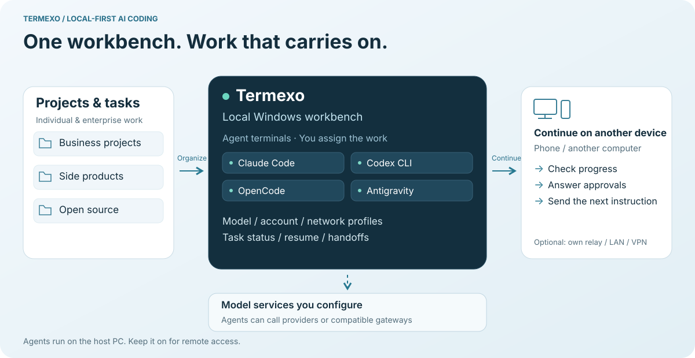
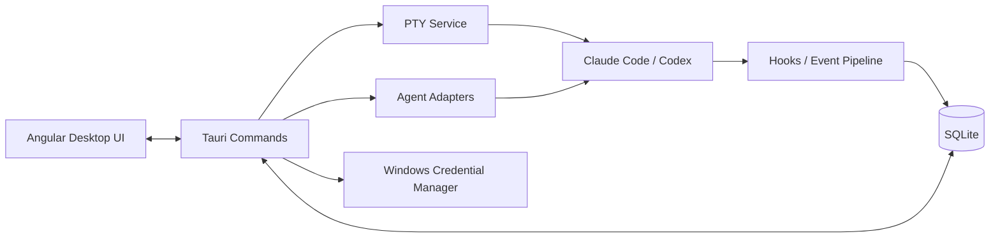

<p align="center">
  
</p>

<h1 align="center">Termexo</h1>

<p align="center"><strong>Start on your desktop. Keep going across networks.</strong></p>

<p align="center">
  <strong>English</strong> · <a href="./README.cn.md">简体中文</a>
</p>

<p align="center">
  
  
  
  
</p>

<p align="center">
  <a href="https://www.termexo.com">Website</a> ·
  <a href="https://github.com/gemron/Termexo/releases/latest">Download</a> ·
  <a href="https://www.npmjs.com/package/termexo">npm</a>
</p>

<p>
  &nbsp;&nbsp;
  &nbsp;&nbsp;
  &nbsp;&nbsp;
  &nbsp;&nbsp;
  
</p>

**Termexo is building a local-first AI coding workbench that brings agents, models, and projects together, so development can continue securely between your computer and phone.**

Today, it runs Claude Code, Codex, OpenCode, Antigravity, and Grok Build in one Windows workbench.
Keep your agents running on your PC, then reconnect through your own relay from a phone or another computer's browser. Check output, answer an approval, or send the next instruction to the same live terminal across networks. Your desktop needs no public IP or router port forwarding.


| See your agents together | Know who needs you | Continue from your phone |
| --- | --- | --- |
| Arrange real terminals side by side, grouped by project. | Spot an agent waiting for input or approval. | Connect across networks through a self-hosted relay, or directly over a trusted LAN or VPN. |

## The problem it solves

Working across multiple AI coding tools and projects means scattered windows, progress that is hard to track, repeated context when switching tasks, and work you cannot easily continue away from your desk. Termexo organizes projects and terminals into workspaces, brings agent status into view, helps resume work through native sessions and handoff packages, and extends the same running workbench to your phone or another computer.

<picture>
  <source media="(max-width: 600px)" srcset="website/assets/termexo-workflow-en-mobile.svg">
  
</picture>

## Scenarios for individuals and enterprise developers

| Scenario | Individual developers | Enterprise team members | How Termexo helps |
| --- | --- | --- | --- |
| Multiple projects | Maintain work projects, a side product, and open-source repositories | Organize each business project's development environment | Workspaces group project folders, terminals, layouts, and configuration, reducing window switching. |
| Agent task allocation and progress | Assign agents to implementation, tests, and code review | Engineers assign tasks, follow progress, and approve results | Side-by-side terminals, a task board, status indicators, and approval reminders reduce repeated output checks. |
| Resuming and handing off work | Resume yesterday's session or continue with another agent | Summarize goals, progress, and next steps to help another engineer take over | Search and resume supported native sessions; carry task context in a handoff package. |
| Long tasks and remote access | Check progress, answer approvals, and send instructions from your phone | Leave tasks running on a development PC and reconnect through a controlled entry point | A self-hosted relay or trusted LAN / VPN connects to the same running terminal; the host PC must stay on. |
| Models and account configuration | Manage subscriptions and API profiles; choose a model for each task | Manage providers, compatible gateways, and network configuration | Model, account, and network profiles in one place, with quota visibility for supported providers. |
| Control over the development environment | Run projects and agents on your own PC and host your own remote entry point | Run the workbench in an environment controlled by your organization and manage your relay | Workbench state stays local and remote access is optional; agent and model configuration determines where model requests go. |

**Available today and planned:** These scenarios center on individuals and team members operating their own workbenches, with people assigning tasks and handling approvals. Shared workspaces, granular permissions, centralized audit, and broader automatic orchestration are part of the [long-term product direction](Termexo.md), not a ready-made enterprise administration platform.

## Try it on Windows

**[Download the Windows installer](https://github.com/gemron/Termexo/releases/latest)** — choose the EXE or MSI asset. No Rust or build tools needed.

Already have Node.js 18.18+? Run:

```powershell
npx termexo@latest
```

Requires Windows 10 build 17763+ and WebView2 Chromium 111+.
Install and configure your chosen agent CLI and model access; Termexo does not include a model subscription.
**MIT licensed. No Termexo account required.**

## From your desk to your phone, through your own relay

1. Open a project on your PC and start Claude Code, Codex, OpenCode, Antigravity, or Grok Build.
2. Follow the **[termexo-relay documentation](https://github.com/gemron/termexo-relay)** to deploy an HTTPS relay reachable by both devices, or use an entry point from its administrator.
3. Enable Remote Access in Settings, enter the relay address, and enroll with an enrollment code or relay account.
4. Open the generated relay link or scan its QR code on your phone. Complete the required relay login and desktop access-token check to reconnect to your terminal.

The desktop opens an outbound tunnel, with no public IP or router port forwarding required. **Keep the PC on with Termexo running and connected to the relay.** Direct access over a trusted LAN or controlled VPN is also available.

Relay login and the desktop access token are independent checks. After the v2 handshake, session frames use AES-256-GCM; the relay forwards encrypted terminal sessions. The relay has Linux, macOS and Windows x64 / arm64 binaries and container deployment; the Termexo desktop application is for Windows.

[](https://www.termexo.com/guide.en.html#remote)

The image shows the mobile interface. **[Read the phone connection guide](https://www.termexo.com/guide.en.html#remote)** for the complete setup.
Remote access is off by default. The relay browser entry point requires HTTPS; direct desktop access uses self-signed HTTPS by default.
Keep the token private. Closing Termexo or stopping the PC ends the running processes.

## Latest release

**[v0.10.6](https://github.com/gemron/Termexo/releases/tag/v0.10.6)** keeps workspace proxy settings effective in OpenCode v2 sessions, including after terminal restoration, and updates the OpenCode npm installer.
[Full changelog](CHANGELOG.md).

If Termexo helps your workflow, a **Star on this repository** helps other developers discover it.
Found a problem? [Open an issue](https://github.com/gemron/Termexo/issues) with your Windows version and reproduction steps.

Trying it for the first time? [Tell us what worked or where you got stuck](https://github.com/gemron/Termexo/issues/new?template=first-use.yml). A short report is enough.

<details>
<summary><strong>More features and screenshots</strong></summary>

## What Works Today

<table>
  <tr>
    <td width="50%" valign="top">
      <strong>Five agents. One screen.</strong><br><br>
      Run Claude Code, Codex, OpenCode, Antigravity, and Grok Build side by side in as many real PTY
      terminals as you need, choose which stay visible, and arrange them in a custom 1–6
      row/column grid. Reorder tabs by dragging, close one with the middle mouse button, and drive the workbench from the
      keyboard. Each workspace remembers its folder, tabs, layout, model, and theme.
      <br><br>
      <a href="website/assets/termexo-workbench.png"></a>
    </td>
    <td width="50%" valign="top">
      <strong>Know when an agent needs you.</strong><br><br>
      Waiting for input, waiting for approval, completed, and failed states are distinct. A
      persistent banner, native Windows notification, and taskbar flash bring you back to the
      exact terminal that needs attention.
      <br><br>
      <a href="website/assets/termexo-attention.png"></a>
    </td>
  </tr>
  <tr>
    <td width="50%" valign="top">
      <strong>Pick up yesterday's conversation.</strong><br><br>
      Search local Claude Code, Codex, OpenCode, Antigravity, and Grok Build sessions across projects,
      accounts, branches, and models. Termexo restores them through the CLIs' own
      <code>claude --resume</code>, <code>codex resume</code>, <code>opencode --session</code>,
      <code>agy --conversation</code>, and <code>grok --resume</code> commands. It can reclaim a Claude session the CLI still holds
      open and keeps native session files read-only.
      <br><br>
      <a href="website/assets/termexo-session-center.png"></a>
    </td>
    <td width="50%" valign="top">
      <strong>Same CLI. Different model.</strong><br><br>
      Point Claude Code at Anthropic, DeepSeek, MiniMax, GLM, or a custom Anthropic-compatible
      endpoint. Save providers as profiles, keep API keys in Windows Credential Manager, and
      switch every Claude terminal in a workspace together.
      <br><br>
      <a href="website/assets/termexo-models.png"></a>
    </td>
  </tr>
  <tr>
    <td width="50%" valign="top">
      <strong>Answer it from your phone.</strong><br><br>
      Turn on remote access and any phone, tablet, or second computer connected through your own relay, trusted LAN or VPN
      opens the whole workbench in a browser — the same workspaces and the same live terminals,
      reading and writing the very PTYs the desktop is running. Terminals scroll by finger, the
      layout folds down to one terminal with panels that float over it, and the link is HTTPS
      behind an access token you can reveal, turn into a QR code, or rotate.
      <br><br>
      <a href="website/assets/termexo-phone.png"></a>
    </td>
    <td width="50%" valign="top">
      <strong>See what this session changed.</strong><br><br>
      The Git view follows the active terminal and measures against the HEAD that terminal started
      on: the files it touched, the commits it made, and a unified or split diff of any one of
      them. It keeps reading while you are in it, so the list stays current without a refresh, and
      it comes back to the file and layout you left it on.
      <br><br>
      <a href="website/assets/termexo-git.png"></a>
    </td>
  </tr>
  <tr>
    <td width="50%" valign="top">
      <strong>Turn a task into a running agent.</strong><br><br>
      The task board keeps projects and tasks with priorities and acceptance criteria. Hand one
      to Claude Code, Codex, OpenCode, or Grok Build and it becomes a real terminal, moving through todo,
      executing, completed, and verified as that terminal reports its own status.
    </td>
    <td width="50%" valign="top">
      <strong>Let it run without babysitting.</strong><br><br>
      Start any agent with automatic confirmation — <code>--permission-mode auto</code> for
      Claude, <code>--approve-for-me</code> for Codex, <code>--auto</code> for OpenCode,
      <code>--dangerously-skip-permissions</code> for Antigravity — so the
      AUTO chip on a terminal means the same thing whichever agent drew it.
    </td>
  </tr>
</table>

Termexo is local by default: it has no account, cloud service, or required sync. Workspace
state stays in local SQLite storage, credentials stay in Windows Credential Manager, and
Claude/Codex session histories are read-only. The agent CLIs still connect to the providers
you configure under their own terms and privacy policies.

The interface is available in Simplified Chinese, English, Spanish, French, German, Japanese,
and Korean. It follows the Windows language automatically, or you can choose a language from
the main toolbar and keep that choice across restarts.

</details>

## Why Termexo

AI coding tools usually run in isolated terminals and sessions. As the number of projects
grows, developers have to remember:

- which terminal belongs to which project, branch, and agent;
- which sessions are running, waiting for input, or waiting for approval;
- how to resume a specific Claude session;
- how model, endpoint, API key, and MCP configurations fit together;
- which parts of a workspace can actually be restored after an application restart.

Termexo uses the **Workspace** as its organizing unit and turns this scattered state into
a local control plane that is observable, recoverable, and extensible.

## Implemented Features

| Capability               | Current implementation                                                                                             |
| ------------------------ | ------------------------------------------------------------------------------------------------------------------ |
| Workspace management     | Create, rename, theme, drag to reorder, and switch workspaces; persist paths, layouts, and terminal configuration |
| Multi-terminal workbench | Unlimited tabs, explicit pane selection, configurable 1–6 row/column grids, pane/workspace maximize, and real PTYs |
| Agent detection          | Detect the Claude Code, Codex, OpenCode, Antigravity, and Grok Build executables, their versions, and health on Windows |
| Start agent sessions     | Launch Claude, Codex, OpenCode, Antigravity, or Grok Build with a working directory and the available account, model, and confirmation options for that CLI |
| Session center           | Read-only discovery of Claude/Codex/OpenCode/Antigravity/Grok Build sessions, search, workspace filtering, native resume, and reclaim of a Claude session the CLI still holds open |
| Agent status tracking    | Isolated hooks per terminal for thinking, tool use, approval, user input, completion, and failure states           |
| Model and MCP profiles   | Manage endpoints, keys, and MCP configuration; switch Claude CLI across Anthropic-compatible backends              |
| Network and npm profiles | Scope HTTP/HTTPS/SOCKS and npm settings globally or per workspace, test reachability, and inject them at launch    |
| Account management       | Manage multiple isolated Claude and ChatGPT/Codex logins, defaults, authentication status, and launch-time choice  |
| Managed CLI lifecycle    | Preview, confirm, install, or upgrade each agent's CLI — from its official npm package, or from the vendor's own Windows installer where one is published — then verify the result |
| Allowance visibility     | Show reported quota where supported, including Grok Build's exhausted free allowance; unknown percentages remain unavailable |
| Task board               | Organise projects and tasks with priorities and acceptance criteria, run one as a Claude/Codex/OpenCode/Grok Build terminal, and track it from todo through executing, completed, and verified |
| Prompt assets            | Recover live per-terminal drafts; search, favorite, pin, delete, and reuse submitted prompts                       |
| Session handoff          | Build redacted, token-budgeted Git/task packages; import/export documents and continue in another Agent            |
| Git graph and diff       | Show the active terminal's branch, commit topology, and changes since terminal start with unified or split diff    |
| Remote access            | Serve the whole workbench over HTTPS to phones and other computers on the network, gated by an access token with QR entry and rotation, with every remote call passing an explicit command allowlist |
| Local data and secrets   | Store workspace/session/event data in SQLite and API keys in Windows Credential Manager                            |
| Browser preview          | Preview the complete UI without Rust and exercise layout flows through an interactive simulated terminal           |


<p align="center">
  <sub>Models, endpoints, and credential entry are managed in one place. Stored secrets are never returned to the frontend.</sub>
</p>

## Design Goals

1. **Local first** — Project paths, terminals, session indexes, and configuration stay on
   the local machine by default. Termexo does not require a Termexo cloud service.
2. **Preserve native agent semantics** — Prefer native session and configuration
   mechanisms instead of pretending that a terminated process is still alive.
3. **Coordinate terminals, do not replace them** — Termexo provides the workbench,
   state, and orchestration layer. Commands still run inside real PTYs and agents.
4. **Make agent state observable** — Map agent-specific events into common running,
   thinking, input, approval, completed, and failed states.
5. **Keep security boundaries explicit** — Secrets belong in the operating-system
   credential store, not in SQLite, snapshots, hook payloads, or logs.
6. **Grow into a multi-agent architecture** — Evolve around adapters, PTY, hooks,
   snapshots, and routing boundaries so more CLIs can be added without rebuilding the core.
7. **Extend workspaces across trusted devices** — Add sharing, remote access, mobile
   approvals, and collaboration without weakening local ownership or security boundaries.

## Current Boundaries

- Claude Code and Codex both support native detection, account/model-aware launch, local session
  discovery, resume, and lifecycle-driven terminal states. Their event vocabularies are not
  identical, and compatible-provider model switching currently applies to Claude terminals.
- When the app exits, terminated operating-system processes are not “fake restored.”
  Termexo restores terminal configuration; historical Claude sessions must be resumed
  explicitly from the session center.
- Claude and Codex JSONL files are read-only. Termexo never edits, renames, or deletes them.
- Snapshot surfaces remain hidden until their production backend is implemented. Git session
  changes are repository deltas observed since terminal start; concurrent editors may contribute.
- V0.5 migrates a redacted context package, not a provider's private native transcript. Automatic
  permission approval, native transcript rewriting, and cross-agent batch model-switch transactions
  remain outside the current release.

See [Termexo.md](./Termexo.md) for the complete product plan and
[V0.2 architecture](./docs/architecture/v0.2.md) for current technical boundaries.

## Build from source

These requirements are for contributors building Termexo, not for installing the release.

### Requirements

- Windows 10 build 17763 (October 2018) or newer, the first to carry the pseudo console the
  terminals run on;
- the WebView2 runtime at Chromium 111 or newer — the interface states its colours through
  `color-mix()` and `oklch()`, which older runtimes drop. Termexo says so and offers the download
  when it finds an older one, and Windows 11 and the installers both provide a current runtime;
- Node.js `^22.22.3`, `^24.15.0`, or `>=26.0.0`;
- Rust stable and Visual Studio C++ Build Tools for the desktop runtime;
- a local installation of at least one agent CLI (Termexo can also install and upgrade them).

### 1. Clone and install frontend dependencies

```powershell
git clone https://github.com/gemron/Termexo.git
cd Termexo
npm --prefix apps/desktop-ui install
```

### 2. Run the browser preview

```powershell
npm run dev
```

Open <http://127.0.0.1:4200>. Browser mode uses a simulated terminal with `help`,
`status`, `git status`, and `clear`, making it suitable for UI development and review.

### 3. Run the desktop application

```powershell
npm run tauri:dev
```

Desktop mode uses real PTYs. If Claude Code is not available on PATH, specify it:

```powershell
$env:TERMEXO_CLAUDE_PATH = "C:\path\to\claude.exe"
npm run tauri:dev
```

## How It Works



- **Angular UI** — workspaces, terminal layouts, session center, settings, and Inspector.
- **Tauri Commands** — a minimal IPC boundary between the frontend and desktop core.
- **PTY Service** — creates, writes to, resizes, and closes real terminal processes.
- **Agent Adapters** — Claude/Codex installation detection, read-only session scanning, and native launch/resume.
- **Hooks Pipeline** — receives agent lifecycle events, deduplicates them, and maps common terminal states.
- **SQLite / Credential Manager** — stores structured local data and sensitive credentials separately.

## Data and Security

| Data                                  | Storage                       | Policy                                       |
| ------------------------------------- | ----------------------------- | -------------------------------------------- |
| Workspaces and terminal configuration | SQLite                        | Local persistence                            |
| Claude/Codex session index            | SQLite                        | Upserted from read-only native session files |
| Agent events                          | JSONL spool + SQLite          | Deduplicated by `event_key`                  |
| Model and MCP profiles                | SQLite                        | Plaintext API keys never enter the database  |
| Prompt assets and handoff packages    | SQLite                        | Common credentials are redacted before save  |
| API keys                              | Windows Credential Manager    | The frontend can read only `hasCredential`   |
| Native agent sessions                 | Claude/Codex data directories | Read-only; never modified or deleted         |

For compatibility with early installations, the database filename and some internal Tauri
identifiers still use a legacy name. This does not affect the Termexo product name or new
`TERMEXO_*` environment variables.

## Roadmap

| Version | Delivered scope | Status |
| --- | --- | --- |
| V0.1–0.5 | Workspaces, real terminals, native session resume, model profiles, and handoff | Released |
| V0.6 | OpenCode, task board, and agent confirmation options | Released |
| V0.7 | Custom window chrome, GPU terminal rendering, and account workflows | Released |
| V0.8.0–0.8.4 | Phone access, first-run guidance, input latency and mobile scrolling improvements | Released |
| V0.8.5 | Bundled ConPTY and WebView2 startup diagnostics | Released |
| V0.8.6 | Screen-accurate terminal replay and reconnect stability | Released |
| V0.8.7 | A screen parser that cannot strand a terminal | Released |
| V0.8.8 | A storage panel, and data that can be moved | Released |
| V0.9.0 | Antigravity as a fourth agent, and vendor installers | Released |
| V0.10.0 | A self-hosted relay, and end-to-end encrypted remote access | Released |
| V0.10.1 | Phone keypad, keyboard-aware remote pages, and settings that keep unsaved edits | Released |
| V0.10.2 | Reliable agent status and notifications, and a multilingual task board | Released |
| V0.10.3 | Clean agent prompts with several viewers, Ctrl+click links, and copying from OpenCode | Released |
| V0.10.4 | Grok Build, reliable Git changes, quieter terminals, and workspace ordering | Released |
| V0.10.5 | Todo board persistence and snapshot transfer, and lightweight Antigravity quota queries | Released |
| V0.10.6 | OpenCode v2 proxy reliability and current CLI installer | Current |
| V1.0 | Stability, security hardening, and recovery experience | Planned |

See [open issues](https://github.com/gemron/Termexo/issues) for ongoing work and
[CHANGELOG.md](CHANGELOG.md) for released changes. Planned work has no promised delivery date.

## Repository Layout

```text
Termexo/
├── apps/desktop-ui/       # Angular desktop UI and browser preview
├── src-tauri/             # Rust core, PTY, agents, hooks, database, and commands
├── docs/architecture/     # Architecture notes for implemented versions
├── docs/images/           # README screenshots
└── Termexo.md             # Product design and long-term roadmap
```

## Development and Verification

```powershell
npm run build
npm test
cargo test --manifest-path src-tauri/Cargo.toml
npm --prefix apps/desktop-ui run e2e:smoke
npm run tauri:build
```

With the local development server running, regenerate the README screenshots with:

```powershell
npm run capture:readme
```

## Contributing

Use [Issues](https://github.com/gemron/Termexo/issues) to report bugs, discuss design
decisions, or propose features. Before submitting code, make sure the change fits the
current release scope and add tests for behavior changes.

## License

Released under the [MIT License](LICENSE).
