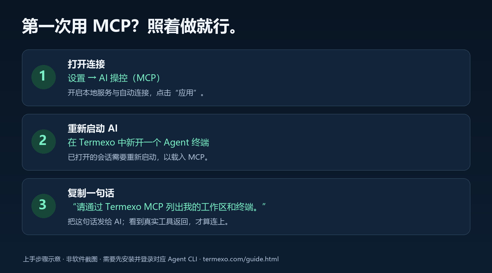

# 用 MCP 操控五种 Agent：Termexo 使用说明

本说明以 Termexo v0.10.13 为准；本地 MCP 功能从 v0.10.10 开始提供。简明上手步骤也收录在[官网中文使用说明](https://www.termexo.com/guide.html#ai-control)和[英文使用说明](https://www.termexo.com/guide.en.html#ai-control)，两份指南均提供 PDF。

**MCP 是 AI 与 Termexo 之间的连接。连好以后，你可以让一个 AI 操作另一个 Agent 的终端：查找终端、发送提示词、提交回车，再读取实际回复。你用日常语言提出要求，不用写代码，也不用记工具名。**

例如，对已经连接 MCP 的 Codex 说「给当前工作区的 OpenCode 发一句 hi，提交回车并读取回复」，它就能通过 Termexo 完成这段终端操作。整个过程仍在你看得见、能随时接手的工作台里。

## 五种 Agent，分别能做什么？

| Agent | 从 Termexo 启动时自动连接 MCP | 操作已运行的终端：发指令、提交、读回复 | 通过任务看板创建并执行 Agent 任务 |
| --- | --- | --- | --- |
| Claude Code | 支持 | 支持 | 支持 |
| Codex | 支持 | 支持 | 支持 |
| OpenCode | 支持 | 支持 | 支持 |
| Grok Build | 支持 | 支持 | 支持 |
| Antigravity CLI | 支持 | 支持 | 暂不支持；先在工作台中启动终端 |

**发起操作的 AI 要连接 Termexo MCP 并获准使用相应工具；目标 Agent 要运行在 Termexo 的终端中。** 终端交互按实际终端 ID 操作，因此可以让 Codex 给 Claude Code 发任务，也可以让 Claude Code 读取 OpenCode 的回复。普通 Shell 也可以创建、发送命令和读取输出。

自动接入、已有终端交互和任务执行是不同能力。`terminal_create` 创建的是 Shell 终端；要启动由 Termexo 管理账号、模型和提示词的 Agent 任务，使用支持前四种 Agent 的任务工具。已有联调结果与测试范围见[真实联调记录](./mcp-live-test.md)。

## 第一次使用：按这 3 步做

开始前，先在 Termexo 添加项目工作区，确认 Claude Code、Codex 等 AI 能正常启动并已登录。MCP 不会替你登录 AI 账号。

### 1. 开启连接

打开桌面「设置 → AI 操控（MCP）」，勾选「启用本地 MCP 服务」，保留「自动连接 Termexo 启动的 Agent」勾选。选择权限，点击「应用」，确认状态显示「运行中」。端口通常不用改。

| 想让 AI 做什么 | 开启哪项权限 |
| --- | --- |
| 查看工作区、开关终端、发命令、读输出 | 终端 |
| 创建、执行、停止、继续任务 | 任务 |
| 修改语言、字号、已有模型或网络配置 | 设置 |

服务默认关闭；启用时默认允许终端和任务，设置权限需单独勾选。终端和任务权限包含执行操作的能力，不只是查看。

### 2. 在 Termexo 中启动 AI

新开一个 Claude Code、Codex、OpenCode、Grok Build 或 Antigravity AI 终端。**已经打开的 AI 会话要重新启动**，才能载入连接；Claude attach 会话要重启原来的 Claude 进程。

从 Termexo 启动的 AI 会自动接入，无需填写地址、复制令牌或修改配置文件。使用期间保持 Termexo 桌面窗口打开。

### 3. 发一句话，确认连上

点击设置面板的「复制这句话」，粘贴到刚启动的 **AI 终端**，按回车发送。也可以直接复制：

> 请通过 Termexo MCP 列出我的工作区和终端，告诉我哪些正在运行。先不要修改任何内容。

这句话是发给 AI 的，不要粘贴到普通 PowerShell 或 CMD 命令行。

**成功标志：**AI 实际调用 Termexo 工具，返回你电脑上的工作区名称和终端状态。终端可能显示 `termexo-desktop` 的工具调用记录。只回答「我可以帮你」还不能说明已连上；设置里的「运行中」也只表示服务已就绪。



*三步操作示意，非软件截图。无需手工填写连接配置，适用于从 Termexo 启动的 Agent。*

## 第一个例子：让 AI 给 OpenCode 发一句 hi

1. 在 Termexo 当前工作区新开一个 OpenCode 终端，确认它已经启动并能正常对话。
2. 在另一个已连接 MCP 的 AI 终端中，发送：

> 请通过 Termexo MCP 找到当前工作区中正在运行的 OpenCode 终端，发送 hi 并提交回车，然后读取它的回复。如果有多个匹配的终端，先列出名称让我选择。

3. 查看目标终端：它应收到已提交的 `hi`，然后产生回复；发起操作的 AI 应读取并报告这份实际回复。

Claude Code、Codex、Grok Build 和 Antigravity 的已有终端可以用同样方式操作，把例句里的 OpenCode 换成目标名称即可。有多个匹配终端时，先选定名称再发送，避免把消息送错。

消息只出现在输入区、还没有回复时，可以继续说：

> 请查看刚才的目标终端。如果 hi 还没有提交，请提交回车；如果已经提交，请读取后续回复，不要重复发送 hi。

这一步走通“找到真实终端 → 发送 → 提交 → 读回结果”后，再把 `hi` 换成实际需求。

## 第二个例子：把项目检查交给 Claude Code

要从任务开始，请先开启任务权限，并确认 Claude Code 已安装、登录，且默认模型配置可用。然后发送：

> 请通过 Termexo MCP，在当前项目创建一个 Claude Code 任务，标题是“梳理项目结构”。使用已配置的默认模型，先只阅读项目，说明主要目录、运行方法和测试入口，不修改文件。启动后查看终端，确认提示词已提交，再把实际输出整理给我。

任务看板应出现该任务，并打开对应的 Agent 终端。让 AI 继续查看终端输出和任务状态，直到能报告实际结果；成功启动只说明任务开始了。也可使用 Codex、OpenCode 或 Grok Build 执行任务。Antigravity 请先在工作台中打开，再通过上一节的终端交互方式发送需求。

需要改代码时，把预期结果、验收条件和允许修改的范围写进需求。多个 Agent 同时改一个项目时，可以使用不同目录或 Git worktree；完成后检查 diff 和相关测试，再决定是否接受结果。

## 连上后，可以这样说

| 目的 | 发给 AI 的话 | 所需权限 |
| --- | --- | --- |
| 查看运行情况 | 请通过 Termexo MCP 查看当前工作区的终端，告诉我哪个正在等待输入。 | 终端 |
| 操作另一个 Agent | 给当前工作区正在运行的 OpenCode 终端发送 hi，提交回车，然后读取实际回复。有多个匹配终端时先让我选择。 | 终端 |
| 执行命令并看结果 | 在当前工作区开一个普通终端，运行 git status，并告诉我结果。 | 终端 |
| 创建待办 | 在当前工作区创建一个 Claude Code 任务，标题是“梳理项目结构”，先保存，不要执行。 | 任务 |
| 开始处理任务 | 执行“梳理项目结构”这个任务，使用已配置的 Claude Code 模型，并查看任务是否正常启动。 | 任务 |
| 调整显示 | 把 Termexo 的终端字号改为 18。 | 设置 |

有多个工作区或同名任务时，告诉 AI 具体名称。需要指定模型时，先在 Termexo 配置对应模型及账号，再告诉 AI 要用哪个配置。

发送命令或启动任务后，可以继续说「请读取输出，确认是否成功」。**已发送、已启动不等于已经完成**；AI 应继续查看终端或任务状态，再报告结果。

## 没成功？按现象排查

| 看到的现象 | 怎么处理 |
| --- | --- |
| AI 说找不到 Termexo 工具 | 确认服务「运行中」、自动连接已勾选，从 Termexo 重新启动 AI 会话，然后再发测试消息。 |
| 服务未运行，提示端口被占用 | 展开「进阶」修改端口，点击「应用」，确认「运行中」后再试。 |
| 有工具，但提示没有访问权限 | 勾选对应的终端、任务或设置权限，点击「应用」，重新连接 AI 以刷新工具列表。AI 客户端自己的工具审批也需要在那里处理。 |
| Claude 提示 Login expired | 输入 `/login`，按提示重新登录，再发送原来的消息。这是 AI 账号的问题。 |
| AI 说已发送，但还没有结果 | 请它继续读取终端输出或任务状态；提示词还在输入框时，需要提交回车。 |
| 想给 Antigravity 新建任务，但任务执行失败 | 任务工具目前只支持 Claude Code、Codex、OpenCode 和 Grok Build。先在工作台启动 Antigravity，再让 AI 操作已有终端。 |
| 操作超时 | 先让 AI 查询当前终端或任务状态，再决定是否重试，避免重复创建或执行。 |
| 浏览器里的云端 AI 连不上 | 此地址仅供本机使用。使用支持本机 MCP 的 AI 客户端；仅粘贴本机地址不能让云端服务访问你的电脑。 |

## 两种 MCP 设置，选哪一个？

- **「AI 操控（MCP）」：**让 AI 操作 Termexo。本说明讲的是这个入口。
- **「MCP Profile」：**给 AI 接入数据库、搜索等其他外部工具。它与上面的入口独立。

如果你在 Termexo 里使用 AI，完成上面的 3 步就能开始。下面是外部客户端连接和技术参考。

## 自动连接 Agent

支持 Claude Code、Codex、OpenCode、Grok Build 和 Antigravity CLI。五种 Agent 的新会话和历史会话重新启动都在实际创建终端进程时接入；前四种 Agent 的任务执行及恢复也使用这一流程。服务未启用或取消自动连接时不会注入。

自动连接的服务名是 `termexo-desktop`，使用 Termexo 自带的 stdio 桥接程序连接本机 HTTP 服务。桥接程序每次请求读取当前端口和系统凭据，因此更新端口或令牌后仍可使用；生成的 Agent 配置和启动命令不包含令牌。访问范围仍由 MCP 设置控制，Agent 自身的工具审批仍生效。

| Agent | 配置方式 |
| --- | --- |
| Claude Code | 在当前 `--mcp-config` 文件列表中追加 Termexo 配置，保留所选 MCP Profile；`attach` 连接到已经运行的 Claude 进程，需重新启动原进程后才能载入 MCP |
| Codex | 本次启动追加 `-c mcp_servers.termexo-desktop=…`，保留其他 MCP 和模型配置 |
| OpenCode | 合并到本次启动的 `OPENCODE_CONFIG_CONTENT`，保留插件及其他 MCP；分别使用 V1 的 `mcp` 和 V2 的 `mcp.servers` 格式 |
| Grok Build | 合并到当前 `GROK_HOME`（默认 `~/.grok`）的 `config.toml`，保留已有条目和注释 |
| Antigravity CLI | 合并到 `~/.gemini/config/mcp_config.json`，保留其他服务 |

Grok 和 Antigravity 没有适用的单次启动 MCP 覆盖选项，因此在首次启动时写入用户配置；同一配置下在 Termexo 外启动的客户端也能看到该条目。关闭自动连接或关闭服务并应用后，Termexo 移除自己添加的条目。已经存在的同名自定义条目及无效配置不会被覆盖，启动时会提示错误。[Grok MCP 配置文档](https://raw.githubusercontent.com/xai-org/grok-build/main/crates/codegen/xai-grok-pager/docs/user-guide/07-mcp-servers.md)和 [Antigravity MCP 文档](https://antigravity.google/docs/mcp)说明了它们的配置格式和位置。

OpenCode V2 的配置和禁用字段与 V1 不同，参见 [OpenCode V2 MCP 文档](https://opencode.ai/v2/docs/mcp-servers)。

## 连接外部客户端

只在你要连接**这台电脑上、在 Termexo 外启动的 AI 应用**时，才需要手动配置。客户端须支持 Streamable HTTP MCP。

1. 先按前文开启服务，确认「运行中」，保持 Termexo 打开。
2. 展开设置面板的「进阶：连接 Termexo 外的 AI 应用 / 修改端口」。找到目标 AI 应用的 MCP 设置：接受 `mcpServers` JSON 的应用点「复制 JSON 配置」；Codex 的 `config.toml` 点「复制 TOML 配置」。把 Termexo 条目合并进去，保留原有服务；不要把配置粘贴到聊天输入框。
3. 重新连接或重启该 AI 应用，发送前文的测试消息，确认返回真实工作区和终端状态。

复制的配置已填入地址及实际访问令牌，不需要手工替换 `<TOKEN>`。令牌相当于连接密码，请妥善保管。手动连接后若修改端口或重新生成令牌，应重新复制并更新客户端配置。普通云端网页聊天不能直接访问这个本机地址。

默认地址为 `http://127.0.0.1:7421/mcp`，以面板显示的地址为准。以下是配置格式参考。JSON 配置用于支持此配置格式及 Streamable HTTP 的客户端：

```json
{
  "mcpServers": {
    "termexo": {
      "type": "http",
      "url": "http://127.0.0.1:7421/mcp",
      "headers": { "Authorization": "Bearer <TOKEN>" }
    }
  }
}
```

Codex 的 `config.toml` 配置：

```toml
[mcp_servers.termexo]
url = "http://127.0.0.1:7421/mcp"
http_headers = { Authorization = "Bearer <TOKEN>" }
```

面板的复制按钮会填入实际令牌；页面展示的 JSON 使用占位符。[Codex 官方 MCP 文档](https://learn.chatgpt.com/docs/extend/mcp?surface=cli)说明了 `url`、`http_headers` 和其他连接选项。

服务权限和 AI 客户端的工具审批分别生效。Codex 非交互运行且 `approval_policy="never"` 时，未批准的写入工具会被客户端拒绝；自动化测试可以通过 `enabled_tools` 限制工具，再为指定工具设置审批策略。[真实联调记录](./mcp-live-test.md)包含实际客户端测试结果与检查范围。

## 工具

| 工具 | 操作 |
| --- | --- |
| `workspace_list` | 查询工作区、项目路径和终端 ID，终端或任务访问任一开启时可用 |
| `terminal_list` | 查询终端及进程运行状态，可按工作区筛选 |
| `terminal_create` | 在已有工作区创建 Shell 终端，可指定目录和启动命令 |
| `terminal_read` | 读取终端画面及滚动历史，支持纯文本或 ANSI 格式，默认最多 20,000 字符 |
| `terminal_write` | 写入文字或控制按键，`submit: true` 追加回车 |
| `terminal_close` | 关闭终端及进程，同步工作区标签和关联任务状态 |
| `task_list` | 查询工作区的项目、任务和执行状态 |
| `task_create` | 创建任务；未指定模型配置时选择适用于该 Agent 的默认配置 |
| `task_update` | 编辑任务；正在执行的任务需先停止 |
| `task_delete` | 删除任务；正在执行的任务需先停止 |
| `task_execute` | 执行待办或失败任务，复用桌面的 Agent 启动与提示词投递流程 |
| `task_stop` | 中断任务，保留终端和会话 |
| `task_resume` | 在原会话中继续已停止任务 |
| `task_complete` | 将执行中的任务标为已完成；尚未投递的任务需等待提示词投递 |
| `task_verify` | 验收已完成任务并记录备注 |
| `settings_get` | 查询语言、终端显示偏好及模型、网络配置，不返回凭据和 MCP 令牌 |
| `settings_update` | 修改语言、终端字体及字号、侧栏显示偏好，立即应用到桌面 |
| `model_profile_update` | 修改已有模型配置，保留其已存储的 API Key |
| `network_profile_update` | 修改已有网络配置，保留其已存储的代理凭据 |

任务工具支持 Claude Code、Codex、OpenCode 和 Grok Build。`terminal_create` 创建 Shell；使用 `task_execute` 启动受 Termexo 配置管理的 Agent。

建议先调用 `workspace_list`、`task_list` 和 `settings_get` 获取实际 ID，再创建或执行任务。修改模型及网络配置影响后续启动的终端，已有进程保留启动时的配置。

## 执行语义

`terminal_write` 成功表示输入已经写入 PTY；`task_execute` 成功表示启动流程已建立任务和终端绑定。它们都不代表命令或任务已经完成。调用 `terminal_read` 或 `task_list` 查询后续状态，任务结果包含 `executionState` 和 `promptDeliveryState`。

服务同时只允许一条桌面自动化操作进入业务流程。其他调用会返回忙碌错误。单次等待最多 60 秒；超时不会撤销已开始的操作，应先查询状态再决定是否重试。桌面端也会拒绝过期请求，并在之前的操作尚未完成时拒绝新的操作。

正在执行的任务停止后可以编辑或删除。编辑停止任务时若更换 Agent，任务返回待办，供新 Agent 重新执行。

## 访问控制和协议

- 服务只监听 IPv4 本机回环地址，远程工作台和中继不提供此入口。
- 终端、任务、设置权限分别控制工具发现和调用。关闭权限后，已经发现工具的客户端也无法发起新的相关调用；客户端需重新连接以刷新工具列表。
- 使用独立 Bearer 令牌，凭据存入系统凭据管理器。重新生成令牌会使旧令牌的下一次请求失效。
- 管理服务的命令仅供桌面主窗口使用，远程命令桥拒绝调用它们。
- 校验 HTTP Host 和 Origin，不提供跨来源浏览器访问。
- 采用无状态 Streamable HTTP 和 JSON 响应，支持协商 `2025-11-25`、`2025-06-18`、`2025-03-26`；不提供 SSE 推送或协议会话。客户端 GET/DELETE 请求返回 405。
- 请求上限 1 MB。参数按工具 schema 验证，拒绝未知字段。工具执行失败通过 `isError: true` 返回；协议或参数错误使用 JSON-RPC error。
- 日志记录工具名及结果状态，不记录参数、终端输出、令牌或凭据。

传输方式及请求头要求参见 [MCP Streamable HTTP 规范](https://modelcontextprotocol.io/specification/2025-11-25/basic/transports)。
