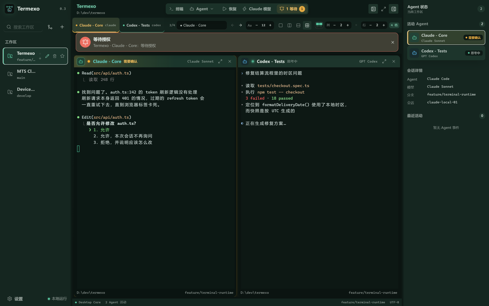

# 掘金：工程实践稿

## 标题

我为什么用 Tauri 做了一个 Claude Code / Codex 多终端工作台

## 导语

当 AI 编程从“偶尔问一句”变成多个 Agent 并行工作，真正稀缺的往往不是模型，而是注意力。本文复盘 Termexo 在真实 PTY、会话恢复、模型 Profile、状态归一化和本地安全上的设计取舍。

## 正文

我同时使用 Claude Code 和 Codex 后，很快遇到了一个传统终端没有主动解决的问题：终端可以无限开，但人的注意力不能。

当四五个 Agent 分散在不同项目里运行时，我经常忘记：哪个终端在等授权，哪个已经完成，昨天那条重要会话属于哪个分支，以及切换模型后到底有没有真的走到新的 Endpoint。

于是我做了 Termexo，一个 Windows 本地多 Agent 工作台。


### 1. 终端只是入口，状态才是工作台的核心

Termexo 没有重写 Claude Code 或 Codex，而是让它们继续运行在真实 PTY 中。桌面层负责 Workspace、网格布局和终端生命周期，Agent Adapter 负责检测 CLI、生成启动命令、恢复会话并把原生事件映射为统一状态。

目前界面会区分运行、思考、等待输入、等待授权、完成和失败。这样做的价值不是多一个彩色圆点，而是让用户只处理真正需要人的终端。



### 2. 会话恢复必须尊重原生数据

一个容易走偏的方案，是把不同 Agent 的消息导入自己的数据库，再“模拟恢复”。这会丢失工具调用、压缩点和 Agent 自己维护的上下文。

Termexo 选择只读扫描原生会话：Claude Code 走 `claude --resume`，Codex 走 `codex resume`。SQLite 只保存 Workspace 状态、索引和事件，不改写 Agent 的原始 JSONL。


### 3. 模型切换不是改一个环境变量

Claude Code 与 Codex 对第三方供应商的配置机制并不相同。尤其 Codex 不会因为设置了通用的 `OPENAI_BASE_URL` 就自动切换模型供应商，它需要自己的 provider 配置，并且当前使用 Responses API。

Termexo V0.4.4 把 Profile 按供应商组织：同一个 Profile 可以分别保存 Anthropic 协议与 OpenAI 协议的模型、Endpoint 和启用状态。DeepSeek、MiniMax、GLM、Kimi 等模型还会获得各自的 Codex 模型目录与 metadata，避免未知模型回退到通用配置。

切换也不是简单重启。现在会先预检目标模型、Endpoint 和凭据；切换失败时恢复原命令、原会话和原 Profile。这个过程做成事务，是因为“界面显示切换成功，实际请求仍发往旧供应商”比直接报错更危险。

### 4. 额度数据宁缺毋滥

不同供应商并不都提供公开额度 API。Termexo 的余量面板区分三类信息：供应商官方返回、本地消费估算和不可用。当前终端默认只显示正在使用的供应商，也可以展开查看全部供应商，并在 Agent 活动时自动刷新。

这里刻意没有用一个看起来很精确的进度条掩盖数据来源。对开发工具来说，“不知道”通常比一个错误的确定值更诚实。

### 5. 本地优先不是一句口号

Termexo 不要求注册账号，也没有自己的同步服务器。工作空间和索引保存在本机 SQLite；API Key 进入 Windows Credential Manager；原生会话文件保持只读。Agent 请求仍按用户选择的模型供应商及其隐私政策发送，Termexo 不会把它们中转到自己的服务。

### 现在可以直接试

项目采用 MIT 许可证，当前版本为 V0.4.4：

```powershell
npx termexo@latest
```

源码：https://github.com/gemron/Termexo

如果你也在 Windows 上并行使用多个 AI CLI，我更想听到的是具体工作流和失败案例。欢迎提 Issue 或 PR；如果项目确实有用，也欢迎 Star，帮助它找到更多愿意一起打磨的人。

## 建议标签

`人工智能` `开发工具` `Rust` `Tauri` `Claude Code` `Codex`

## 发布声明

本文由 Termexo 项目维护者撰写，基于 V0.4.4 的公开源码与功能整理；封面使用 AI 辅助生成，正文为真实产品截图。
