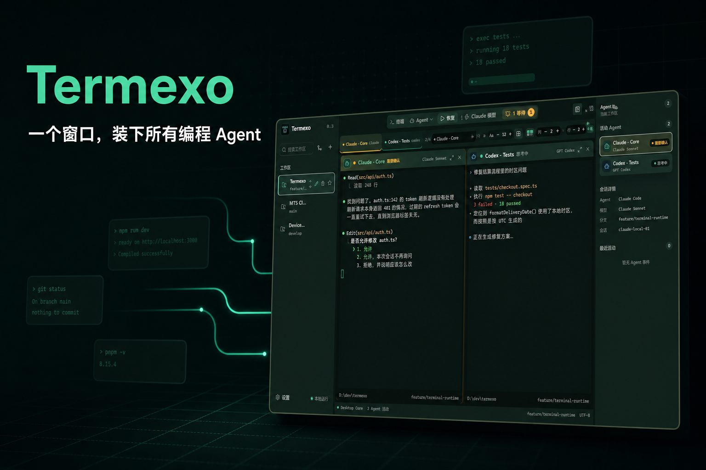

# IT之家：投稿新闻稿

## 标题

开源 AI 编程工作台 Termexo 0.4.4 发布：支持 Claude Code、Codex 多模型供应商切换

## 投稿分类

软件 / 开源 / Windows

## 正文

8 月 11 日消息，Windows 本地 AI 编程工作台 Termexo 发布 0.4.4 版本。该项目采用 MIT 许可证开源，主要用于在同一个桌面工作空间中运行和管理 Claude Code、Codex 及其终端会话。



Termexo 提供多终端网格、Workspace 持久化、Agent 状态提醒、原生会话发现与恢复、多账号、模型及 MCP Profile、网络代理、npm 配置和 CLI 安装升级等功能。应用使用真实 PTY 运行 Agent CLI，并通过 `claude --resume` 与 `codex resume` 恢复会话；Claude Code 和 Codex 的原始会话文件保持只读。

0.4.4 版本完善了 Codex 的第三方模型供应商切换。用户可为 DeepSeek、MiniMax、GLM、Kimi 等供应商分别配置 Claude 与 Codex 使用的模型和 Endpoint。考虑到 Codex 当前使用 Responses API，实际兼容性仍取决于供应商是否提供对应接口。

新版还为第三方模型建立独立 metadata，避免未知模型回退到通用配置；终端标题区域显示当前模型，切换列表会禁用当前正在使用的模型。模型切换采用预检和恢复流程，操作失败时恢复原会话及模型配置。

右侧供应商余量面板默认只显示当前终端所用供应商，并支持查看及手动刷新全部供应商。Agent 活动时余量会自动刷新。对于没有官方额度查询接口的供应商，Termexo 会将本地统计标记为“估算”或显示“不可用”，不作为供应商官方余额。


项目默认只在本地保存工作空间、索引和设置，API Key 交由 Windows Credential Manager 保管，不要求注册 Termexo 账号。Termexo 0.4.4 支持 Windows 10/11 x64，可从 GitHub 下载 EXE、MSI 安装包，也可在安装 Node.js 18.18 或更高版本后运行：

```powershell
npx termexo@latest
```

项目地址：https://github.com/gemron/Termexo

版本发布页：https://github.com/gemron/Termexo/releases/tag/v0.4.4

npm：https://www.npmjs.com/package/termexo

## 投稿备注（不放入正文）

- 稿件由 Termexo 项目维护者提供，不是第三方评测。
- 封面使用 AI 辅助生成，正文截图来自项目仓库。
- 如编辑需要，可提供 EXE/MSI SHA-256、完整更新日志和更多无水印截图。
