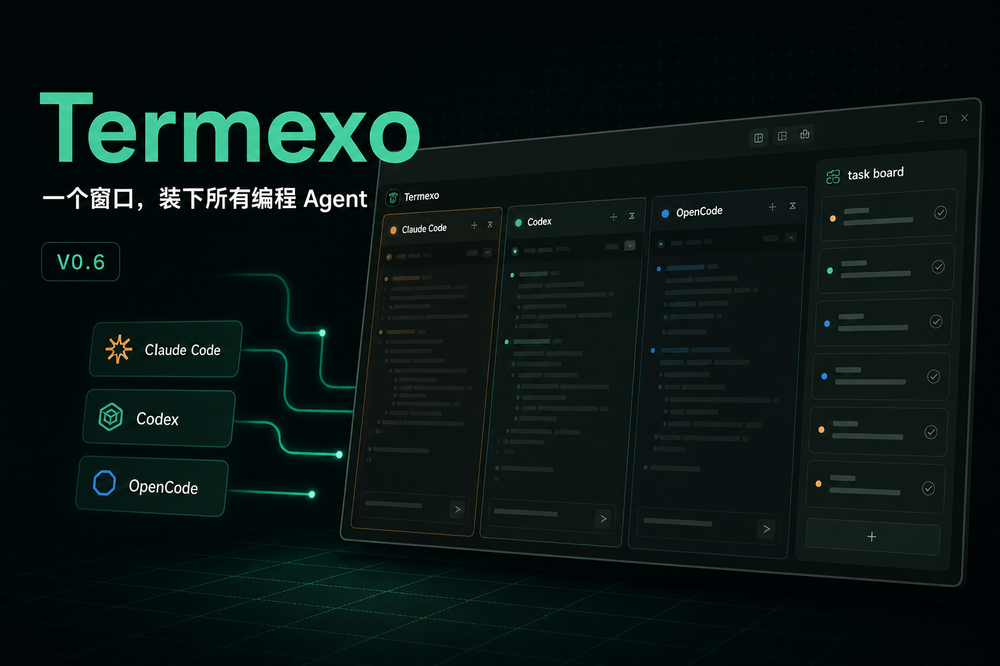
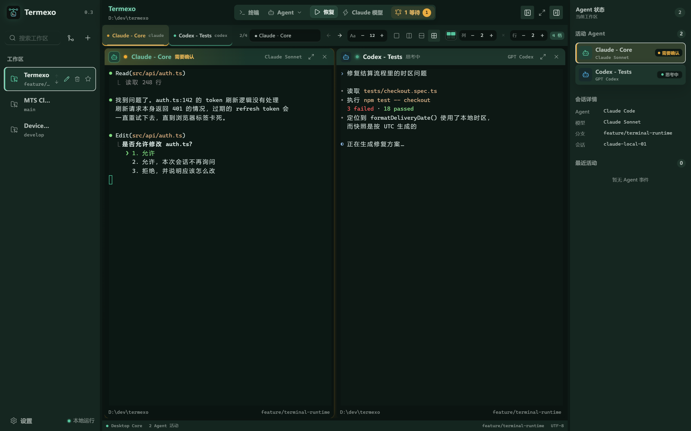
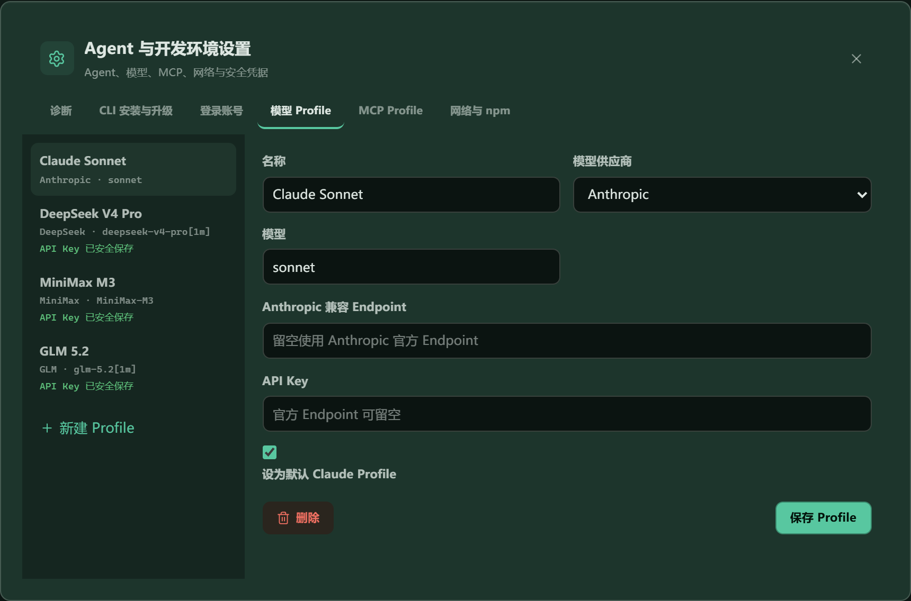
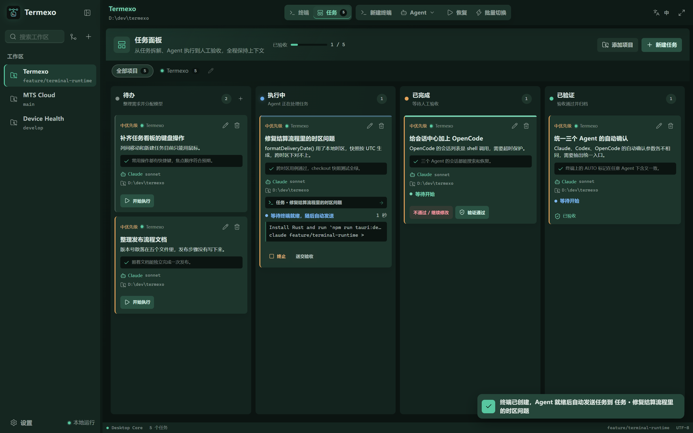
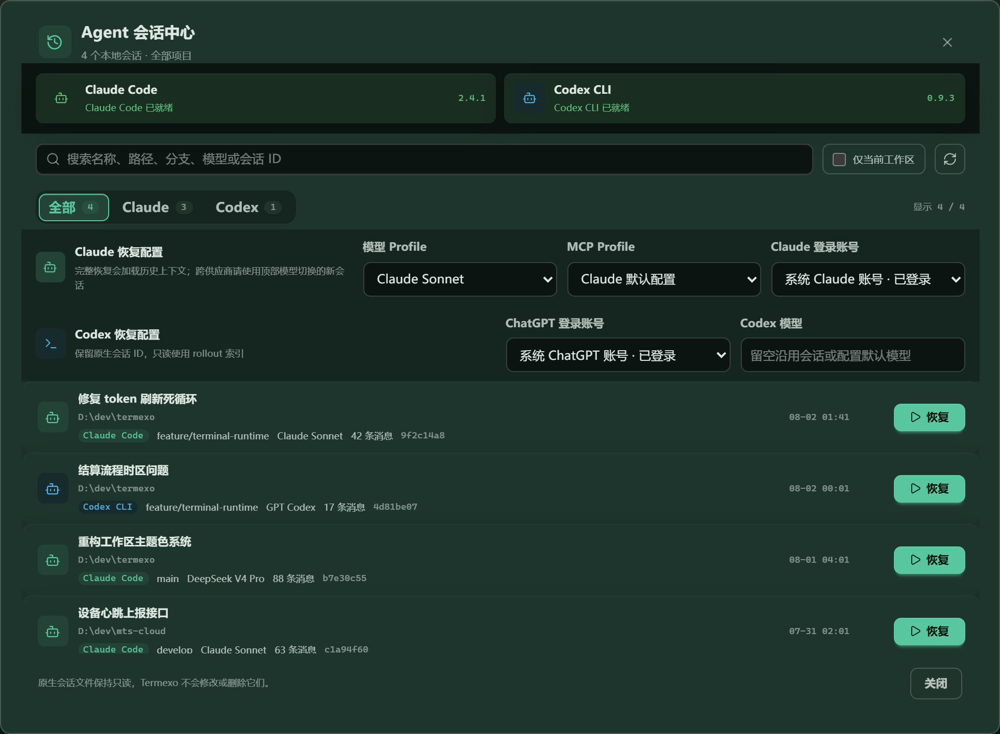

# 当三个编程 Agent 同时开工，我终于不用在一排终端里“找人”了

如果你已经把 Claude Code、Codex 或 OpenCode 用进日常开发，大概经历过这样的场面：几个项目同时推进，终端开了一排；这个 Agent 在跑测试，那个 Agent 等你确认，昨天还有一段重要会话不知道藏在哪个窗口里。

AI 写代码越来越快，开发者的注意力却没有变多。

这也是我做 Termexo 的原因：把散落的编程 Agent 收进一个可观察、可恢复、能真正承接任务的 Windows 工作台。



## 它不是另一个聊天框，而是 Agent 的本地工作台

Termexo 不替换 Claude Code、Codex 和 OpenCode，也不重新包装它们的对话界面。三个 Agent 仍然运行在真实 PTY 终端里，Termexo 负责工作空间、布局、状态、会话与任务这一层。

你可以为不同项目建立 Workspace，在一个窗口里打开多个 Agent 终端，再按需要排成 1—6 行/列的网格。项目目录、终端标签、布局、模型与主题都会保留。哪个 Agent 正在思考、等待输入、等待授权、已经完成或执行失败，也能从标签、提示条和右侧状态面板里直接看到。

当 Agent 真正需要人时，Windows 系统通知和任务栏提醒会把你带回对应终端。于是工作方式从“轮流点开每个窗口看看”，变成“只处理需要我介入的地方”。



## 从 V0.4.4 到 V0.6，变化不只是多了几个按钮

V0.4.4 解决的是 Agent 能否稳定运行和切换的问题。全局或 Workspace 级网络 Profile 可以管理 HTTP、HTTPS、SOCKS、`NO_PROXY`、npm registry 与企业 CA；CLI 安装和升级会先预览、确认并检查网络，失败后尽量恢复原版本。

模型、Endpoint 和凭据也被收进供应商 Profile。Claude Code 可以切换 Anthropic、DeepSeek、MiniMax、GLM 或自定义 Anthropic 兼容端点，API Key 交给 Windows Credential Manager 保存。模型切换会先预检，部分失败时恢复原命令、原会话和原 Profile，尽量避免“界面显示已经切换，实际请求仍发往旧地址”。

这一版还补上了本地 Token 统计、速率曲线与 Plan 额度提醒。没有公开配额接口的供应商会明确标成“估算”或“不可用”，不会用一个看似精确的数字冒充官方数据。



V0.4.5 继续打磨了长期使用时很影响手感的细节：可以搜索并预览本机终端字体；中文输入法候选框也会跟随当前终端的真实光标，减少多终端同时输出时候选框跑位的问题。

## V0.5：把提示词和上下文变成可复用资产

Agent 多起来以后，下一个麻烦不是“怎么启动”，而是“怎么把上下文带走”。

Termexo V0.5 会按终端保存实时输入。窗口意外关闭时，尚未发送的草稿可以恢复；已经提交过的提示词可以搜索、收藏、置顶、删除和再次使用。那些反复输入的测试要求、代码审查清单和发布步骤，不必再散落在剪贴板与聊天记录里。

更重要的是会话交接。Termexo 可以按当前终端或整个 Workspace 生成交接包，整理任务状态、会话摘要、最近提示词、终端输出、Git 状态与 Diff、变更文件、验证结果、风险和下一步。交接内容既能导出为 Markdown，也能保存为机器可读的 JSON，还可以直接发送给另一个 Agent 继续处理。

为了避免交接包越做越大，它支持 Token 预算，并会在不破坏 UTF-8 字符的前提下截断过长内容；写入前还会清除常见的 API Key、Bearer Token、密码和 Secret。这里迁移的是经过脱敏的工作上下文，不会修改 Agent 自己的原生会话记录。

## V0.6：从“管理终端”走到“把任务跑起来”

到了 V0.6，OpenCode 成为与 Claude Code、Codex 并列的一等 Agent。启动、会话发现与恢复、重启还原、状态识别和自动确认都进入同一套工作流。

任务看板则把“要做什么”和“哪个终端正在做”连了起来。每条任务可以带上项目、优先级、验收标准、目标 Agent 和模型。点击开始执行后，任务会创建真实 Agent 终端，并随着终端状态在待办、执行中、已完成和已验收之间流转。

这意味着看板不只是手工拖卡片：任务、Agent 会话和验收结果属于同一条链路。Agent 做完以后，人仍然可以选择“验收通过”或“继续修改”，把最终判断留在自己手里。



三个 Agent 还统一支持可选的自动确认模式，终端会用一致的 `AUTO` 标记提示当前状态。自动确认适合你完全信任的仓库与任务；涉及未知脚本、敏感数据或高权限操作时，仍然应该保留人工确认。

V0.6 也重新整理了终端工作台：标签可以拖拽排序、中键关闭、滚轮切换，常用操作支持键盘快捷键。对于仍被 Claude CLI 持有的后台会话，Termexo 可以查看并通过 fork 或 attach 接管，避免普通恢复后刚发第一条消息终端就退出。

## 昨天的会话，今天还能原样接上

Termexo 会跨项目、账号、分支和模型发现本机原生会话，并调用 Agent 自己的恢复能力：Claude Code 使用 `claude --resume`，Codex 使用 `codex resume`，OpenCode 使用 `opencode --session`。

原始会话文件始终保持只读。Termexo 不会为了统一界面去改写 JSONL，也不会把历史对话伪装成一段新提示词。这一点看起来不够“魔法”，但工具调用、上下文压缩和 Agent 自身维护的状态都更可靠。



## 本地优先，是它刻意保留的边界

Termexo 不要求注册账号，也没有自己的云端中转服务。Workspace、终端配置、会话索引和事件保存在本机 SQLite；API Key 保存在 Windows Credential Manager；Agent 原始会话只读。

当然，“本地优先”不等于模型请求不联网。Claude Code、Codex 和 OpenCode 仍会按照你选择的供应商及其隐私政策访问对应模型服务。Termexo 做的是本地管理与编排，不是替供应商中转请求。

它更适合这些场景：

- 同时维护多个项目，经常并行运行两个以上编程 Agent；
- 需要频繁恢复历史会话，或者管理多个隔离账号；
- 使用代理、企业网络或不同模型供应商，希望把配置按 Workspace 隔离；
- 想让任务、提示词、Git 上下文和 Agent 终端形成一套可追踪的工作流。

如果你只偶尔打开一个 CLI、完成一轮对话就退出，原生终端可能已经足够。Termexo 的价值，主要出现在 Agent 数量、项目数量和上下文切换开始消耗注意力之后。

## 一条命令即可体验

Termexo 当前面向 Windows 10/11，采用 MIT 许可证开源。安装了 Node.js 与 WebView2 后，可以直接运行完整桌面应用：

```powershell
npx termexo@latest
```

- 官网：https://www.termexo.com
- GitHub：https://github.com/gemron/Termexo
- 下载：https://github.com/gemron/Termexo/releases/latest
- npm：https://www.npmjs.com/package/termexo

如果你也在同时使用 Claude Code、Codex 或 OpenCode，欢迎把真实工作流和失败案例带到 Issue。Termexo 仍在快速迭代，但它想解决的问题一直很具体：让多个 Agent 帮你写代码，而不是让你花更多时间管理一排终端。

---

> 本文由 Termexo 项目维护者基于 V0.6.0 的公开源码与已发布功能整理。封面使用 AI 辅助生成，正文均为真实产品截图。
