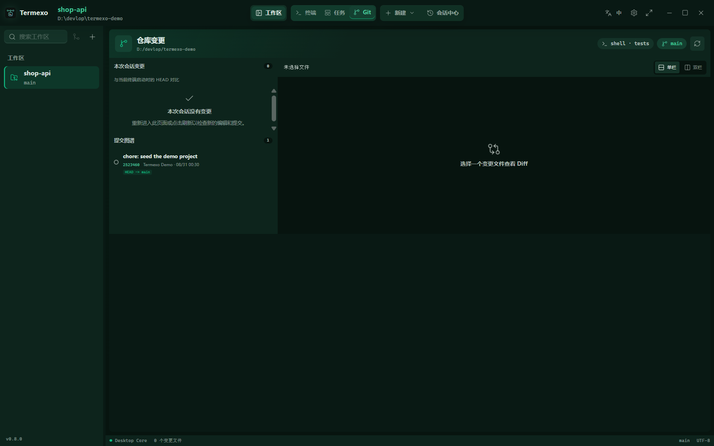

<!--
平台：知乎
标题：人不在电脑前，怎么盯着 AI 编程 Agent 干活？
分类：AI 编程 / 开发工具
标签：AI 编程、Claude Code、Codex、开源软件、程序员工具
发布声明：Termexo 项目维护者原创回答；正文截图均为真实产品界面，本文未使用 AI 生成配图。
-->

# 人不在电脑前，怎么盯着 AI 编程 Agent 干活？

先说结论：目前我没有找到「不用盯」的办法，只找到了「不用坐在这张桌子前盯」的办法。

这个问题我自己被折磨过很久。让 Claude Code 跑一个跨十几个文件的重构，估摸着要二十分钟，于是去开个会、接杯水。回来一看，它在第三分钟就停下了，屏幕上是一句「是否允许执行这条命令」，剩下十七分钟它就那么亮着等我。Agent 越能独立干活，人越不敢走开——可真正需要人的那个瞬间往往只有几秒钟，就是一个 y 或者一句「继续，但别删测试」。

先亮身份：我是 Termexo 的维护者，下面不是第三方测评，是我自己为这个问题做了什么、以及刻意没做什么。

## 做了什么：把工作台本身搬到手机上

V0.8 加了远程访问。在桌面端设置里打开开关，同一局域网或者 VPN 里的手机、平板、另一台电脑用浏览器打开，看到的就是完整工作台：同一批工作空间、同一批终端，实时读写桌面上正在跑的那一批 PTY 进程。

这一句里最要紧的是「同一批」。它不是把终端输出推到手机上看的只读镜像，也不是在手机上另起一套会话——你在手机上敲的 y，就是桌面上那个进程收到的 y；桌面端同时看到的是同一份滚动缓冲区。


手机上是特意重排过的：640px 以下分屏收成单终端，两侧面板浮在工作区之上而不是硬挤走一列，控件放大到手指能点。终端滚动也单独处理过——xterm 6 把缓冲区画在 canvas 上、滚动条也是自绘的，手指拖拽其实触达不到任何可滚动元素，所以现在拖拽会合成滚轮事件交给 xterm 分发：普通缓冲区直接滚，Claude Code 这类全屏 TUI 按它们自己订阅的方式收到滚轮上报，行为跟桌面滚轮一致，松手带惯性。

## 刻意没做什么

这部分我觉得比功能更值得说清楚。

**没有云端中转，也没有账号。** 链路直接跑在你自己的两台设备之间，没有 Termexo 服务器参与，我这边也不存在任何可以看到你终端的地方。代价是对称的：你人不在这个网络里就连不上。它不是「随时随地」，是「你还在家里或办公室、只是不在这张桌子前」。真要在外面用，请自己接 VPN，不要往公网转发端口。

**令牌等同于完整控制权。** 默认自签名 HTTPS，凭访问令牌进入，设置面板可以显示令牌、生成二维码、随时更换。自签名证书会让浏览器提示不安全，每台设备要手动确认一次——这个提示我没法消掉，只能说清楚它是什么。而拿到令牌的人，就等于拿到了这台电脑上 Termexo 的完整控制权。所以：只在可信网络里开。

**远程端能做的事有一份显式白名单。** 改远程访问设置本身、npm 自更新、原生文件读写，都被拒绝。原因值得摊开讲：远程请求没有另写一套后端，而是复用桌面端自己的命令表，从 socket 收到的请求被转成 `InvokeRequest` 交给主 webview，走同样的命令、同样的反序列化。好处是远程和本地永远不会行为分叉；坏处是 Tauri 的 ACL 在本地来源下不覆盖应用命令，而桥接必然声称自己是本地来源——所以白名单是唯一的授权边界，只能写死。

还有一个不太优雅的事实：一个 PTY 只有一个尺寸。它属于「正在使用的那一端」，你在手机上操作，桌面端的列数会跟着变；切回电脑再变回来。这个没法两全。

## 回到桌前那一步

远程解决的是「在外面按一下」，回来之后还有个问题：这半小时它到底改了什么。V0.8 的 Git 视图跟着当前终端走，以该终端启动时的 HEAD 为基线，只显示这次会话动过哪些文件、提交了什么，任意文件可看单栏或双栏 Diff，带 +N / −N。切换终端或读取失败都不会把你弹回终端视图，离开再回来还停在原来那个文件上。



## 谁不需要这个

如果你本来就守着屏幕、一次只跑一个 Agent，原生终端大概率已经够用了，装这个是多此一举。它更适合同时开着好几个 Agent、而且确实会离开座位的人。

另外得说明：Termexo 只有 Windows 版，没有 macOS 和 Linux。MIT 开源，一条命令可以试：

```powershell
npx termexo@latest
```

- 官网：https://www.termexo.com
- GitHub：https://github.com/gemron/Termexo
- Release：https://github.com/gemron/Termexo/releases/tag/v0.8.1
- npm：https://www.npmjs.com/package/termexo

欢迎试用和反馈，也欢迎提 Issue 或 PR；如果确实帮到了你，可以顺手 Star 一下。我更想听的是：你离开座位那段时间，最怕 Agent 卡在哪一步？

> 本回答由 Termexo 项目维护者撰写，正文截图为真实产品界面。
