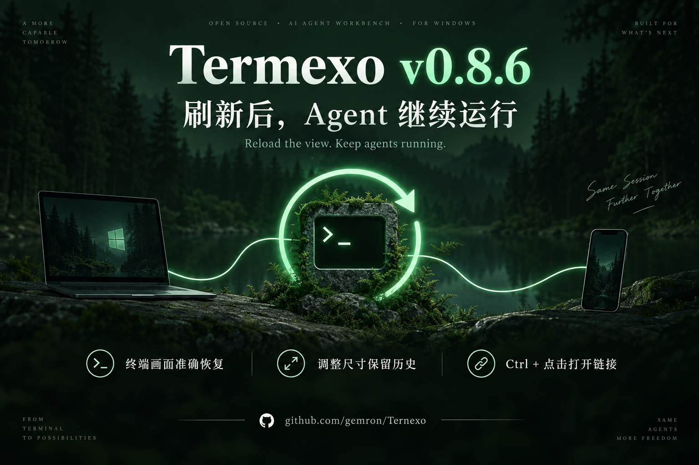

# Termexo v0.8.6 图文推广

正式发布时间：2026-09-11 02:44:43 UTC。已通过 GitHub Release API 核验：正式发布、非预发布。

来源：https://github.com/gemron/Termexo/releases/tag/v0.8.6

## 中文更新说明

### Termexo v0.8.6：刷新后 Agent 继续运行，重连后终端画面准确恢复

我是 Termexo 的维护者。Termexo 是 MIT 开源的 Windows 多 Agent 工作台，把 Claude Code、Codex 和 OpenCode 放在同一个窗口里。Agent 在电脑上运行，手机也可以通过可信局域网或 VPN 连接同一个工作台。

v0.8.6 这次主要修复一个影响连续工作的环节：窗口刷新、远程重连、切换终端或调整窗口大小后，正在运行的任务和眼前的画面应该接得上。

一、刷新界面，继续连接正在运行的 Agent

此前前端加载会被误当成一次新的终端启动，刷新可能重启原本正在工作的进程。现在会检查后端终端是否仍在运行，重新接入它，保留本次启动，也不再重复生成恢复参数、触发不必要的“接管会话”提示。

这里保留的是后端仍在运行的进程；关闭 Termexo 或关闭电脑，仍会结束运行中的进程。

二、重连后，恢复屏幕状态

旧方案保存有限长度的原始 PTY 输出，再把尾部重放给客户端。但终端输出包含光标移动、颜色、滚动区域等状态指令，截断之后再播放，容易出现画面重复、光标错位和换行错乱。

v0.8.6 改为由后端解析并保存终端屏幕，再向客户端重绘历史、可见网格、光标和输入模式。鼠标上报模式也会恢复，手机重连后仍能滚动 Agent 界面。

三、调整尺寸和切换终端时，内容衔接更稳

窗口变宽或变窄时，解析后的屏幕按新网格重新排版，不再直接丢弃历史。切换到此前隐藏的终端时，先确定当前尺寸，再从后端重绘。连续到达的重同步信号也会合并处理，避免多轮重画互相干扰。

四、输出中的文件和网址，可以 Ctrl + 点击打开

Agent 提到的修改文件、报错位置和参考页面，可以从终端输出直接打开。对于 Windows 会执行的文件类型，会在文件管理器中定位，便于先查看。

五、会话状态和长期运行也做了修复

Codex 恢复前会检查会话文件是否存在；完成状态改为依据主线程 Stop 钩子，减少把侧线程结束误报成任务完成的情况。Agent 事件详情与保留条数增加上限，旧数据库会在首次启动时压缩回收空间，因此升级后的第一次启动可能多花几秒。

下载与试用

支持 Windows 10 build 17763+，需要 WebView2 Chromium 111+。可使用 EXE / MSI 安装包；已有 Node.js 18.18+ 也可运行：
npx termexo@latest

Agent CLI 和模型服务需要自行配置，Termexo 不包含模型订阅。远程访问默认关闭，仅用于可信局域网或 VPN，默认自签名 HTTPS 可能出现证书提示；访问令牌具有工作台控制权限，请妥善保管。

发布说明与安装包：https://github.com/gemron/Termexo/releases/tag/v0.8.6
源码：https://github.com/gemron/Termexo
官网：https://www.termexo.com/

欢迎反馈刷新、重连或切换窗口时的实际体验；遇到问题可附上 Windows 版本和复现步骤。

文案由项目维护者提供，AI 根据正式 Release 辅助整理；封面为 AI 生成的概念插画，并非应用截图。

## 英文稿

### Termexo v0.8.6: keep agents running and restore terminal screens after reload

I maintain Termexo, an MIT-licensed Windows workbench for Claude Code, Codex and OpenCode. Agents run on the desktop, and a phone can connect to the same workspace over a trusted LAN or VPN.

Version 0.8.6 focuses on what happens when you reload a view, reconnect remotely, resize a window or switch to a terminal that was hidden.

Keep the running process

Previously, frontend loading could be mistaken for a new terminal launch. Reloading could restart an agent that was already working. The view now reconnects to a backend terminal that is still alive, preserving its current launch and avoiding redundant session takeover requests. This does not keep agents alive after you close Termexo or shut down the computer.

Restore a screen, not a fragment of output

A terminal stream contains stateful instructions: cursor movement, character attributes, scrolling regions and screen modes. Replaying only the tail of a bounded PTY buffer can lose the state those instructions depend on, producing duplicate content, misplaced cursors and broken wrapping.

The backend now parses output into a terminal screen and sends a redraw of its history, visible grid, cursor and input modes. Mouse reporting is restored too, so phone scrolling continues to work after reconnecting.

Resize and resynchronize consistently

Resizing reflows the parsed screen instead of dropping history. A previously hidden terminal claims its dimensions before redrawing from the backend. Repeated resynchronization signals are handled one redraw at a time, with signals received during a redraw merged into a follow-up.

Open what the agent points to

Ctrl-click opens URLs and file paths in terminal output. Paths to file types Windows would execute are revealed in the file manager instead.

Session state and event storage

Codex session restoration checks that the rollout file still exists. Completion uses the main-thread Stop hook to avoid confusing side-thread activity with the end of the task. Event detail size and retained event count are bounded. Existing databases are compacted on the first upgraded launch, which may take a few extra seconds.

Try it

Requirements: Windows 10 build 17763+ and WebView2 based on Chromium 111+. Download an EXE/MSI installer, or run npx termexo@latest with Node.js 18.18+. Agent CLIs and model services require their own setup; model subscriptions are not included.

Remote access is off by default and intended for trusted LAN/VPN connections. Default self-signed HTTPS can show a certificate warning; the access token grants control of the workspace.

Release and downloads: https://github.com/gemron/Termexo/releases/tag/v0.8.6
Source: https://github.com/gemron/Termexo
Website: https://www.termexo.com/

Feedback with Windows versions and reproduction steps is welcome. AI-assisted writing based on the official release; the cover is an AI-generated conceptual illustration, not an application screenshot.

## 技术稿

### 终端重连为什么会错行：从 PTY 字节重放到屏幕状态恢复

我是 Termexo 的维护者。最近在这个 Windows 终端工作台里，集中修复了一组看起来不太相关的问题：刷新会让 Agent 重新启动，远程重连后文字重复，调整尺寸会丢历史，切换隐藏终端又出现错位。它们共同指向了两件事：进程生命周期与视图生命周期没有分清，终端恢复又丢了状态。

加载视图不应该等于启动进程

Termexo 的后端进程比一次前端刷新活得更久。但原实现会在加载时推进终端的启动版本，后端把它理解成重启请求。于是用户只是刷新了窗口，正在运行的 Agent 却被重新启动。

修复方式是先判断后端终端是否仍然存活。存在就重新接入，保留原启动；仅在确实需要启动时生成启动参数。否则，同一个还持有会话的 CLI，又收到恢复那份会话的请求，就会产生不必要的接管提示。这个修改只覆盖后端仍然运行的情况，不覆盖应用退出或电脑关机。

为什么重放 PTY 尾部不能可靠恢复画面

终端输出不是普通日志。一次光标移动或局部重绘，依赖前面建立的光标位置、字符属性、滚动区域和屏幕模式。

缓存必须有容量上限。一旦只保留尾部，就可能丢失后续控制指令依赖的前置状态。新客户端把这些字节写入自己当前的模拟器状态，得到的画面可能重复、错行，或者把光标放在错误位置。增加缓存只能把发生问题的时刻推迟，并没有消除这种状态依赖。

因此，v0.8.6 把恢复对象从“输出字节的尾部”改成“后端解析后的终端屏幕”。后端持续解析 PTY 输出，客户端重连时接收历史、可见网格、光标和输入模式的重绘。鼠标上报模式也包含在恢复中，否则手机虽然看到了画面，滚动输入仍可能失效。

尺寸也是状态的一部分

隐藏面板使用 display: none，没有可供适配的尺寸。它此前按照 PTY 当时的网格写入历史，切到前台又改变渲染尺寸，容易把两种宽度下的画面混在一起。

现在先让视图认领自己的尺寸，再从后端屏幕重绘。调整网格时，后端将解析后的屏幕按新尺寸重新排版，替代原先直接丢弃缓冲的处理。另一个客户端认领终端导致尺寸变化时，同样走这条恢复路径。

重同步要防止自我放大

如果客户端暂时读不过来，服务端会提示重同步。多个信号到达后，如果并发发起多轮重绘，每轮保留的实时输出就可能混入另一轮历史；多余绘制又占用读取 socket 的时间，进一步触发重同步。

这次改为同一时间只执行一轮重绘。其间到达的信号合并成一次跟进，减少恢复工作自身制造的新积压。

这次实践的收获

检查终端恢复问题时，除了输出内容，还需要一起检查进程身份、输入模式、屏幕网格与实时输出的衔接。只要其中一项仍依赖旧客户端残留的状态，刷新后的行为就可能与首次打开不同。

相关实现已随 Termexo v0.8.6 发布。以上依据项目发布记录整理，未新增独立性能测量。
技术来源：https://github.com/gemron/Termexo/releases/tag/v0.8.6
文案由维护者提供，AI 辅助整理；如配封面，封面为概念插画。

## 配图



使用内置 imagegen 生成，已检查版本号、中英文标题与三个功能标签；概念插画，不是产品截图。

### 完整提示词

```text
Use case: ads-marketing. Create a polished landscape 1536x1024 release announcement cover for Termexo v0.8.6, an MIT open-source Windows AI agent workbench. Deep forest green and near-black background, mint green luminous accents, restrained editorial typography, generous margins. Main text exactly "Termexo v0.8.6". Chinese headline exactly "刷新后，Agent 继续运行". Smaller English subtitle exactly "Reload the view. Keep agents running." Three neatly spaced feature captions exactly "终端画面准确恢复" / "调整尺寸保留历史" / "Ctrl + 点击打开链接". Footer exactly "github.com/gemron/Termexo". Use a beautiful conceptual illustration of a persistent terminal session with a thin circular refresh arrow surrounding a stable glowing terminal prompt, a small desktop and phone silhouette connected by one continuous line. Illustration, not a screenshot. No fake application UI, no graphs, no benchmark numbers, no invented logos, no unsupported uptime promises. Clear accurate Chinese lettering.
```

## 发布记录

| 渠道 | 状态 | 链接与核验 |
| --- | --- | --- |
| 知乎 | 已发布，配封面 | https://zhuanlan.zhihu.com/p/2081698755363992812 ；正式文章页及发布成功提示，AI 辅助标识已核验 |
| X | 已发布，配海报 | https://x.com/gemronguo/status/2098245688245313985 ；主页显示新帖和 AI 标识、配图链接 |
| 微博 | 已发布，配海报 | https://weibo.com/1906408514/RhAsh4oAK ；个人主页显示 v0.8.6 新帖，2026-09-11 11:02，AI 生成标识 |
| Medium | 已发布，正文配海报 | https://medium.com/@guomengyue1987/termexo-v0-8-6-keep-agents-running-and-restore-terminal-screens-after-reload-1ea574ffa7a6 ；“Your story is published!”提示、正式文章和封面已核验；主题 Software Development，关闭订阅者邮件通知 |
| Product Hunt | 已发布，正文配海报 | https://www.producthunt.com/p/termexo/termexo-v0-8-6-reload-the-view-keep-agents-running ；已有 Termexo 产品论坛中的更新帖，标题、正文、海报已核验 |
| 掘金 | 已提交，审核中，正文配海报 | https://juejin.cn/spost/7683830679905697819 ；成功页显示“发布成功”，文章页标题旁显示“审核中”；分类开发工具，标签 GitHub，正文海报已转存并显示 |
| CSDN | 已提交，发布流程提示审核中，正文配海报 | https://blog.csdn.net/guomengyue1987/article/details/164972465 ；成功页显示“发布成功！正在审核中”，登录会话中可访问文章并显示海报；标签 windows，声明“部分内容由AI辅助生成” |
| OSCHINA | 已投稿，审核中，正文配海报 | https://my.oschina.net/gemron?key=news ；显示“操作成功”，我的资讯由 23 增至 24，新标题显示审核中，2026-09-11 11:15:51；外站图片已转存 |
| 思否 | 已发布，技术复盘稿 | https://segmentfault.com/a/1190000048289333 ；正式文章显示标题、完整正文、终端标签及 Release 来源，不含下载推广号召；本渠道未使用宣传封面 |

本轮共 9 个渠道：6 个已发布，3 个提交后提示审核中。8 个渠道配图；思否采用纯技术稿。审核中不等于公开审核通过；不将自检访问计为推广增长。

本文件与同名 JSON 保存可复用底稿，实际发布时按平台调整篇幅和格式。思否此前工具会话出现登录失效，切换到用户 Chrome 后账号可用，现已完成发布。用户要求不使用 Playwright 后，后续全部改用浏览器界面工具。

OSCHINA 新投稿入口从账号主页“投递新闻”进入，为 https://my.oschina.net/u/223115/admin/publish 。旧昵称路径与旧跳转入口本次返回错误页。

## 本轮范围

沿用此前九个渠道。V2EX、微信公众号及其他前次受阻或待审核渠道未重复投放，详情见 launch-v0.8.5-2026-09-09.md。本轮没有重新核验这些旧阻塞是否解除。

## 可复用推广包

termexo-v0.8.6-promotion-kit.zip 包含本说明、分渠道底稿 JSON 和本版 PNG 封面。
