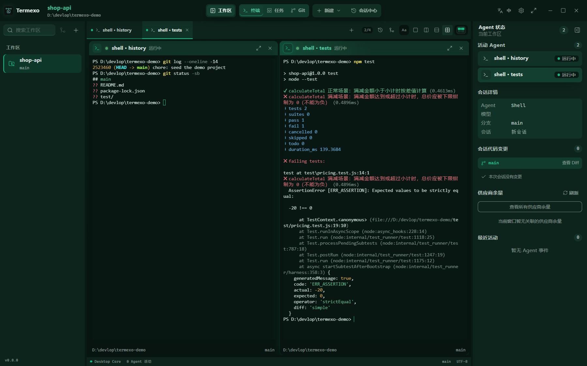

# Termexo v0.8.7 跨站更新发布

已核验正式 Release：[Termexo v0.8.7](https://github.com/gemron/Termexo/releases/tag/v0.8.7)，发布于 2026-09-11 15:16:30 UTC。

本轮共 9 个渠道：7 个已发布，2 个已提交待审核。状态核验时间：2026-09-11 23:28 Asia/Shanghai。全程未使用 Playwright。

## 发布结果

| 网站 | 状态 | 配图／文案 | 链接 |
| --- | --- | --- | --- |
| 知乎 | 已发布 | 真实工作台截图 | [查看](https://zhuanlan.zhihu.com/p/2081885367305818749) |
| Medium | 已发布 | 真实工作台截图 | [查看](https://medium.com/@guomengyue1987/termexo-v0-8-7-fixing-blank-terminals-when-switching-clients-38621e470496) |
| Product Hunt | 已发布 | 真实工作台截图 | [查看](https://www.producthunt.com/p/termexo/termexo-v0-8-7-fixing-blank-terminals-when-switching-clients) |
| 思否 | 已发布 | 技术复盘 | [查看](https://segmentfault.com/a/1190000048290831) |
| X | 已发布 | 英文短帖，含 Release 链接预览 | [查看](https://x.com/gemronguo/status/2098432934441332747) |
| 微博 | 已发布 | 中文短帖 | [查看](https://weibo.com/1906408514/RhFkapr68) |
| 掘金 | 已提交，审核中 | 真实工作台截图 | [查看](https://juejin.cn/spost/7684172753693442074) |
| OSCHINA | 已提交，审核中 | 真实工作台截图 | [查看](https://my.oschina.net/gemron?key=news) |
| CSDN | 已发布 | 技术复盘 | [查看](https://blog.csdn.net/guomengyue1987/article/details/165008668) |

CSDN：原稿因“广告-诱导外链”未通过；同一文章改为技术复盘，删除下载引导及外链后重新提交。最终文章页显示“公开”，修改时间 2026-09-11 23:27:55。

掘金文章标题旁显示“审核中”；OSCHINA“我的资讯”增加到 25 条，新稿显示“审核中”。这些状态不代表已通过平台审核。

## 配图

官网工作台截图（v0.8.0 界面示意，非 v0.8.7 新增功能截图）。使用仓库 website/assets/termexo-workbench.png 原图；[官网图片](https://www.termexo.com/assets/termexo-workbench.png)。知乎、Medium、Product Hunt、掘金与 OSCHINA 使用此图。CSDN 和思否最终使用技术复盘稿，X 与微博使用短帖。

## 中文通用更新说明

### Termexo v0.8.7：修复终端空白与假停止，让跨端切换更可靠

我是 Termexo 的维护者。Termexo 是 MIT 开源的 Windows 工作台，用于集中使用 Claude Code、Codex 和 OpenCode。

v0.8.7 聚焦终端可靠性：Agent 明明还在运行，界面却空白并显示“已停止”，这样的故障比普通显示错乱更影响工作。本次修复了宽字符与窗口缩窄共同触发的一条故障链，跨客户端切换也是它的复现路径之一。

一、换用 avt 屏幕解析器
旧解析器在某些宽字符边界状态下会 panic，随后屏幕互斥锁被毒化，后续读取持续失败。本版改用 asciinema 项目使用的 avt 终端模型，处理屏幕状态和尺寸变化。

二、单次解析异常可以恢复
如果解析器内部出错，会按原网格重建屏幕，并恢复被毒化的锁。代价可能是该终端的滚动历史，而不是让仍在运行的终端持续无法访问。

三、重绘迟迟不返回，不再拖住输出
重绘等待与输出之间的阻塞关系得到修复，避免一次没有答复的重绘让终端持续沉默。单个终端的屏幕快照、输出编码和发布也移到全局锁外，减少对其它终端输入、输出和尺寸调整的牵连。

四、刷新后继续保留输入模式
鼠标上报、bracketed paste 和小键盘模式从输出流单独跟踪并恢复。手机重连后滚动 Agent 界面所依赖的鼠标上报状态也因此得到保留。

这次是可靠性修复，不代表对所有终端故障作出“永不出错”的保证。环境要求保持不变：Windows 10 build 17763 或更高，WebView2 Chromium 111 或更高。

下载与完整更新记录：https://github.com/gemron/Termexo/releases/tag/v0.8.7
官网：https://www.termexo.com/

本文由维护者提供发布记录，使用 AI 辅助整理。

## 英文稿（Medium / Product Hunt）

### Termexo v0.8.7: fixing blank terminals when switching clients

配图说明：Existing workbench screenshot (v0.8.0), shown for context.

I'm the maintainer of Termexo, an MIT-licensed Windows workspace for Claude Code, Codex and OpenCode.

v0.8.7 focuses on a frustrating reliability problem: an agent could keep running while its terminal went blank and appeared stopped. Resizing around a wide character could trigger a parser panic, poison the screen mutex and leave subsequent screen reads failing. Switching between clients could reproduce that combination.

The screen model now uses avt, the terminal model used by asciinema. If a parser fault occurs, the screen can be rebuilt at the same grid size and a poisoned mutex recovered. Scrollback may be lost for that terminal, but the failure should no longer make the live terminal permanently inaccessible through this path.

The release also fixes output being held up by an unanswered redraw, and moves screen snapshot work, output encoding and publication outside the shared terminal lock. One terminal's redraw should no longer hold up operations on all the others.

Mouse reporting, bracketed paste and keypad modes are tracked separately from the screen model and restored after refresh. Preserving mouse reporting also matters for scrolling agent interfaces from a phone.

This is a fix for specific failure paths, not a claim that terminals can never fail. Requirements remain Windows 10 build 17763+ and WebView2 Chromium 111+.

Release and downloads: https://github.com/gemron/Termexo/releases/tag/v0.8.7
Website: https://www.termexo.com/

Maintainer update; written with AI assistance from the release notes.

## 技术复盘稿（思否）

### 终端空白但 Agent 仍在运行：Termexo v0.8.7 的解析器与锁恢复复盘

我是 Termexo 的维护者。本文根据 v0.8.7 发布记录，整理一次终端显示故障的原因与处理思路，使用 AI 辅助成稿。

## 进程活着，不代表终端画面还能访问

故障表现是：界面空白，终端被标记为“已停止”，但背后的 Agent 仍在运行。跨客户端激活同一个 Agent 是复现路径之一，因为客户端之间往往会发生终端尺寸变化。

关键边界在宽字符。窗口缩窄后，旧屏幕模型中可能留下一个容不下后半格的宽字符。解析器通过断言检查不变量，这次检查触发 panic；屏幕互斥锁随后进入被毒化状态，而应用持续拒绝读取它，于是一次解析错误演变成该进程生命周期内无法恢复的显示故障。

这说明仅检查 PTY 子进程是否存活，不足以判断终端是否可用：屏幕状态、恢复路径与进程状态需要分别观察。

## 修复既要替换解析器，也要设计失败后的退路

v0.8.7 将屏幕模型换成 avt。更重要的是，在解析器内部出错时，按相同网格重建屏幕，并恢复被毒化的锁。这里有明确取舍：可能丢失该终端的滚动历史，但避免让仍在运行的终端持续无法访问。

锁恢复也不应被理解成“忽略错误继续使用原状态”。本次恢复路径包含屏幕重建；讨论类似设计时，应同时审视共享状态是否还有效，而不是只关注怎样获取锁。

## 重绘失败不应把后续输出一起堵住

另一个问题发生在重绘等待：终端新输出需要等重绘结束才继续写出。如果一次重绘迟迟没有答复，后续输出也会被拖住。

本版修复了这条阻塞路径。对流式界面而言，暂时落后的画面还有机会被下一帧修正，持续不再显示输出则会切断用户判断任务进度的依据。

## 缩小共享锁内的工作量

此前生成某个终端的快照时，会一直持有其它终端输入、输出、尺寸调整和启动也要经过的锁。结果是一个终端的重绘，可能牵连所有终端。

v0.8.7 将快照生成、输出编码与发布移到锁外。由此可以提炼一个检查点：共享锁内除了取得必要状态，是否还混入了随屏幕大小或输出量增长的工作？这类工作会放大多终端之间的等待。

## 屏幕模型之外，还有输入模式

新解析器负责屏幕建模，不负责输入如何上报。因此鼠标上报、bracketed paste、小键盘模式需要从输出流单独跟踪，并在刷新时一起恢复。只恢复字符网格仍不完整：丢失鼠标上报，就会影响手机端滚动 Agent 的交互。

这次修复针对已识别的故障链，并不是对所有输入组合的无故障保证。其可复用的经验是：为状态解析失败设计可恢复边界，限制一次重绘能阻塞的范围，并把显示状态与输入协议状态分别维护。

发布记录：[Termexo v0.8.7](https://github.com/gemron/Termexo/releases/tag/v0.8.7)。

## CSDN 修订版

标题同思否，正文同技术复盘稿，但文末来源改为以下纯文本，未附外链：

> 资料来源：Termexo 仓库 CHANGELOG.cn.md 中的 V0.8.7 更新记录。

摘要：从一次宽字符与尺寸变化触发的屏幕解析故障出发，讨论互斥锁毒化恢复、重绘等待边界、共享锁粒度，以及终端输入模式的独立维护。

## X 短帖

I maintain Termexo. v0.8.7 fixes a blank-terminal failure when switching clients, adds parser recovery and reduces redraw blocking. MIT Windows workspace for coding agents.
Release: https://github.com/gemron/Termexo/releases/tag/v0.8.7
AI-assisted update.

## 微博短帖

Termexo v0.8.7 已发布！我是项目维护者，这次聚焦终端可靠性：

• 换用 avt 屏幕解析器，修复宽字符与窗口缩窄触发的终端空白、假停止。
• 解析异常后重建屏幕，避免单次故障持续阻断访问。
• 修复重绘等待拖住输出，减少不同终端之间的锁竞争。
• 刷新后保留鼠标上报、粘贴及小键盘模式。

完整说明与下载：https://github.com/gemron/Termexo/releases/tag/v0.8.7
#开源软件# #开发工具#
文案由 AI 辅助整理。

## 各站设置

- 知乎：包含 AI 辅助创作；正文配图。
- 掘金：开发工具分类、GitHub 标签；摘要为“Termexo v0.8.7 换用 avt 解析器，修复宽字符与尺寸变化触发的终端空白，并改进异常恢复、重绘等待和终端间的锁竞争。”。
- OSCHINA：软件更新资讯；标题为“Termexo v0.8.7 发布：换用 avt 解析器，修复终端空白与重绘阻塞”；原文链接为本版 Release。
- Medium：Software Development 主题；未发送订阅者邮件通知。
- Product Hunt：Termexo 产品论坛中的版本更新帖。
- 思否：终端标签；原创技术复盘。
- CSDN：windows 标签、部分内容由 AI 辅助生成；最终无推广外链。
- 微博：内容由 AI 生成声明。

未重复投递仍在等待审核的产品目录，也未尝试此前存在账号、邀请或平台限制的其他渠道。
